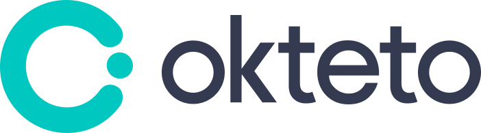

# Velero Adopters

If you're using Velero and want to add your organization to this list, 
[follow these directions][1]!

&nbsp; &nbsp; &nbsp;
&nbsp; &nbsp; &nbsp;
&nbsp; &nbsp; &nbsp;
&nbsp; &nbsp; &nbsp;
&nbsp; &nbsp; &nbsp;
&nbsp; &nbsp; &nbsp;
&nbsp; &nbsp; &nbsp;
&nbsp; &nbsp; &nbsp;
&nbsp; &nbsp; &nbsp;
&nbsp; &nbsp; &nbsp;

## Success Stories

Below is a list of adopters of Velero in **production environments** that have
publicly shared the details of how they use it.

**[BitGo][20]**  
BitGo uses Velero backup and restore capabilities to seamlessly provision and scale fullnode statefulsets on the fly as well as having it serve an integral piece for our kubernetes disaster-recovery story.

**[Bugsnag][30]**  
We use Velero for managing backups of an internal instance of our on-premise clustered solution. We also recommend our users of [on-premise Bugsnag installations][31] use Velero for [managing their own backups][32].

**[Banzai Cloud][60]**  
[Banzai Cloud Pipeline][61] is a Kubernetes-based microservices platform that integrates services needed for Day-1 and Day-2 operations along with first-class support both for on-prem and hybrid multi-cloud deployments. We use Velero to periodically [backup and restore these clusters in case of disasters][62].

## Solutions built with Velero

Below is a list of solutions where Velero is being used as a component.

**[Nirmata][10]**  
We have integrated our [solution with Velero][11] to provide our customers with out of box backup/DR.

**[Kyma][40]**  
Kyma [integrates with Velero][41] to effortlessly back up and restore Kyma clusters with all its resources. Velero capabilities allow Kyma users to define and run manual and scheduled backups in order to successfully handle a disaster-recovery scenario.

**[Red Hat][50]**  
Red Hat has developed the [Cluster Application Migration Tool][51] which uses [Velero and Restic][52] to drive the migration of applications between OpenShift clusters.

**[Dell EMC][70]**  
For Kubernetes environments, [PowerProtect Data Manager][71] leverages the Container Storage Interface (CSI) framework to take snapshots to back up the persistent data or the data that the application creates e.g. databases. [Dell EMC leverages Velero][72] to backup the namespace configuration files (also known as Namespace meta data) for enterprise grade data protection.

**[SIGHUP][80]**  
SIGHUP integrates Velero in its [Fury Kubernetes Distribution][81] providing predefined schedules and configurations to ensure an optimized disaster recovery experience.
[Fury Kubernetes Disaster Recovery Module][82] is ready to be deployed into any Kubernetes cluster running anywhere.

**[MayaData][90]**  
MayaData is a large user of Velero as well as a contributor. MayaData offers a Data Agility platform called [OpenEBS Director][91], that helps customers confidently and easily manage stateful workloads in Kubernetes. Velero is one of the core software building block of the OpenEBS Director's [DMaaS or data migration as a service offering][92] used to enable data protection strategies.

**[Okteto][93]**  
Okteto integrates Velero in [Okteto Cloud][94] and [Okteto Enterprise][95] to periodically backup and restore our clusters for disaster recovery. Velero is also a core software building block to provide namespace cloning capabilities, a feature that allows our users cloning staging environments into their personal development namespace for providing production-like development environments.
​
## Adding your organization to the list of Velero Adopters

If you are using Velero and would like to be included in the list of `Velero Adopters`, add an SVG version of your logo to the `site/static/img/adopters` directory in this repo and submit a [pull request][3] with your change. Name the image file something that reflects your company (e.g., if your company is called Acme, name the image acme.png). See this for an example [PR][4].

### Adding a logo to velero.io

If you would like to add your logo to a future `Adopters of Velero` section on [velero.io][2], follow the steps above to add your organization to the list of Velero Adopters. Our community will follow up and publish it to the [velero.io][2] website.

[1]: #adding-a-logo-to-veleroio
[2]: https://velero.io
[3]: https://github.com/vmware-tanzu/velero/pulls
[4]: https://github.com/vmware-tanzu/velero/pull/2242

[10]: https://www.nirmata.com/2019/08/14/kubernetes-disaster-recovery-using-velero-and-nirmata/
[11]: https://nirmata.com

[20]: https://bitgo.com

[30]: https://bugsnag.com
[31]: https://www.bugsnag.com/on-premise
[32]: https://docs.bugsnag.com/on-premise/clustered/backup-restore/

[40]: https://kyma-project.io
[41]: https://kyma-project.io/docs/components/backup/#overview-overview

[50]: https://redhat.com
[51]: https://github.com/fusor/mig-operator
[52]: https://github.com/fusor/mig-operator/blob/master/docs/usage/2.md

[60]: https://banzaicloud.com
[61]: https://banzaicloud.com/products/pipeline/
[62]: https://banzaicloud.com/blog/vault-backup-velero/

[70]: https://dellemc.com
[71]: https://dellemc.com/dataprotection
[72]: https://www.dellemc.com/resources/en-us/asset/briefs-handouts/solutions/h18141-dellemc-dpd-kubernetes.pdf

[80]: https://sighup.io
[81]: https://github.com/sighupio/fury-distribution
[82]: https://github.com/sighupio/fury-kubernetes-dr

[90]: https://mayadata.io
[91]: https://director.mayadata.io/
[92]: https://help.mayadata.io/hc/en-us/articles/360033401591-DMaaS

[93]: https://okteto.com
[94]: https://cloud.okteto.com
[95]: https://okteto.com/enterprise/
