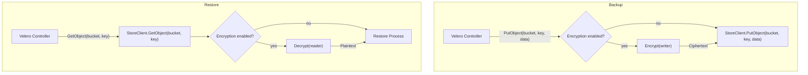

# Client-Side Encryption (CSE)

## Background

Velero currently supports server‑side encryption (SSE) via cloud-managed keys (SSE-S3, SSE-KMS) and customer-managed server‑side keys (SSE-C). However, data leaving Velero remains unencrypted until the cloud provider applies encryption, which does not satisfy strict end-to-end requirements mandated by compliance regimes such as PCI DSS, HIPAA, or GDPR.

Client-side encryption (CSE) using the `age` tool addresses this gap by encrypting data locally before it ever leaves Velero.

## Motivation

- **True end‑to‑end encryption**: Data is encrypted locally before it ever leaves Velero.
- **Asymmetric key management**: No Velero-managed symmetric secrets or external KMS.
- **Streaming workflows**: Encrypt/decrypt on the fly without buffering entire objects.

## Goals

- **Opt‑in**: Enable CSE via `.spec.encryption.type` in the BackupStorageLocation API.
- **Transparent integration**: Wrap existing `PutObject`/`GetObject` calls without changes to user workflows.
- **Single backend**: Leverage `age` public-key tool exclusively.
- **Secure defaults**: Disallow plaintext fallback when enabled.

## Non‑Goals

- **End-to-end tests**: Automate backup-and-restore with CSE.
- **Key rotation and versioning**: Internal `EncryptionKeyStore` to manage multiple key versions for decrypting old objects. Supported backends:

   * **Kubernetes Secret**
   * **HashiCorp Vault**
- **Additional algorithms**: Extend beyond `age`.
- **CLI integration**: Surface encryption settings, rotation commands, and `EncryptionKeyStore` management in the Velero CLI.

## High-Level Design

- **Initialization**: On creating a BackupStorageLocation with `.spec.encryption.type=age`, Velero constructs an `EncryptedStore` wrapper around the object store client.
- **Backup flow**:

   * Velero calls `PutObject(bucket, key, data)`.
   * If encryption is enabled, data is streamed through `enc.Encrypt` before uploading.
- **Restore flow**:

   * Velero calls `GetObject(bucket, key)`.
   * If encryption is enabled, the retrieved stream is passed through `enc.Decrypt`.



## Detailed Design

### API & CRD Changes

```go
// +kubebuilder:validation:Enum=none;age
// EncryptionType specifies which encryption strategy to use.
type EncryptionType string

const (
	// No encryption.
	EncryptionTypeNone EncryptionType = "none"
	// age encryption.
	EncryptionTypeAge EncryptionType = "age"
)

// EncryptionSpec holds configuration for a chosen encryption strategy.
type EncryptionSpec struct {
	// Type is the kind of encryption to apply.
	// +kubebuilder:default=none
	Type EncryptionType `json:"type,omitempty"`

	// Options contains strategy-specific key/value pairs.
	//   recipient: age1j...
	//   privateKey: AGE-SECRET-KEY...
	// +optional
	Options map[string]string `json:"options,omitempty"`
}

// BackupStorageLocationSpec defines the desired state of a Velero BackupStorageLocation
type BackupStorageLocationSpec struct {
    ...
	// Encryption defines which algorithm and options to use for encryption.
	// +optional
	Encryption *EncryptionSpec `json:"encryption,omitempty"`
}
```

- Defaulting to `none` ensures backward compatibility.

### Encryption Interface

```go
// Encryption defines streaming encryption/decryption.
type Encryption interface {
	Encrypt(io.Writer) (io.WriteCloser, error)
	Decrypt(io.ReadCloser) (io.ReadCloser, error)
}

// NewEncryptionFromConfig returns an Encryption instance based on type and options.
func NewEncryptionFromConfig(t velerov1api.EncryptionType, opts map[string]string) (Encryption, error) {
	switch t {
	case velerov1api.EncryptionTypeNone:
		return nil, nil
	case velerov1api.EncryptionTypeAge:
		return NewAgeEncryption(opts)
	default:
		return nil, fmt.Errorf("unsupported encryption type %q", t)
	}
}
```

### Age Backend

Implemented in `internal/encryption/age.go`:

- **Configuration**: Loads `opts["recipient"]` and `opts["privateKey"]` (or from env `AGE_RECIPIENT`/`AGE_PRIVATE_KEY`). Env is a **priority**.
- **Encrypt**: age.Encrypt(w, recipient) returns a streaming writer.
- **Decrypt**: age.Decrypt(r, identity) returns a streaming reader.

Supports parsing both X25519 and SSH-style age recipients/identities via `age.ParseX25519Recipient` and `agessh.ParseRecipient`.

### Object-Store Integration

In `pkg/persistence/object_store.go`:

- **Suffix**: Append .<type> (e.g., .age) to all filenames via NewObjectStoreLayout(prefix, filenameSuffix).
- **Wrapper**: If `.spec.encryption` != nil && `.spec.encryption.type` != none, call `NewEncryptedStore`(inner, type, logger, opts).
- **PutObject**: Streams through `enc.Encrypt` before `inner.PutObject`.
- **GetObject**: Streams through `enc.Decrypt` after `inner.GetObject`.

Implementation in `pkg/persistence/object_store_encryption.go` ensures proper error handling and logging.

### Testing

- Unit tests for age backend (`internal/encryption/age_test.go`).
- Wrapper tests for store integration (`pkg/persistence/object_store_encryption_test.go`).
- TODO: end-to-end scenarios in Kubernetes.

### Backward Compatibility

- Default behavior unchanged when `.spec.encryption` is unset.
- Old controllers fail fast on age-encrypted restores.
- CRD changes are additive.

## Alternatives Considered

- **Plugin-level encryption**: e.g., AWS plugin ([vmware-tanzu/velero-plugin-for-aws#263](https://github.com/vmware-tanzu/velero-plugin-for-aws/pull/263)), limiting portability.

## Security Considerations

- Keys from Kubernetes Secrets or environment variables.
- Streams prevent plaintext persistence.
- Uses audited `filippo.io/age` library.
