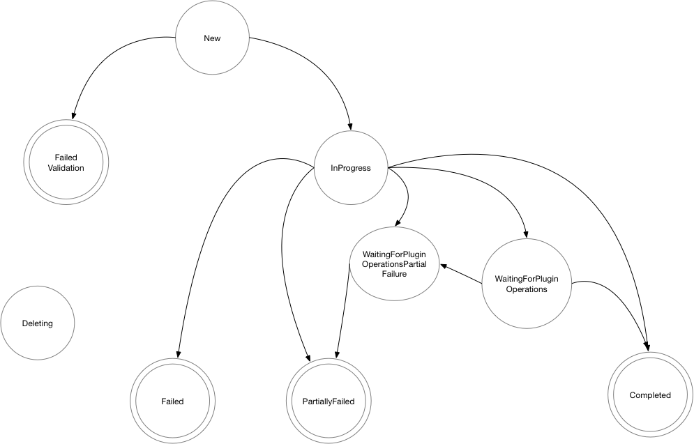

# Plugin Progress Monitoring

This is intended as a replacement for the previously-approved Upload Progress Monitoring design
([Upload Progress Monitoring](upload-progress.md)) in order to expand the supported use cases beyond
snapshot uploads to include what was previously called Async Backup/Restore Item Actions. This
updated design should handle the combined set of use cases for those previously separate designs.

Volume snapshotter plug-in are used by Velero to take snapshots of persistent volume contents. 
Depending on the underlying storage system, those snapshots may be available to use immediately, 
they may be uploaded to stable storage internally by the plug-in or they may need to be uploaded after
the snapshot has been taken. We would like for Velero to continue on to the next part of the backup as quickly
as possible but we would also like the backup to not be marked as complete until it is a usable backup.  We'd also
eventually like to bring the control of upload under the control of Velero and allow the user to make decisions
about the ultimate destination of backup data independent of the storage system they're using.

We would also like any internal or third party Backup or Restore Item Action to have the option of
making use of this same ability to run some external process without blocking the current backup or
restore operation. Beyond Volume Snapshotters, this is also needed for data mover operations on both
backup and restore, and potentially useful for other third party operations -- for example
in-cluster registry image backup or restore could make use of this feature in a third party plugin).

### Glossary
- <b>BIA</b>: BackupItemAction
- <b>RIA</b>: RestoreItemAction

## Examples
- AWS - AWS snapshots return quickly, but are then uploaded in the background and cannot be used until EBS moves
the data into S3 internally.

- vSphere - The vSphere plugin takes a local snapshot and then the vSphere plugin uploads the data to S3.  The local
snapshot is usable before the upload completes.

- Restic - Does not go through the volume snapshot path.  Restic backups will block Velero progress
until completed. However, with the more generalized approach in the revised design, restic/kopia
backup and restore *could* make use of this framework if their actions are refactored as
Backup/RestoreItemActions.

- Data Movers
    - Data movers are asynchronous processes executed inside backup/restore item actions that applies to a specific kubernetes resources. A common use case for data mover is to backup/restore PVCs whose data we want to move to some form of backup storage outside of using velero kopia/restic implementations.
    - Workflow
        - User takes velero backup of PVC A
        - BIA plugin applies to PVCs with compatible storage driver
        - BIA plugin triggers data mover
	  - Most common use case would be for the plugin action to create a new CR which would
            trigger an external controller action
	  - Another possible use case would be for the plugin to run its own async action in a
            goroutine, although this would be less resilient to plugin container restarts.
        - BIA plugin returns
        - Velero backup process continues
        - Main velero backup process monitors running BIA threads via gRPC to determine if process is done and healthy


## Primary changes from the original Upload Progress Monitoring design

The most fundamental change here is that rather than proposing a new special-purpose
SnapshotItemAction, the existing BackupItemAction plugin will be modified to accommodate an optional
snapshot (or other item operation) ID return. The primary reasons for this change are as follows:

1. The intended scope has moved beyond snapshot processing, so it makes sense to support
asynchronous operations in other backup or restore item actions.

2. We expect to have plugin API versioning implemented in Velero 1.10, making it feasible to
implement changes in the existing plugin APIs now.

3. We will need this feature on both backup and restore, meaning that if we took the "new plugin
type" approach, we'd need two new plugin types.

4. Other than the snapshot/operation ID return, the rest of the plugin processing is identical to
Backup/RestoreItemActions. With separate plugin types, we'd have to repeat all of that logic
(including dealing with additional items, etc.) twice.

The other major change is that we will be applying this to both backups and restores, although the
Volume Snapshotter use case only needs this on backup. This means that everything we're doing around
backup phase and workflow will also need to be done for restore.

Then there are various minor changes around terminology to make things more generic. Instead of
"snapshotID", we'll have "operationID" (which for volume snapshotters will be a snapshot
ID).

## Goals

- Enable monitoring of backup/restore item action operations that continue after snapshotting and other operations have completed
- Keep non-usable backups and restores (upload/persistence has not finished, etc.) from appearing as completed
- Make use of plugin API versioning functionality to manage changes to Backup/RestoreItemAction interfaces
- Enable vendors to plug their own data movers into velero using BIA/RIA plugins

## Non-goals
- Today, Velero is unable to recover from an in progress backup when the velero server crashes (pod is deleted). This has an impact on running asynchronous processes, but it’s not something we intend to solve in this design.

## Models

### Internal configuration and management
In this model, movement of the snapshot to stable storage is under the control of the snapshot
plug-in.  Decisions about where and when the snapshot gets moved to stable storage are not
directly controlled by Velero.  This is the model for the current VolumeSnapshot plugins.

### Velero controlled management
In this model, the snapshot is moved to external storage under the control of Velero.  This
enables Velero to move data between storage systems.  This also allows backup partners to use
Velero to snapshot data and then move the data into their backup repository.

## Backup and Restore phases

Velero currently has backup/restore phases "InProgress" and "Completed".  A backup moves to the
Completed phase when all of the volume snapshots have completed and the Kubernetes metadata has been
written into the object store.  However, the actual data movement may be happening in the background
after the backup has been marked "Completed".  The backup is not actually a stable backup until the
data has been persisted properly.  In some cases (e.g. AWS) the backup cannot be restored from until
the snapshots have been persisted.

Once the snapshots have been taken, however, it is possible for additional backups or restores (as
long as they don't use not-yet-completed backups) to be made without interference.  Waiting until
all data has been moved before starting the next backup will slow the progress of the system without
adding any actual benefit to the user.

New backup/restore phases, "WaitingForPluginOperations" and
"WaitingForPluginOperationsPartiallyFailed" will be introduced.  When a backup or restore has
entered one of these phases, Velero is free to start another backup/restore.  The backup/restore
will remain in the "WaitingForPluginOperations" phase until all BIA/RIA operations have completed
(for example, for a volume snapshotter, until all data has been successfully moved to persistent
storage).  The backup/restore will not fail once it reaches this phase, although an error return
from a plugin could cause a backup or restore to move to "PartiallyFailed".  If the backup is
deleted (cancelled), the plug-ins will attempt to delete the snapshots and stop the data movement -
this may not be possible with all storage systems.

In addition, for backups (but not restores), there will also be two additional phases, "Finalizing"
and "FinalizingPartiallyFailed", which will handle any steps required after plugin operations have
all completed. Initially, this will just include adding any required resources to the backup that
might have changed during asynchronous operation execution, although eventually other cleanup
actions could be added to this phase.

### State progression


### New
When a backup/restore request is initially created, it is in the "New" phase.  

The next state is either "InProgress" or "FailedValidation"

### FailedValidation
If the backup/restore request is incorrectly formed, it goes to the "FailedValidation" phase and
terminates

### InProgress
When work on the backup/restore begins, it moves to the "InProgress" phase.  It remains in the
"InProgress" phase until all pre/post execution hooks have been executed, all snapshots have been
taken and the Kubernetes metadata and backup/restore info is safely written to the object store
plug-in.

In the current implementation, Restic backups will move data during the "InProgress" phase.  In the
future, it may be possible to combine a snapshot with a Restic (or equivalent) backup which would
allow for data movement to be handled in the "WaitingForPluginOperations" phase,

The next phase would be "WaitingForPluginOperations" for backups or restores which have unfinished
asynchronous plugin operations and no errors so far, "WaitingForPluginOperationsPartiallyFailed" for
backups or restores which have unfinished asynchronous plugin operations at least one error,
"Completed" for restores with no unfinished asynchronous plugin operations and no errors,
"PartiallyFailed" for restores with no unfinished asynchronous plugin operations and at least one
error, "Finalizing" for backups with no unfinished asynchronous plugin operations and no errors,
"FinalizingPartiallyFailed" for backups with no unfinished asynchronous plugin operations and at
least one error, or "PartiallyFailed".  Backups/restores which would have a final phase of
"Completed" or "PartiallyFailed" may move to the "WaitingForPluginOperations" or
"WaitingForPluginOperationsPartiallyFailed" state.  A backup/restore which will be marked "Failed"
will go directly to the "Failed" phase.  Uploads may continue in the background for snapshots that
were taken by a "Failed" backup/restore, but no progress will not be monitored or updated. If there
are any operations in progress when a backup is moved to the "Failed" phase (although with the
current workflow, that shouldn't happen), Cancel() should be called on these operations. When a
"Failed" backup is deleted, all snapshots will be deleted and at that point any uploads still in
progress should be aborted.

### WaitingForPluginOperations (new)
The "WaitingForPluginOperations" phase signifies that the main part of the backup/restore, including
snapshotting has completed successfully and uploading and any other asynchronous BIA/RIA plugin
operations are continuing.  In the event of an error during this phase, the phase will change to
WaitingForPluginOperationsPartiallyFailed.  On success, the phase changes to
"Finalizing" for backups and "Completed" for restores.  Backups cannot be
restored from when they are in the WaitingForPluginOperations state.

### WaitingForPluginOperationsPartiallyFailed (new)
The "WaitingForPluginOperationsPartiallyFailed" phase signifies that the main part of the
backup/restore, including snapshotting has completed, but there were partial failures either during
the main part or during any async operations, including snapshot uploads.  Backups cannot be
restored from when they are in the WaitingForPluginOperationsPartiallyFailed state.

### Finalizing (new)
The "Finalizing" phase signifies that asynchronous backup operations have all completed successfully
and Velero is currently backing up any resources indicated by asynchronous plugins as items to back
up after operations complete. Once this is done, the phase changes to Completed.  Backups cannot be
restored from when they are in the Finalizing state.

### FinalizingPartiallyFailed (new)

The "FinalizingPartiallyFailed" phase signifies that, for a backup which had errors during initial
processing or asynchronous plugin operation, asynchronous backup operations have all completed and
Velero is currently backing up any resources indicated by asynchronous plugins as items to back up
after operations complete. Once this is done, the phase changes to PartiallyFailed.  Backups cannot
be restored from when they are in the FinalizingPartiallyFailed state.

### Failed
When a backup/restore has had fatal errors it is marked as "Failed" Backups in this state cannot be
restored from.

### Completed
The "Completed" phase signifies that the backup/restore has completed, all data has been transferred
to stable storage (or restored to the cluster) and any backup in this state is ready to be used in a
restore.  When the Completed phase has been reached for a backup it is safe to remove any of the
items that were backed up.

### PartiallyFailed
The "PartiallyFailed" phase signifies that the backup/restore has completed and at least part of the
backup/restore is usable.  Restoration from a PartiallyFailed backup will not result in a complete
restoration but pieces may be available.

## Workflow

When a Backup or Restore Action is executed, any BackupItemAction, RestoreItemAction, or
VolumeSnapshot plugins will return operation IDs (snapshot IDs or other plugin-specific
identifiers).  The plugin should be able to provide status on the progress for the snapshot and
handle cancellation of the operation/upload if the snapshot is deleted.  If the plugin is restarted,
the operation ID should remain valid.

When all snapshots have been taken and Kubernetes resources have been persisted to the ObjectStorePlugin
the backup will either have fatal errors or will be at least partially usable.

If the backup/restore has fatal errors it will move to the "Failed" state and finish. If a
backup/restore fails, the upload or other operation will not be cancelled but it will not be
monitored either.  For backups in any phase, all snapshots will be deleted when the backup is
deleted.  Plugins will cancel any data movement or other operations and remove snapshots and other
associated resources when the VolumeSnapshotter DeleteSnapshot method or DeleteItemAction Execute
method is called.

Velero will poll the plugins for status on the operations when the backup/restore exits the
"InProgress" phase and has no fatal errors.

If any operations are not complete, the backup/restore will move to either WaitingForPluginOperations
or WaitingForPluginOperationsPartiallyFailed or Failed.

Post-snapshot and other operations may take a long time and Velero and its plugins may be restarted
during this time.  Once a backup/restore has moved into the WaitingForPluginOperations or
WaitingForPluginOperationsPartiallyFailed phase, another backup/restore may be started.

While in the WaitingForPluginOperations or WaitingForPluginOperationsPartiallyFailed phase, the
snapshots and item actions will be periodically polled.  When all of the snapshots and item actions
have reported success, restores will move directly to the Completed or PartiallyFailed phase, and
backups will move to the Finalizing or FinalizingPartiallyFailed phase, depending on whether the
backup/restore was in the WaitingForPluginOperations or WaitingForPluginOperationsPartiallyFailed
phase.

While in the Finalizing or FinalizingPartiallyFailed phase, Velero will update the backup with any
resources indicated by plugins that they must be added to the backup after operations are completed,
and then the backup will move to the Completed or PartiallyFailed phase, depending on whether there
are any backup errors.

The Backup resources will be written to object storage at the time the backup leaves the InProgress
phase, but it will not be synced to other clusters (or usable for restores in the current cluster)
until the backup has entered a final phase: Completed, Failed or PartiallyFailed. During the
Finalizing phases, a the backup resources will be updated with any required resources related to
asynchronous plugins.

## Reconciliation of InProgress backups

InProgress backups will not have a `velero-backup.json` present in the object store.  During
reconciliation, backups which do not have a `velero-backup.json` object in the object store will be
ignored.

## Plug-in API changes

### OperationProgress struct

    type OperationProgress struct {
        Completed bool                          // True when the operation has completed, either successfully or with a failure
        Err string                              // Set when the operation has failed
        NCompleted, NTotal int64                // Quantity completed so far and the total quantity associated with the operation in operationUnits
                                                // For data mover and volume snapshotter use cases, this would be in bytes
                                                // On successful completion, completed and total should be the same.
        OperationUnits string                   // Units represented by completed and total -- for data mover and item
	                                        // snapshotters, this will usually be bytes.
        Description string                      // Optional description of operation progress
        Started, Updated time.Time              // When the upload was started and when the last update was seen.  Not all
                                                // systems retain when the upload was begun, return Time 0 (time.Unix(0, 0))
                                                // if unknown.
    }

### VolumeSnapshotter changes

Two new methods will be added to the VolumeSnapshotter interface:

    Progress(snapshotID string) (OperationProgress, error)
    Cancel(snapshotID string) (error)

Progress will report the current status of a snapshot upload.  This should be callable at
any time after the snapshot has been taken.  In the event a plug-in is restarted, if the operationID
(snapshot ID) continues to be valid it should be possible to retrieve the progress.

`error` is set if there is an issue retrieving progress.  If the snapshot is has encountered an
error during the upload, the error should be returned in OperationProgress and error should be nil.

### BackupItemAction and RestoreItemAction plug-in changes

Currently CSI snapshots and the Velero Plug-in for vSphere are implemented as BackupItemAction
plugins.  While the majority of BackupItemAction plugins do not take snapshots or upload data, this
functionality is useful for any longstanding plugin operation managed by an external
process/controller so we will modify BackupItemAction and RestoreItemAction to optionally return an
operationID in addition to the modified item.

Velero can attempt to cancel an operation by calling the Cancel API call on the BIA/RIA. The plugin
can then take any appropriate action as needed. Cancel will be called for unfinished operations on
backup deletion, and possibly reaching timeout. Cancel is not intended to be used to delete/remove
the results of completed actions and will have no effect on a completed action. Cancel has no return
value apart from the standard Error return, but this should only be used for unexpected
failures. Under normal operations, Cancel will simply return a nil error (and nothing else), whether
or not the plugin is able to cancel the operation.

_AsyncOperationsNotSupportedError_ should only be returned (by Progress) if the
Backup/RestoreItemAction plugin should not be handling the item.  If the Backup/RestoreItemAction
plugin should handle the item but, for example, the item/snapshot ID cannot be found to report
progress, Progress will return an InvalidOperationIDError error rather than a populated
OperationProgress struct. If the item action does not start an asynchronous operation, then
operationID will be empty.

Three new methods will be added to the BackupItemAction interface, and the Execute() return signature
will be modified:

	// Name returns the name of this BIA. Plugins which implement this interface must defined Name,
	// but its content is unimportant, as it won't actually be called via RPC. Velero's plugin infrastructure
	// will implement this directly rather than delegating to the RPC plugin in order to return the name
	// that the plugin was registered under. The plugins must implement the method to complete the interface.
	Name() string
	// Execute allows the BackupItemAction to perform arbitrary logic with the item being backed up,
	// including mutating the item itself prior to backup. The item (unmodified or modified)
	// should be returned, along with an optional slice of ResourceIdentifiers specifying
	// additional related items that should be backed up now, an optional operationID for actions which
	// initiate asynchronous actions, and a second slice of ResourceIdentifiers specifying related items
	// which should be backed up after all asynchronous operations have completed. This last field will be
	// ignored if operationID is empty, and should not be filled in unless the resource must be updated in the
	// backup after async operations complete (i.e. some of the item's kubernetes metadata will be updated
	// during the asynch operation which will be required during restore)
	Execute(item runtime.Unstructured, backup *api.Backup) (runtime.Unstructured, []velero.ResourceIdentifier, string, []velero.ResourceIdentifier, error)
    	
    	// Progress  
	Progress(operationID string, backup *api.Backup) (velero.OperationProgress, error)
    	// Cancel  
	Cancel(operationID string, backup *api.Backup) error

Three new methods will be added to the RestoreItemAction interface, and the
RestoreItemActionExecuteOutput struct will be modified:

	// Name returns the name of this RIA. Plugins which implement this interface must defined Name,
	// but its content is unimportant, as it won't actually be called via RPC. Velero's plugin infrastructure
	// will implement this directly rather than delegating to the RPC plugin in order to return the name
	// that the plugin was registered under. The plugins must implement the method to complete the interface.
	Name() string
	// Execute allows the ItemAction to perform arbitrary logic with the item being restored,
	// including mutating the item itself prior to restore. The item (unmodified or modified)
	// should be returned, an optional OperationID, along with an optional slice of ResourceIdentifiers
	// specifying additional related items that should be restored, a warning (which will be
	// logged but will not prevent the item from being restored) or error (which will be logged
	// and will prevent the item from being restored) if applicable. If OperationID is specified
    	// then velero will wait for this operation to complete before the restore is marked Completed.
	Execute(input *RestoreItemActionExecuteInput) (*RestoreItemActionExecuteOutput, error)

    	
    	// Progress  
	Progress(operationID string, restore *api.Restore) (velero.OperationProgress, error)

        // Cancel  
	Cancel(operationID string, restore *api.Restore) error
    
    // RestoreItemActionExecuteOutput contains the output variables for the ItemAction's Execution function.
    type RestoreItemActionExecuteOutput struct {
        // UpdatedItem is the item being restored mutated by ItemAction.
        UpdatedItem runtime.Unstructured

        // AdditionalItems is a list of additional related items that should
        // be restored.
        AdditionalItems []ResourceIdentifier

        // SkipRestore tells velero to stop executing further actions
        // on this item, and skip the restore step. When this field's
        // value is true, AdditionalItems will be ignored.
        SkipRestore bool

        // OperationID is an identifier which indicates an ongoing asynchronous action which Velero will
        // continue to monitor after restoring this item. If left blank, then there is no ongoing operation
        OperationID string
    }

## Changes in Velero backup format

No changes to the existing format are introduced by this change.  As part of the backup workflow changes, a
`<backup-name>-itemoperations.json.gz` file will be added that contains the items and operation IDs
(snapshotIDs) returned by VolumeSnapshotter and BackupItemAction plugins.  Also, the creation of the
`velero-backup.json` object will not occur until the backup moves to one of the terminal phases
(_Completed_, _PartiallyFailed_, or _Failed_).  Reconciliation should ignore backups that do not
have a `velero-backup.json` object.

The Backup/RestoreItemAction plugin identifier as well as the ItemID and OperationID will be stored
in the `<backup-name>-itemoperations.json.gz`.  When checking for progress, this info will be used
to select the appropriate Backup/RestoreItemAction plugin to query for progress. Here's an example
of what a record for a datamover plugin might look like:
```
    {
        "spec": {
            "backupName": "backup-1",
            "backupUID": "f8c72709-0f73-46e1-a071-116bc4a76b07",
            "backupItemAction": "velero.io/volumesnapshotcontent-backup",
            "resourceIdentifier": {
	        "Group": "snapshot.storage.k8s.io",
                "Resource": "VolumeSnapshotContent",
                "Namespace": "my-app",
                "Name": "my-volume-vsc"
            },
            "operationID": "<DataMoverBackup objectReference>",
            "itemsToUpdate": [
	      {
	        "Group": "velero.io",
                "Resource": "VolumeSnapshotBackup",
                "Namespace": "my-app",
                "Name": "vsb-1"
              }
	    ]
	},
        "status": {
            "operationPhase": "Completed",
            "error": "",
            "nCompleted": 12345,
            "nTotal": 12345,
            "operationUnits": "byte",
            "description": "",
            "Created": "2022-12-14T12:00:00Z",
            "Started": "2022-12-14T12:01:00Z",
            "Updated": "2022-12-14T12:11:02Z"
        },
    }
```

The cluster that is creating the backup will have the Backup resource present and will be able to
manage the backup before the backup completes.

If the Backup resource is removed (e.g. Velero is uninstalled) before a backup completes and writes
its `velero-backup.json` object, the other objects in the object store for the backup will be
effectively orphaned.  This can currently happen but the current window is much smaller.

### `<backup-name>-itemoperations.json.gz`
The itemoperations file is similar to the existing `<backup-name>-itemsnapshots.json.gz`  Each snapshot taken via
BackupItemAction will have a JSON record in the file.  Exact format TBD.

This file will be uploaded to object storage at the end of processing all of the items in the
backup, before the phase moves away from `InProgress`.

## Changes to Velero restores

A `<restore-name>-itemoperations.json.gz` file will be added that contains the items and operation
IDs returned by RestoreItemActions. The format will be the same as the
`<backup-name>-itemoperations.json.gz` generated for backups.

This file will be uploaded to object storage at the end of processing all of the items in the
restore, before the phase moves away from `InProgress`.

## CSI snapshots

For systems such as EBS, a snapshot is not available until the storage system has transferred the
snapshot to stable storage.  CSI snapshots expose the _readyToUse_ state that, in the case of EBS,
indicates that the snapshot has been transferred to durable storage and is ready to be used.  The
CSI BackupItemAction.Progress method will poll that field and when completed, return completion.

## vSphere plug-in

The vSphere Plug-in for Velero uploads snapshots to S3 in the background.  This is also a
BackupItemAction plug-in, it will check the status of the Upload records for the snapshot and return
progress.

## Backup workflow changes

The backup workflow remains the same until we get to the point where the `velero-backup.json` object
is written.  At this point, Velero will
run across all of the VolumeSnapshotter/BackupItemAction operations and call the _Progress_ method
on each of them.

If all backup item operations have finished (either successfully or failed), the backup will move to
one of the finalize phases.

If any of the snapshots or backup items are still being processed, the phase of the backup will be
set to the appropriate phase (_WaitingForPluginOperations_ or
_WaitingForPluginOperationsPartiallyFailed_), and the async backup operations controller will
reconcile periodically and call Progress on any unfinished operations. In the event of any of the
progress checks return an error, the phase will move to _WaitingForPluginOperationsPartiallyFailed_.

Once all operations have completed, the backup will be moved to one of the finalize phases, and the
backup finalizer controller will update the the `velero-backup.json`in the object store with any
resources necessary after asynchronous operations are complete and the backup will move to the
appropriate terminal phase.


## Restore workflow changes

The restore workflow remains the same until velero would currently move the backup into one of the
terminal states. At this point, Velero will run across all of the RestoreItemAction operations and
call the _Progress_ method on each of them.

If all restore item operations have finished (either successfully or failed), the restore will be
completed and the restore will move to the appropriate terminal phase and the restore will be
complete.

If any of the restore items are still being processed, the phase of the restore will be set to the
appropriate phase (_WaitingForPluginOperations_ or _WaitingForPluginOperationsPartiallyFailed_), and
the async restore operations controller will reconcile periodically and call Progress on any
unfinished operations. In the event of any of the progress checks return an error, the phase will
move to _WaitingForPluginOperationsPartiallyFailed_. Once all of the operations have completed, the
restore will be moved to the appropriate terminal phase.

## Restart workflow

On restart, the Velero server will scan all Backup/Restore resources.  Any Backup/Restore resources
which are in the _InProgress_ phase will be moved to the _Failed_ phase.  Any Backup/Restore
resources in the _WaitingForPluginOperations_ or _WaitingForPluginOperationsPartiallyFailed_ phase
will be treated as if they have been requeued and progress checked and the backup/restore will be
requeued or moved to a terminal phase as appropriate.

## Notes on already-merged code which may need updating

Since this design is modifying a previously-approved design, there is some preparation work based on
the earlier upload progress monitoring design that may need modification as a result of these
updates. Here is a list of some of these items:

1. Consts for the "Uploading" and "UploadingPartiallyFailed" phases have already been defined. These
   will need to be removed when the "WaitingForPluginOperations" and
   "WaitingForPluginOperationsPartiallyFailed" phases are defined.
   - https://github.com/vmware-tanzu/velero/pull/3805
1. Remove the ItemSnapshotter plugin APIs (and related code) since the revised design will reuse
   VolumeSnapshotter and BackupItemAction plugins.
   - https://github.com/vmware-tanzu/velero/pull/4077
   - https://github.com/vmware-tanzu/velero/pull/4417
1. UploadProgressFeatureFlag shouldn't be needed anymore. The current design won't really need a
   feature flag here -- the new features will be added to V2 of the VolumeSnapshotter,
   BackupItemAction, and RestoreItemAction plugins, and it will only be used if there are plugins which
   return operation IDs.
   - https://github.com/vmware-tanzu/velero/pull/4416
1. Adds <backup-name>-itemsnapshots.gz file to backup (when provided) -- this is still part of the
   revised design, so it should stay.
   - https://github.com/vmware-tanzu/velero/pull/4429
1. Upload Progress Monitoring and Item Snapshotter basic support: This PR is not yet merged, so
   nothing will need to be reverted. While the implementation here will be useful in informing the
   implementation of the new design, several things have changed in the design proposal since the PR
   was written.
   - https://github.com/vmware-tanzu/velero/pull/4467

# Implementation tasks

VolumeSnapshotter new plugin APIs  
BackupItemAction new plugin APIs  
RestoreItemAction new plugin APIs  
New backup phases  
New restore phases  
Defer uploading `velero-backup.json`  
AWS EBS plug-in Progress implementation  
Operation monitoring  
Implementation of `<backup-name>-itemoperations.json.gz` file  
Implementation of `<restore-name>-itemoperations.json.gz` file
Restart logic  
Change in reconciliation logic to ignore backups/restores that have not completed  
CSI plug-in BackupItemAction Progress implementation  
vSphere plug-in BackupItemAction Progress implementation (vSphere plug-in team)  


# Open Questions

1. Do we need a Cancel operation for VolumeSnapshotter?
   - From feedback, I'm thinking we probably don't need it. The only real purpose of Cancel
     here is to tell the plugin that Velero won't be waiting anymore, so if there are any
     required custom cancellation actions, now would be a good time to perform them. For snapshot
     uploads that are already in proress, there's not really anything else to cancel.
2. Should we actually write the backup *before* moving to the WaitingForPluginOperations or
   WaitingForPluginOperationsPartiallyFailed phase rather than waiting until all operations
   have completed? The operations in question won't affect what gets written to object storage
   for the backup, and since we've already written the list of operations we're waiting for to
   object storage, writing the backup now would make the process resilient to Velero restart if
   it happens during WaitingForPluginOperations or WaitingForPluginOperationsPartiallyFailed

