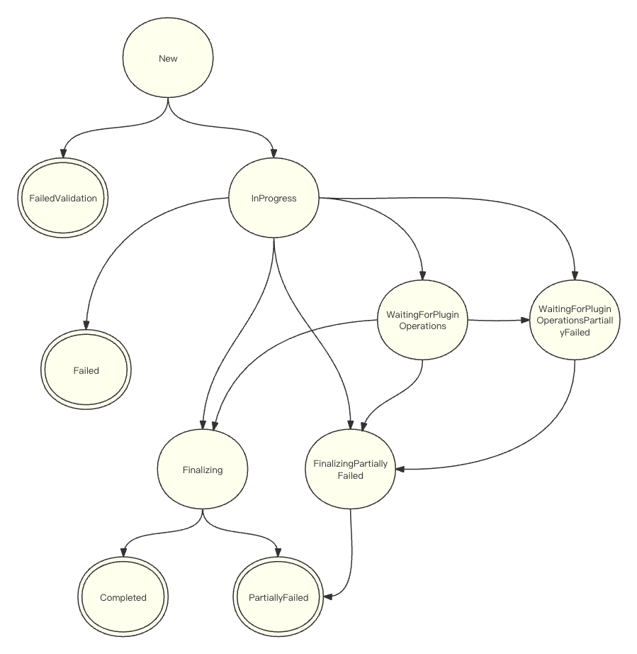

# Design for Adding Finalization Phase in Restore Workflow

## Abstract
This design proposes adding the finalization phase to the restore workflow. The finalization phase would be entered after all item restoration and plugin operations have been completed, similar to the way the backup process proceeds. Its purpose is to perform any wrap-up work necessary before transitioning the restore process to a terminal phase.

## Background
Currently, the restore process enters a terminal phase once all item restoration and plugin operations have been completed. However, there are some wrap-up works that need to be performed after item restoration and plugin operations have been fully executed. There is no suitable opportunity to perform them at present.

To address this, a new finalization phase should be added to the existing restore workflow. in this phase, all plugin operations and item restoration has been fully completed, which provides a clean opportunity to perform any wrap-up work before termination, improving the overall restore process.

Wrap-up tasks in Velero can serve several purposes:
- Post-restore modification - Velero can modify the restored data that was temporarily changed for some purpose but required to be changed back finally or data that was newly created but missing some information. For example, [issue6435](https://github.com/vmware-tanzu/velero/issues/6435) indicates that some custom settings(like labels, reclaim policy) on restored PVs was lost because those restored PVs was newly dynamically provisioned. Velero can address it by patching the PVs' custom settings back in the finalization phase.
- Clean up unused data - Velero can identify and delete any data that are no longer needed after a successful restore in the finalization phase.
- Post-restore validation - Velero can validate the state of restored data and report any errors to help users locate the issue in the finalization phase.

The uses of wrap-up tasks are not limited to these examples. Additional needs may be addressed as they develop over time.

## Goals
- Add the finalization phase and the corresponding controller to restore workflow.

## Non Goals
- Implement the specific wrap-up work.


## High-Level Design
- The finalization phase will be added to current restore workflow. 
- The logic for handling current phase transition in restore and restore operations controller will be modified with the introduction of the finalization phase.
- A new restore finalizer controller will be implemented to handle the finalization phase.

## Detailed Design

### phase transition
Two new phases related to finalization will be added to restore workflow, which are `FinalizingPartiallyFailed` and `Finalizing`. The new phase transition will be similar to backup workflow, proceeding as follow: 



### restore finalizer controller
The new restore finalizer controller will be implemented to watch for restores in `FinalizingPartiallyFailed` and `Finalizing` phases. Any wrap-up work that needs to wait for the completion of item restoration and plugin operations will be executed by this controller, and the phase will be set to either `Completed` or `PartiallyFailed` based on the results of these works. 

Points worth noting about the new restore finalizer controller:

A new structure `finalizerContext` will be created to facilitate the implementation of any wrap-up tasks. It includes all the dependencies the tasks require as well as a function `execute()` to orderly implement task logic. 
```
// finalizerContext includes all the dependencies required by wrap-up tasks
type finalizerContext struct {
    .......
	restore *velerov1api.Restore
	log     logrus.FieldLogger
    .......
}

// execute executes all the wrap-up tasks and return the result
func (ctx *finalizerContext) execute() (results.Result, results.Result) {
    // execute task1
    .......

    // execute task2
    .......

    // the task execution logic will be expanded as new tasks are included
     .......
}

// newFinalizerContext returns a finalizerContext object, the parameters will be added as new tasks are included. 
func newFinalizerContext(restore *velerov1api.Restore, log logrus.FieldLogger, ...) *finalizerContext{
    return &finalizerContext{
       .......
        restore: restore,
        log: log,
        ....... 
    }
}
```
The finalizer controller is responsible for collecting all dependencies and creating a `finalizerContext` object using those dependencies. It then invokes the `execute` function. 
```
func (r *restoreFinalizerReconciler) Reconcile(ctx context.Context, req ctrl.Request) (ctrl.Result, error) {
    ....... 
    
    // collect all dependencies required by wrap-up tasks
    .......

    // create a finalizerContext object and invoke execute()
    finalizerCtx := newFinalizerContext(restore, log, ...)
    warnings, errs := finalizerCtx.execute()

    .......
}

```
After completing all necessary tasks, the result metadata in object storage will be updated if any errors or warnings occur during the execution. This behavior breaks the feature of keeping metadata files in object storage immutable, However, we believe the tradeoff is justified because it provides users with the access to examine the error/warning details when the wrap-up tasks go wrong.

```
// UpdateResults updates the result metadata in object storage if necessary 
func (r *restoreFinalizerReconciler) UpdateResults(restore *api.Restore, newWarnings *results.Result, newErrs *results.Result, backupStore persistence.BackupStore) error {
	originResults, err := backupStore.GetRestoreResults(restore.Name)
	if err != nil {
		return errors.Wrap(err, "error getting restore results")
	}
	warnings := originResults["warnings"]
	errs := originResults["errors"]
	warnings.Merge(newWarnings)
	errs.Merge(newErrs)

	m := map[string]results.Result{
		"warnings": warnings,
		"errors":   errs,
	}
	if err := putResults(restore, m, backupStore); err != nil {
		return errors.Wrap(err, "error putting restore results")
	}

	return nil
}
```

## Compatibility
The new finalization phases are added without modifying the existing phases in the restore workflow. Both new and ongoing restore processes will continue to eventually transition to a terminal phase from any prior phase, ensuring backward compatibility.

## Implementation
This will be implemented during the Velero 1.14 development cycle.
