# Velero Generic Data Path Load Affinity Enhancement Design

## Glossary & Abbreviation

**Velero Generic Data Path (VGDP)**: VGDP is the collective modules that is introduced in [Unified Repository design][1]. Velero uses these modules to finish data transfer for various purposes (i.e., PodVolume backup/restore, Volume Snapshot Data Movement). VGDP modules include uploaders and the backup repository. 

**Exposer**: Exposer is a module that is introduced in [Volume Snapshot Data Movement Design][1]. Velero uses this module to expose the volume snapshots to Velero node-agent pods or node-agent associated pods so as to complete the data movement from the snapshots.

## Background

The implemented [VGDP LoadAffinity design][3] already defined the a structure `LoadAffinity` in `--node-agent-configmap` parameter. The parameter is used to set the affinity of the backupPod of VGDP.

There are still some limitations of this design:
* The affinity setting is global. Say there are two StorageClasses and the underlying storage can only provision volumes to part of the cluster nodes. The supported nodes don't have intersection. Then the affinity will definitely not work in some cases.
* The old design focuses on the backupPod affinity, but the restorePod also needs the affinity setting.

As a result, create this design to address the limitations.

## Goals

- Enhance the node affinity of VGDP instances for volume snapshot data movement: add per StorageClass node affinity.
- Enhance the node affinity of VGDP instances for volume snapshot data movement: support the or logic between affinity selectors.
- Define the behaviors of node affinity of VGDP instances in node-agent for volume snapshot data movement restore, when the PVC restore doesn't require delay binding.

## Non-Goals

- It is also beneficial to support VGDP instances affinity for PodVolume backup/restore, this will be implemented after the PodVolume micro service completes.

## Solution

This design still uses the ConfigMap specified by `velero node-agent` CLI's parameter `--node-agent-configmap` to host the node affinity configurations.

Upon the implemented [VGDP LoadAffinity design][3] introduced `[]*LoadAffinity` structure, this design add a new field `StorageClass`. This field is optional.
* If the `LoadAffinity` element's `StorageClass` doesn't have value, it means this element is applied to global, just as the old design.
* If the `LoadAffinity` element's `StorageClass` has value, it means this element is applied to the VGDP instances' PVCs use the specified StorageClass.
* The `LoadAffinity` element whose `StorageClass` has value has higher priority than the `LoadAffinity` element whose `StorageClass` doesn't have value.


```go
type Configs struct {
    // LoadConcurrency is the config for load concurrency per node.
    LoadConcurrency *LoadConcurrency `json:"loadConcurrency,omitempty"`

    // LoadAffinity is the config for data path load affinity.
    LoadAffinity []*LoadAffinity `json:"loadAffinity,omitempty"`    
}

type LoadAffinity struct {
    // NodeSelector specifies the label selector to match nodes
    NodeSelector metav1.LabelSelector `json:"nodeSelector"`
}
```

``` go
type LoadAffinity struct {
    // NodeSelector specifies the label selector to match nodes
    NodeSelector metav1.LabelSelector `json:"nodeSelector"`

    // StorageClass specifies the VGDPs the LoadAffinity applied to. If the StorageClass doesn't have value, it applies to all. If not, it applies to only the VGDPs that use this StorageClass.
    StorageClass string `json:"storageClass"`
}
```

### Decision Tree

```mermaid
flowchart TD
    A[VGDP Pod Needs Scheduling] --> B{Is this a restore operation?}
    
    B -->|Yes| C{StorageClass has volumeBindingMode: WaitForFirstConsumer?}
    B -->|No| D[Backup Operation]
    
    C -->|Yes| E{restorePVC.ignoreDelayBinding = true?}
    C -->|No| F[StorageClass binding mode: Immediate]
    
    E -->|No| G[Wait for target Pod scheduling<br/>Use Pod's selected node<br/>⚠️ Affinity rules ignored]
    E -->|Yes| H[Apply affinity rules<br/>despite WaitForFirstConsumer]
    
    F --> I{Check StorageClass in loadAffinity by StorageClass field}
    H --> I
    D --> J{Using backupPVC with different StorageClass?}
    
    J -->|Yes| K[Use final StorageClass<br/>for affinity lookup]
    J -->|No| L[Use original PVC StorageClass<br/>for affinity lookup]
    
    K --> I
    L --> I
    
    I -->|StorageClass found| N[Filter the LoadAffinity by <br/>the StorageClass<br/>🎯 and apply the LoadAffinity HIGHEST PRIORITY]
    I -->|StorageClass not found| O{Check loadAffinity element without StorageClass field}

    O -->|No loadAffinity configured| R[No affinity constraints<br/>Schedule on any available node<br/>🌐 DEFAULT]
    
    O --> V[Validate node-agent availability<br/>⚠️ Ensure node-agent pods exist on target nodes]
    N --> V
    
    V --> W{Node-agent available on selected nodes?}
    W -->|Yes| X[✅ VGDP Pod scheduled successfully]
    W -->|No| Y[❌ Pod stays in Pending state<br/>Timeout after 30min<br/>Check node-agent DaemonSet coverage]
    
    R --> Z[Schedule on any node<br/>✅ Basic scheduling]
    
    %% Styling
    classDef successNode fill:#d4edda,stroke:#155724,color:#155724
    classDef warningNode fill:#fff3cd,stroke:#856404,color:#856404
    classDef errorNode fill:#f8d7da,stroke:#721c24,color:#721c24
    classDef priorityHigh fill:#e7f3ff,stroke:#0066cc,color:#0066cc
    classDef priorityMedium fill:#f0f8ff,stroke:#4d94ff,color:#4d94ff
    classDef priorityDefault fill:#f8f9fa,stroke:#6c757d,color:#6c757d
    
    class X,Z successNode
    class G,V,Y warningNode
    class Y errorNode
    class N,T,U priorityHigh
    class P,Q priorityMedium
    class R priorityDefault
```



### Examples

#### LoadAffinity interacts with LoadAffinityPerStorageClass

``` json
{
    "loadAffinity": [
        {
            "nodeSelector": {
                "matchLabels": {
                    "beta.kubernetes.io/instance-type": "Standard_B4ms"
                }
            }
        },
        {
            "nodeSelector": {
                "matchExpressions": [
                    {
                        "key": "kubernetes.io/os",
                        "values": [
                            "linux"
                        ],
                        "operator": "In"
                    }
                ]
            },
            "storageClass": "kibishii-storage-class"
        },
        {
            "nodeSelector": {
                "matchLabels": {
                    "beta.kubernetes.io/instance-type": "Standard_B8ms"
                }
            },
            "storageClass": "kibishii-storage-class"
        }
    ]
}
```

This sample demonstrates how the `loadAffinity` elements with `StorageClass` field and without `StorageClass` field setting work together.
If the VGDP mounting volume is created from StorageClass `kibishii-storage-class`, its pod will run Linux nodes or instance type as `Standard_B8ms`.

The other VGDP instances will run on nodes, which instance type is `Standard_B4ms`.

#### LoadAffinity interacts with BackupPVC

``` json
{
    "loadAffinity": [
        {
            "nodeSelector": {
                "matchLabels": {
                    "beta.kubernetes.io/instance-type": "Standard_B4ms"
                }
            },
            "storageClass": "kibishii-storage-class"
        },
        {
            "nodeSelector": {
                "matchLabels": {
                    "beta.kubernetes.io/instance-type": "Standard_B2ms"
                }
            },
            "storageClass": "worker-storagepolicy"
        }
    ],
    "backupPVC": {
        "kibishii-storage-class": {
            "storageClass": "worker-storagepolicy"
        }
    }
}
```

Velero data mover supports to use different StorageClass to create backupPVC by [design](https://github.com/vmware-tanzu/velero/pull/7982).

In this example, if the backup target PVC's StorageClass is `kibishii-storage-class`, its backupPVC should use StorageClass `worker-storagepolicy`. Because the final StorageClass is `worker-storagepolicy`, the backupPod uses the loadAffinity specified by `loadAffinity`'s elements with `StorageClass` field set to `worker-storagepolicy`. backupPod will be assigned to nodes, which instance type is `Standard_B2ms`.


#### LoadAffinity interacts with RestorePVC

``` json
{
    "loadAffinity": [
        {
            "nodeSelector": {
                "matchLabels": {
                    "beta.kubernetes.io/instance-type": "Standard_B4ms"
                }
            },
            "storageClass": "kibishii-storage-class"
        }
    ],
    "restorePVC": {
        "ignoreDelayBinding": false
    }
}
```

##### StorageClass's bind mode is WaitForFirstConsumer

``` yaml
apiVersion: storage.k8s.io/v1
kind: StorageClass
metadata:
  name: kibishii-storage-class
parameters:
  svStorageClass: worker-storagepolicy
provisioner: csi.vsphere.vmware.com
reclaimPolicy: Delete
volumeBindingMode: WaitForFirstConsumer
```

If restorePVC should be created from StorageClass `kibishii-storage-class`, and it's volumeBindingMode is `WaitForFirstConsumer`.
Although `loadAffinityPerStorageClass` has a section matches the StorageClass, the `ignoreDelayBinding` is set `false`, the Velero exposer will wait until the target Pod scheduled to a node, and returns the node as SelectedNode for the restorePVC.
As a result, the `loadAffinityPerStorageClass` will not take affect.

##### StorageClass's bind mode is Immediate

``` yaml
apiVersion: storage.k8s.io/v1
kind: StorageClass
metadata:
  name: kibishii-storage-class
parameters:
  svStorageClass: worker-storagepolicy
provisioner: csi.vsphere.vmware.com
reclaimPolicy: Delete
volumeBindingMode: Immediate
```

Because the StorageClass volumeBindingMode is `Immediate`, although `ignoreDelayBinding` is set to `false`, restorePVC will not be created according to the target Pod.

The restorePod will be assigned to nodes, which instance type is `Standard_B4ms`.

[1]: Implemented/unified-repo-and-kopia-integration/unified-repo-and-kopia-integration.md
[2]: Implemented/volume-snapshot-data-movement/volume-snapshot-data-movement.md
[3]: Implemented/node-agent-affinity.md