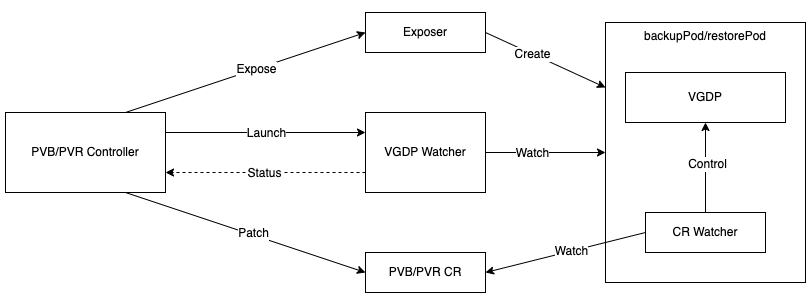

# VGDP Micro Service For fs-backup

## Glossary & Abbreviation

**VGDP**: Velero Generic Data Path. The collective modules that is introduced in [Unified Repository design][1]. Velero uses these modules to finish data transmission for various purposes. It includes uploaders and the backup repository.  
**fs-backup**: Also known as pod volume backup (PVB)/pod volume restore (PVR). It is one of the primary backup methods built-in with Velero. It has been refactored in [Unified Repository design][1].  
**PVB**: Pod Volume Backup, the internal name for backup part of fs-backup.  
**PVR**: Pod Volume Restore, the internal name for restore part of fs-backup.  
**Exposer**: Exposer is introduced in [Volume Snapshot Data Movement design][2] and is used to expose the volume snapshots/volumes for VGDP to access locally.  
**VGDP MS**: VGDP Micro Service, it is introduced in [VGDP Micro Service For Volume Snapshot Data Movement][3]. It hosts VGDP instances in dedicated backup/restore pods, instead of in node-agent pods.   

## Background
As described in [VGDP Micro Service For Volume Snapshot Data Movement][3], hosting VGDP instances in dedicated pods has solved many major problems and brought significant improvements in scalability. These improvements are also effective for fs-backup. And besides the benefits listed in [VGDP Micro Service For Volume Snapshot Data Movement][3], we can also see below ones specifically for fs-backup:
- This enables fs-backup to support Windows workloads. Windows doesn't support propagate mount, so the current fs-backup solution doesn't work for Windows nodes and Windows workloads. However, if the final host-path for the source volume is mounted to the VGDP MS pods, it should work.   
- This enables fs-backup to reuse the existing VGDP features seamlessly, i.e., concurrency control, node selector, etc.

By moving all VGDP instances out of node-agent pods, we would further get prepared for below important features and improvements:
- NFS support: NFS volumes are mounted to VGDP MS pods, so node-agent pods don't need to restart when a new BSL is added.
- Performance improvement for Kopia uploader restore ([#7725][9]): dedicated cache volumes could be mounted to the VGDP MS pods, without affecting node-agent pods.
- Controllable resource usage for node-agent: node-agent pods are long running and so not suitable for data path activities as the OS usually reclaim memory in a lazy reclaim behavior, so the unused memory may be shown as occupied by node-agent pods, which misleads Kubernetes or other related sub system. After this change, node-agent pods no longer require large resource (CPU/memory) usage, so no obvious memory retain will be observed.
- Simplify node-agent configuration: host-path mounts, root user and privileged mode are no longer required by node-agent; and the configuration differences of node-agent for linux and Windows nodes could be eliminated. 

## Goals
- Create a solution to make VGDP instances as micro services for fs-backup
- Modify the fs-backup workflow to offload the VGDP work from node-agent to the VGDP MS
- Create the mechanism for fs-backup to control and monitor the VGDP MS in various scenarios

## Non-Goals
- The current solution covers the VGDP Micro Service for fs-backup itself, the potentional features/improvements that rely on this solution will be covered by further designs and implementations.   


## Overview
The solution is based on [VGDP Micro Service For Volume Snapshot Data Movement][3], the architecture is followed as is and existing components are not changed unless it is necessary.  
Below diagram shows how these components work together:  
  

Below lists the changed components, why and how:  
**Pod-Volume Exposer**: A new exposer, pod-volume exposer is added. It retrieves the host path of the specific volume and then creates the backupPod/restorePod and mounts the host path to the pod. The command of the backupPod/restorePod is also changed to launch VGDP MS for PVB/PVR.  
**PVB/PVR Controller**: The PVB/PVR controllers are refactored to work with podVolume exposer, VGDP-MS, etc. The controllers will also support Cancel and resume. So PVB/PVR CRD is also refactored to support these scenarios.    
**PVB/PVR VGDP-MS**: New commands for PVB/PVR VGDP-MS are added. The VGDP instances are started in the backupPod/restorePod as result of the commands.  

The VGDP Watcher and its mechanism are fully reused.

The [Node-agent concurrency][4] is reused to control the concurrency of VGDP MS for fs-backup. When there are too many volumes in the backup/restore, which takes too much computing resources(CPU, memory, etc.) or Kubernetes resources(pods, PVCs, PVs, etc.), users could set the concurrency in each node so as to control the total number of concurrent VGDP instances in the cluster.  

## Detailed Design
### Exposer
As the old behavior, the host path (e.g., `/var/lib/kubelet/pods`) for the Kubernetes pods are mounted to node-agent pods, then the VGDP instances running in the same pods access the data through subdir of the host path for a specific volume, e.g.,  `/var/lib/kubelet/pods/<pod UID>/volumes/kubernetes.io~csi/<PVC name>/mount`. Therefore, a node-agent pod could access all volumes attached to the same node.  
For the new implementation, the exposer retrieves the host path for a specific volume directly, and then mount that host path to the backupPod/restorePod. This also means that the backupPod/restorePod could only access the volume to be backed up or restored.    

The exposer creates backupPod/restorePod and sets ```velero pod-volume``` as the command run by backupPod/restorePod. And `velero` image is used for the backupPod/restorePod.   
There are sub commands varying from backup and restore:  
```velero pod-volume backup --volume-path xxx --pod-volume-backup xxx --resource-timeout xxx --log-format xxx --log-level xxx```  
Or:  
```velero pod-volume restore --volume-path xxx --pod-volume-restore xxx --resource-timeout xxx --log-format xxx --log-level xxx```  

Below are the parameters of the commands:  
**volume-path**: Deliver the full path inside the backupPod/restorePod for the volume to be backed up/restored.    
**pod-volume-backup**: PVB CR for this backup.  
**pod-volume-restore**: PVR CR for this restore.  
**resource-timeout**: resource-timeout is used to control the timeout for operations related to resources. It has the same meaning with the resource-timeout for node-agent.  
**log-format** and **log-level**: This is to control the behavior of log generation inside VGDP-MS.  

Below pod configurations are inherited from node-agent and set to backupPod/restorePod's spec:
- Volumes: Some configMaps will be mapped as volumes to node-agent, so we add the same volumes of node-agent to the backupPod/restorePod
- Environment Variables
- Security Contexts  

Since the volume data is still accessed by host path, the backupPod/restorePod may still need to run in Privileged mode in some environments. Therefore, the Privileged mode setting which is a part of Security Contexts will be inherited from node-agent.    
The root user is still required, especially by the restore (in order to restore the file system attributes, owners, etc.), so we will use root user for backupPod/restorePod.  

As same as [VGDP Micro Service For Volume Snapshot Data Movement][3], the backupPod/restorePods's ```RestartPolicy``` is set to ```RestartPolicyNever```, so that once VGDP-MS terminates for any reason, backupPod/restorePod won't restart and the PVB/PVR is marked as one of the terminal phases (Completed/Failed/Cancelled) accordingly.  

### VGDP Watcher
The VGDP watcher is fully reused, specifically, we still use the dual mode event watcher to watch the status change from backupPod/restorePod or the VGDP instance.  
The AsyncBR adapter and its interface is also fully reused.  

### VGDP-MS
The VGDP-MS that is represented by ```velero pod-volume``` keeps the same workflow as [VGDP Micro Service For Volume Snapshot Data Movement][3]:  
  

**Start DUCR/DDCR Watcher**: The same as [VGDP Micro Service For Volume Snapshot Data Movement][3], except that it watches PVB/PVR CRs.  
**Wait DUCR/DDCR InProgress**: The same as The same as [VGDP Micro Service For Volume Snapshot Data Movement][3], VGDP-MS won't start the VGDP instance until PVB/PVR CR turns to ```InProgress```.  
**Record VGDP Starts**: The same as [VGDP Micro Service For Volume Snapshot Data Movement][3].  
**VGDP Callbacks**: The same as [VGDP Micro Service For Volume Snapshot Data Movement][3].  
**Record VGDP Ends**: The same as [VGDP Micro Service For Volume Snapshot Data Movement][3].    
**Record VGDP Progress**: The same as [VGDP Micro Service For Volume Snapshot Data Movement][3].  
**Set VGDP Output**: The same as [VGDP Micro Service For Volume Snapshot Data Movement][3].  

The return message for VGDP completion is also reused, except that `VolMode` is always set to `PersistentVolumeFilesystem`:  
```
type BackupResult struct {
    SnapshotID    string              `json:"snapshotID"`
    EmptySnapshot bool                `json:"emptySnapshot"`
    Source        exposer.AccessPoint `json:"source,omitempty"`
}
```
```
type RestoreResult struct {
    Target exposer.AccessPoint `json:"target,omitempty"`
}
```  
``` 
type AccessPoint struct {
    ByPath  string                        `json:"byPath"`
    VolMode uploader.PersistentVolumeMode `json:"volumeMode"`
}
``` 

And the mechanism and data struct for Progress update is also reused:
``` 
type Progress struct {
    TotalBytes int64 `json:"totalBytes,omitempty"`
    BytesDone  int64 `json:"doneBytes,omitempty"`
}
```    

### Log Collection
The log collection mechanism is the same as [VGDP Micro Service For Volume Snapshot Data Movement][3].       

### Resource Control
The resource control mechanism is the same as [VGDP Micro Service For Volume Snapshot Data Movement][3].  

### Restic Restore
As the current Restic path deprecation process, restore is still supported. On the other hand, we don't want to support Restic path for this new VGDP MS implementation.  
Therefore, the legacy PVR controller and workflow is preserved for Restic path restore.  The controller watches legacy PVRs only, and then launches the legacy workflow. Meawhile, the new PVR controller should skip legacy PVRs.  
After Restic path is full deprecated, the code for the legacy controller and workflow should be removed.  

### Velero Server Restarts
The backup/restore stays in InProgress phase during the running of PVB/PVR, no phase changes between completion of item iteration and completion of PVB/PVR.   As a result, on Velero server restarts, there is no way to resume a backup/restore.  
Therefore, the backup/restore will be be marked as Failed, which is the same as the old behavior. And it is still not as good as CSI snapshot data movement for which the backup/restore could be resumed as long as it has iterated all items.  
By the meanwhile, there is indeed some improvements. As the old behavior, once the backup/restore is set as Failed on Velero server restart, the running PVB/PVR will be left there, as a result, the VGDP instances may run for a long time and take lots of resource for nothing; for the new implementation, PVB/PVR will be set as Cancel immediately after the backup/restore is set as Failed.  

### node-agent Restarts
As the old behavior, once a node-agent pod restarts, all the PVBs/PVRs running in the same node will be set as Failed as there is no way to resume the VGDP instances for them.  
For the new implementation, since the VGDP instances run in dedicated backupPods/restorePods without affected, the PVBs/PVRs will be resumed after node-agent restarts. This includes PVBs/PVRs in all phases.  

The legacy PVRs handling Restic restore are processed by the old workflow, so they will still be set as Failed on node-agent restart.  

### Windows Support
Windows nodes and workloads will be supported by following the same changes for CSI snapshot data movement as listed in [Velero Windows Support][7]. There are some additional changes particularly for PVB/PVR.   

#### Restore Helper 
PVR requires an init-container, called `restore-wait`, to run in the workload pod. There are default configurations for the container and users could customize them by the `pod-volume-restore` RIA plugin configMap.
The `pod-volume-restore` RIA is used to config the init-container, so it should support Windows pods for all the configurations.  
Meanwhile, the customized options in the configMap should also support Windows pods. If an option is not suitable for Windows pods, it will be ignored by the RIA.  

By default, the init-container uses `velero` image with a binary called `velero-restore-helper` inside, so that binary should be compiled and assembled to the `velero` image for Windows.  

#### Privileged mode
Privileged pods are implemented by [HostProcess Pods][8] on Windows and need to be specially configured. And there are many constrains for it.  
As one of the constrains, HostProcess pods supports Windows service accounts only. As a result, restore will not be able to support it until [#8423][10] is fixed, otherwise, the restored files are not usable by workloads which run under genneral container users, e.g., `containerUser` or `containerAdministrator`.  
Therefore, as the current implementation, fs-backup will not support Windows workloads in the environments where Privileged mode is required. A limitation should be documented.  

## node-agent
node-agent is required to host the PVB/PVR controller which reconciles PVB/PVR and operates PVB/PVR in other steps before the VGDP instance is started, i.e., Accept, Expose, etc.  
node-agent still requires host path mount because of two deprecating features [in-tree storage provider support deprecation][5] and [emptyDir volume support deprecation][6]. As a result, Privileged mode and root user are still required in some environments. Therefore, we will keep the node-agent deamonset as is, until the two deprecations complete.   

## CRD Changes
In order to support the VGDP MS workflow, some elements in the PVB/PVR CRDs are added or extended:
- New phases are added for PVB/PVR: `PodVolumeBackupPhaseAccepted`, `PodVolumeBackupPhasePrepared`, `PodVolumeBackupPhaseCanceling`, `PodVolumeBackupPhaseCanceled`; `PodVolumeRestorePhaseAccepted`, `PodVolumeRestorePhasePrepared`, `PodVolumeRestorePhaseCanceling`, `PodVolumeRestorePhaseCanceled`.  
- New fields are added to PVB/PVR spec to support cancel: `Cancel bool`
- New fields are added to PVB/PVR spec to support the accept phase and processing: `AcceptedTimestamp *metav1.Time`
- A new field, which records the node the PVR is running, is added to PVR Status: `Node string`

New changes happen to Backup/Restore CRDs.  

Below is the new PVB CRD:
```yaml
apiVersion: apiextensions.k8s.io/v1
kind: CustomResourceDefinition
metadata:
  annotations:
    controller-gen.kubebuilder.io/version: v0.16.5
  name: podvolumebackups.velero.io
spec:
  group: velero.io
  names:
    kind: PodVolumeBackup
    listKind: PodVolumeBackupList
    plural: podvolumebackups
    singular: podvolumebackup
  scope: Namespaced
  versions:
  - additionalPrinterColumns:
    - description: PodVolumeBackup status such as New/InProgress
      jsonPath: .status.phase
      name: Status
      type: string
    - description: Time duration since this PodVolumeBackup was started
      jsonPath: .status.startTimestamp
      name: Started
      type: date
    - description: Completed bytes
      format: int64
      jsonPath: .status.progress.bytesDone
      name: Bytes Done
      type: integer
    - description: Total bytes
      format: int64
      jsonPath: .status.progress.totalBytes
      name: Total Bytes
      type: integer
    - description: Name of the Backup Storage Location where this backup should be
        stored
      jsonPath: .spec.backupStorageLocation
      name: Storage Location
      type: string
    - description: Time duration since this PodVolumeBackup was created
      jsonPath: .metadata.creationTimestamp
      name: Age
      type: date
    - description: Name of the node where the PodVolumeBackup is processed
      jsonPath: .status.node
      name: Node
      type: string
    - description: The type of the uploader to handle data transfer
      jsonPath: .spec.uploaderType
      name: Uploader
      type: string
    name: v1
    schema:
      openAPIV3Schema:
        properties:
          apiVersion:
            description: |-
              APIVersion defines the versioned schema of this representation of an object.
              Servers should convert recognized schemas to the latest internal value, and
              may reject unrecognized values.
              More info: https://git.k8s.io/community/contributors/devel/sig-architecture/api-conventions.md#resources
            type: string
          kind:
            description: |-
              Kind is a string value representing the REST resource this object represents.
              Servers may infer this from the endpoint the client submits requests to.
              Cannot be updated.
              In CamelCase.
              More info: https://git.k8s.io/community/contributors/devel/sig-architecture/api-conventions.md#types-kinds
            type: string
          metadata:
            type: object
          spec:
            description: PodVolumeBackupSpec is the specification for a PodVolumeBackup.
            properties:
              backupStorageLocation:
                description: |-
                  BackupStorageLocation is the name of the backup storage location
                  where the backup repository is stored.
                type: string
              cancel:
                description: |-
                  Cancel indicates request to cancel the ongoing PodVolumeBackup. It can be set
                  when the PodVolumeBackup is in InProgress phase
                type: boolean
              node:
                description: Node is the name of the node that the Pod is running
                  on.
                type: string
              pod:
                description: Pod is a reference to the pod containing the volume to
                  be backed up.
                properties:
                  apiVersion:
                    description: API version of the referent.
                    type: string
                  fieldPath:
                    description: |-
                      If referring to a piece of an object instead of an entire object, this string
                      should contain a valid JSON/Go field access statement, such as desiredState.manifest.containers[2].
                      For example, if the object reference is to a container within a pod, this would take on a value like:
                      "spec.containers{name}" (where "name" refers to the name of the container that triggered
                      the event) or if no container name is specified "spec.containers[2]" (container with
                      index 2 in this pod). This syntax is chosen only to have some well-defined way of
                      referencing a part of an object.
                    type: string
                  kind:
                    description: |-
                      Kind of the referent.
                      More info: https://git.k8s.io/community/contributors/devel/sig-architecture/api-conventions.md#types-kinds
                    type: string
                  name:
                    description: |-
                      Name of the referent.
                      More info: https://kubernetes.io/docs/concepts/overview/working-with-objects/names/#names
                    type: string
                  namespace:
                    description: |-
                      Namespace of the referent.
                      More info: https://kubernetes.io/docs/concepts/overview/working-with-objects/namespaces/
                    type: string
                  resourceVersion:
                    description: |-
                      Specific resourceVersion to which this reference is made, if any.
                      More info: https://git.k8s.io/community/contributors/devel/sig-architecture/api-conventions.md#concurrency-control-and-consistency
                    type: string
                  uid:
                    description: |-
                      UID of the referent.
                      More info: https://kubernetes.io/docs/concepts/overview/working-with-objects/names/#uids
                    type: string
                type: object
                x-kubernetes-map-type: atomic
              repoIdentifier:
                description: RepoIdentifier is the backup repository identifier.
                type: string
              tags:
                additionalProperties:
                  type: string
                description: |-
                  Tags are a map of key-value pairs that should be applied to the
                  volume backup as tags.
                type: object
              uploaderSettings:
                additionalProperties:
                  type: string
                description: |-
                  UploaderSettings are a map of key-value pairs that should be applied to the
                  uploader configuration.
                nullable: true
                type: object
              uploaderType:
                description: UploaderType is the type of the uploader to handle the
                  data transfer.
                enum:
                - kopia
                - ""
                type: string
              volume:
                description: |-
                  Volume is the name of the volume within the Pod to be backed
                  up.
                type: string
            required:
            - backupStorageLocation
            - node
            - pod
            - repoIdentifier
            - volume
            type: object
          status:
            description: PodVolumeBackupStatus is the current status of a PodVolumeBackup.
            properties:
              acceptedTimestamp:
                description: |-
                  AcceptedTimestamp records the time the pod volume backup is to be prepared.
                  The server's time is used for AcceptedTimestamp
                format: date-time
                nullable: true
                type: string
              completionTimestamp:
                description: |-
                  CompletionTimestamp records the time a backup was completed.
                  Completion time is recorded even on failed backups.
                  Completion time is recorded before uploading the backup object.
                  The server's time is used for CompletionTimestamps
                format: date-time
                nullable: true
                type: string
              message:
                description: Message is a message about the pod volume backup's status.
                type: string
              path:
                description: Path is the full path within the controller pod being
                  backed up.
                type: string
              phase:
                description: Phase is the current state of the PodVolumeBackup.
                enum:
                - New
                - Accepted
                - Prepared
                - InProgress
                - Canceling
                - Canceled
                - Completed
                - Failed
                type: string
              progress:
                description: |-
                  Progress holds the total number of bytes of the volume and the current
                  number of backed up bytes. This can be used to display progress information
                  about the backup operation.
                properties:
                  bytesDone:
                    format: int64
                    type: integer
                  totalBytes:
                    format: int64
                    type: integer
                type: object
              snapshotID:
                description: SnapshotID is the identifier for the snapshot of the
                  pod volume.
                type: string
              startTimestamp:
                description: |-
                  StartTimestamp records the time a backup was started.
                  Separate from CreationTimestamp, since that value changes
                  on restores.
                  The server's time is used for StartTimestamps
                format: date-time
                nullable: true
                type: string
            type: object
        type: object
    served: true
    storage: true
    subresources: {}
```

Below is the new PVR CRD:
```yaml
apiVersion: apiextensions.k8s.io/v1
kind: CustomResourceDefinition
metadata:
  annotations:
    controller-gen.kubebuilder.io/version: v0.16.5
  name: podvolumerestores.velero.io
spec:
  group: velero.io
  names:
    kind: PodVolumeRestore
    listKind: PodVolumeRestoreList
    plural: podvolumerestores
    singular: podvolumerestore
  scope: Namespaced
  versions:
  - additionalPrinterColumns:
    - description: PodVolumeRestore status such as New/InProgress
      jsonPath: .status.phase
      name: Status
      type: string
    - description: Time duration since this PodVolumeRestore was started
      jsonPath: .status.startTimestamp
      name: Started
      type: date
    - description: Completed bytes
      format: int64
      jsonPath: .status.progress.bytesDone
      name: Bytes Done
      type: integer
    - description: Total bytes
      format: int64
      jsonPath: .status.progress.totalBytes
      name: Total Bytes
      type: integer
    - description: Name of the Backup Storage Location where the backup data is stored
      jsonPath: .spec.backupStorageLocation
      name: Storage Location
      type: string
    - description: Time duration since this PodVolumeRestore was created
      jsonPath: .metadata.creationTimestamp
      name: Age
      type: date
    - description: Name of the node where the PodVolumeRestore is processed
      jsonPath: .status.node
      name: Node
      type: string
    - description: The type of the uploader to handle data transfer
      jsonPath: .spec.uploaderType
      name: Uploader Type
      type: string
    name: v1
    schema:
      openAPIV3Schema:
        properties:
          apiVersion:
            description: |-
              APIVersion defines the versioned schema of this representation of an object.
              Servers should convert recognized schemas to the latest internal value, and
              may reject unrecognized values.
              More info: https://git.k8s.io/community/contributors/devel/sig-architecture/api-conventions.md#resources
            type: string
          kind:
            description: |-
              Kind is a string value representing the REST resource this object represents.
              Servers may infer this from the endpoint the client submits requests to.
              Cannot be updated.
              In CamelCase.
              More info: https://git.k8s.io/community/contributors/devel/sig-architecture/api-conventions.md#types-kinds
            type: string
          metadata:
            type: object
          spec:
            description: PodVolumeRestoreSpec is the specification for a PodVolumeRestore.
            properties:
              backupStorageLocation:
                description: |-
                  BackupStorageLocation is the name of the backup storage location
                  where the backup repository is stored.
                type: string
              cancel:
                description: |-
                  Cancel indicates request to cancel the ongoing PodVolumeRestore. It can be set
                  when the PodVolumeRestore is in InProgress phase
                type: boolean
              pod:
                description: Pod is a reference to the pod containing the volume to
                  be restored.
                properties:
                  apiVersion:
                    description: API version of the referent.
                    type: string
                  fieldPath:
                    description: |-
                      If referring to a piece of an object instead of an entire object, this string
                      should contain a valid JSON/Go field access statement, such as desiredState.manifest.containers[2].
                      For example, if the object reference is to a container within a pod, this would take on a value like:
                      "spec.containers{name}" (where "name" refers to the name of the container that triggered
                      the event) or if no container name is specified "spec.containers[2]" (container with
                      index 2 in this pod). This syntax is chosen only to have some well-defined way of
                      referencing a part of an object.
                    type: string
                  kind:
                    description: |-
                      Kind of the referent.
                      More info: https://git.k8s.io/community/contributors/devel/sig-architecture/api-conventions.md#types-kinds
                    type: string
                  name:
                    description: |-
                      Name of the referent.
                      More info: https://kubernetes.io/docs/concepts/overview/working-with-objects/names/#names
                    type: string
                  namespace:
                    description: |-
                      Namespace of the referent.
                      More info: https://kubernetes.io/docs/concepts/overview/working-with-objects/namespaces/
                    type: string
                  resourceVersion:
                    description: |-
                      Specific resourceVersion to which this reference is made, if any.
                      More info: https://git.k8s.io/community/contributors/devel/sig-architecture/api-conventions.md#concurrency-control-and-consistency
                    type: string
                  uid:
                    description: |-
                      UID of the referent.
                      More info: https://kubernetes.io/docs/concepts/overview/working-with-objects/names/#uids
                    type: string
                type: object
                x-kubernetes-map-type: atomic
              repoIdentifier:
                description: RepoIdentifier is the backup repository identifier.
                type: string
              snapshotID:
                description: SnapshotID is the ID of the volume snapshot to be restored.
                type: string
              sourceNamespace:
                description: SourceNamespace is the original namespace for namespace
                  mapping.
                type: string
              uploaderSettings:
                additionalProperties:
                  type: string
                description: |-
                  UploaderSettings are a map of key-value pairs that should be applied to the
                  uploader configuration.
                nullable: true
                type: object
              uploaderType:
                description: UploaderType is the type of the uploader to handle the
                  data transfer.
                enum:
                - kopia
                - ""
                type: string
              volume:
                description: Volume is the name of the volume within the Pod to be
                  restored.
                type: string
            required:
            - backupStorageLocation
            - pod
            - repoIdentifier
            - snapshotID
            - sourceNamespace
            - volume
            type: object
          status:
            description: PodVolumeRestoreStatus is the current status of a PodVolumeRestore.
            properties:
              acceptedTimestamp:
                description: |-
                  AcceptedTimestamp records the time the pod volume restore is to be prepared.
                  The server's time is used for AcceptedTimestamp
                format: date-time
                nullable: true
                type: string
              completionTimestamp:
                description: |-
                  CompletionTimestamp records the time a restore was completed.
                  Completion time is recorded even on failed restores.
                  The server's time is used for CompletionTimestamps
                format: date-time
                nullable: true
                type: string
              message:
                description: Message is a message about the pod volume restore's status.
                type: string
              node:
                description: Node is name of the node where the pod volume restore
                  is processed.
                type: string
              phase:
                description: Phase is the current state of the PodVolumeRestore.
                enum:
                - New
                - Accepted
                - Prepared
                - InProgress
                - Canceling
                - Canceled
                - Completed
                - Failed
                type: string
              progress:
                description: |-
                  Progress holds the total number of bytes of the snapshot and the current
                  number of restored bytes. This can be used to display progress information
                  about the restore operation.
                properties:
                  bytesDone:
                    format: int64
                    type: integer
                  totalBytes:
                    format: int64
                    type: integer
                type: object
              startTimestamp:
                description: |-
                  StartTimestamp records the time a restore was started.
                  The server's time is used for StartTimestamps
                format: date-time
                nullable: true
                type: string
            type: object
        type: object
    served: true
    storage: true
    subresources: {}
```

## Installation Changes
No changes to installation, the backupPod/restorePod's configurations are either inherited from node-agent or retrieved from node-agent-configmap.  

## Upgrade
Upgrade is not impacted.  

## CLI
CLI is not changed.


[1]: ../unified-repo-and-kopia-integration/unified-repo-and-kopia-integration.md
[2]: ../volume-snapshot-data-movement/volume-snapshot-data-movement.md
[3]: ../vgdp-micro-service/vgdp-micro-service.md
[4]: ../node-agent-concurrency.md
[5]: https://github.com/vmware-tanzu/velero/issues/8955
[6]: https://github.com/vmware-tanzu/velero/issues/8956
[7]: https://github.com/vmware-tanzu/velero/issues/8289
[8]: https://kubernetes.io/docs/tasks/configure-pod-container/create-hostprocess-pod/
[9]: https://github.com/vmware-tanzu/velero/issues/7725
[10]: https://github.com/vmware-tanzu/velero/issues/8423