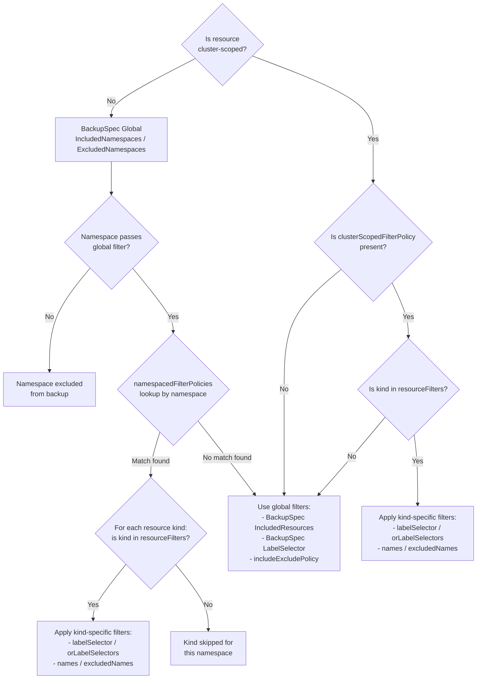

# Fine Grained Backup Filters via Resource Policies

## Glossary & Abbreviation

**Backup Filter**: The mechanism in Velero that determines which Kubernetes resources are collected from the cluster and written into the backup archive. Backup filters currently operate on four dimensions: namespace, resource type, label, and cluster scope.  
**Global Filter**: A filter that applies uniformly across all namespaces in a backup. All existing Velero backup filters are global filters.  
**Namespace-Scoped Filter**: A filter that applies only within specific namespaces, overriding the global filter for those namespaces. This is the capability introduced by this design.  
**ClusterScopedFilterPolicy**: A global filter for cluster-scoped resources that allows per-kind label selectors and name patterns, functioning similarly to `NamespacedFilterPolicy` but applied to cluster-scoped resources globally.  
**Resource Filter**: A filter rule that pairs one or more resource kinds with their own label selector and/or name patterns. Multiple resource filters within a namespace-scoped policy allow different filtering criteria for different resource types.  
**Resource Name Filter**: A filter that matches individual resource instances by their metadata.name, using glob patterns. This is a new filter dimension introduced by this design.  
**Resource Policy**: An existing Velero mechanism where backup behavior rules are defined in a ConfigMap and referenced from `BackupSpec.ResourcePolicy`. Currently used for volume policies and global include/exclude policies.  

## Background

Velero's backup filter system allows users to specify which resources to include or exclude from a backup. The filters operate on three dimensions:

1. **Namespace** — `IncludedNamespaces`/`ExcludedNamespaces` select which namespaces to back up
2. **Resource Type** — `IncludedResources`/`ExcludedResources` (or the newer scoped variants `Included/ExcludedClusterScopedResources`, `Included/ExcludedNamespaceScopedResources`) select which Kubernetes resource types to back up
3. **Labels** — `LabelSelector`/`OrLabelSelectors` filter individual objects by their labels

All three dimensions are applied **globally** — the same resource type filter, the same label selector, and the same namespace list apply uniformly throughout the entire backup operation. Specifically:

- In `item_collector.go`, the `ResourceIncludesExcludes.ShouldInclude()` check is a single global check applied to every resource type across all namespaces.
- In `listResourceByLabelsPerNamespace()`, the same `LabelSelector` is passed to every Kubernetes API list call regardless of namespace.
- There is no mechanism to filter resources by their individual `metadata.name`.

This creates three critical gaps for common backup scenarios:

**Gap 1: Different resource needs per namespace.** When multiple applications share the same cluster, different namespaces often require different backup strategies. For example, a namespace running a database workload may need all resource types backed up, while a namespace running a stateless frontend may only need Deployments, ConfigMaps, and Services. Setting `IncludedResources: [configmaps]` means *all* ConfigMaps in *all* included namespaces — you cannot say "only ConfigMaps in namespace-a but everything in namespace-b."

**Gap 2: Same resource type, different workloads.** Resources of the same type (e.g., ConfigMaps or Secrets) in the same namespace may belong to different workloads. For instance, a namespace may contain `app-config`, `app-secret`, `monitoring-config`, and `monitoring-secret`. Without name-based filtering, you cannot selectively back up only the `app-*` resources — the only option is label-based selection, which requires workloads to have been pre-labeled appropriately.

**Gap 3: Different kinds need different selectors.** Within a single namespace, different resource types may belong to different workloads with different labels. For example, Deployments labeled `app=workload-1` and StatefulSets labeled `app=workload-2` in the same namespace. The current single-label-selector-per-namespace model cannot express this — the label selector applies identically to all resource types.

## Goals

- Extend the `ResourcePolicies` ConfigMap format with a `namespacedFilterPolicies` section that allows per-namespace, per-kind resource filtering with independent label selectors and name patterns for each resource type
- Extend the `ResourcePolicies` ConfigMap format with a `clusterScopedFilterPolicy` section that allows per-kind resource filtering with independent label selectors and name patterns for cluster-scoped resources globally
- Support resource name filtering by glob patterns using the same `gobwas/glob` library that Velero uses for namespace patterns, ensuring consistency across the codebase
- Support per-kind label selectors, so that different resource types within the same namespace can be filtered with different labels
- Maintain full backward compatibility — existing backups with no `namespacedFilterPolicies` behave exactly as they do today
- Define clear precedence rules for how per-namespace filters interact with global filters
- Add corresponding validation within the Resource Policies validation pipeline using existing Velero wildcard validation functions
- Update `velero backup describe` output to display per-namespace filter information when present
- Ensure the restore process works correctly with backups produced by namespace-scoped filters, without requiring restore-side code changes in the initial phase

## Non-Goals

- Adding namespace-scoped filters to `RestoreSpec` or the restore pipeline is not part of the initial implementation. Restore from a namespace-filtered backup works automatically because the restore process reads whatever is in the backup archive. Restore-side namespace filters will be addressed in a follow-up.
- Changing existing `BackupSpec` fields (`IncludedResources`, `LabelSelector`, etc.) or adding new CRD fields is explicitly avoided by this design.
- Supporting regex patterns for resource names is not included. Glob patterns (already used throughout Velero) are sufficient and consistent.
- Modifying the plugin `ResourceSelector` system (`AppliesTo()` / `resolvedAction.ShouldUse()`) is not part of this design.
- CLI flags for inline specification of namespace-scoped filters are not part of the initial implementation. The configuration is expressed in the ResourcePolicy ConfigMap YAML.

## Architecture of Namespace-Scoped Filters

### Configuration Model

The namespace-scoped filters and fine-grained global filters are defined in the same ResourcePolicy ConfigMap that is already referenced by `BackupSpec.ResourcePolicy`. The YAML format is extended with two new top-level keys: `clusterScopedFilterPolicy` and `namespacedFilterPolicies`

```yaml
version: v1
volumePolicies:
  # existing volume policies (unchanged)
  - conditions:
      capacity: "0,100Gi"
    action:
      type: skip
includeExcludePolicy:
  # existing global include/exclude policy (unchanged)
  includedNamespaceScopedResources:
    - configmaps
clusterScopedFilterPolicy:
  # NEW: global overrides for cluster-scoped resources
  resourceFilters:
    - kinds: [ClusterRole, ClusterRoleBinding]
      names: ["my-app-*"]
    - kinds: [CustomResourceDefinition]
      labelSelector:
        app: my-app
namespacedFilterPolicies:
  # NEW: per-namespace filter overrides
  - namespaces:
      - ns-a
    resourceFilters:
      - kinds: [ConfigMap, Secret, Deployment]
        labelSelector:
          app: my-app
  - namespaces:
      - ns-b
    resourceFilters:
      - kinds: [Deployment]
        names: [app-1, app-2]
      - kinds: [ConfigMap]
        labelSelector:
          app: my-service
```

All four sections coexist in the same ConfigMap. They are independent — `volumePolicies` handles volume backup strategy, `includeExcludePolicy` handles global resource type filtering, `clusterScopedFilterPolicy` handles cluster-scoped resource filtering by kind/name/label, and `namespacedFilterPolicies` handles per-namespace, per-kind overrides.

### The `resourceFilters` Model

Each `namespacedFilterPolicies` entry targets one or more namespaces and contains a `resourceFilters` array. Each entry in `resourceFilters` pairs one or more resource kinds with their own label selector and name patterns:

```yaml
namespacedFilterPolicies:
  - namespaces: [ns-a]
    resourceFilters:
      - kinds: [ConfigMap, Secret]        # these kinds share a selector
        labelSelector: {app: my-app}
        names: ["app-*"]
      - kinds: [Deployment]           # this kind has its own selector
        names: [workload-1, workload-2]
      - kinds: [StatefulSet]               # this kind has no extra filtering
```

This model has one way to express filters — there is no ambiguity about how to structure the configuration. Only resource kinds listed in `resourceFilters` entries are included in the backup for the matched namespaces; unlisted kinds are implicitly excluded.

#### Catch-All Resource Filter (Empty `kinds` or `["*"]`)

A `ResourceFilter` entry with an empty (or omitted) `kinds` field, or a field explicitly set to `["*"]`, acts as a **catch-all**. Its `labelSelector` or `orLabelSelectors` (if provided) is applied to **all resource types in the namespace that are not already matched by a kind-specific filter entry**. If no selectors are provided, all unlisted resources are included. Using `["*"]` is highly recommended as it makes the catch-all intention explicit and self-documenting.

**Rules for catch-all entries:**
- At most **one** catch-all entry is allowed per `NamespacedFilterPolicy`.
- `names` and `excludedNames` are **not** supported on catch-all entries. Name patterns are kind-specific by nature and cannot be applied across arbitrary kinds; use kind-specific entries for name-based filtering.
- The catch-all applies to kinds that are **not listed in any other `resourceFilters` entry** in the same policy. Kind-specific entries take precedence over the catch-all.
- A catch-all entry **does not inherit or fall back to `BackupSpec.LabelSelector`**. If a catch-all entry has no `labelSelector`/`orLabelSelectors`, all unlisted resource kinds in the namespace are included with **no label filtering** — the global label selector is not applied. Define a catch-all with an explicit `labelSelector` if label-based filtering is desired for unlisted kinds.

**Evaluation order within a namespace filter policy:**
1. For each resource kind encountered during backup, the system first checks whether a kind-specific `resourceFilters` entry exists for that kind.
2. If a kind-specific entry exists, it is used exclusively (its label selectors and name patterns apply).
3. If no kind-specific entry exists but a catch-all entry is present, the catch-all's `labelSelector`/`orLabelSelectors` is applied to that kind.
4. If neither a kind-specific entry nor a catch-all entry exists, the kind is excluded from the backup for that namespace.

### Filter Precedence Model

The namespace-scoped filter system and fine-grained global filter system layer on top of the existing global filter system. They intentionally behave differently:
- **`namespacedFilterPolicies`** acts as an **exclusive allowlist (boundary)**. Only kinds explicitly listed (or matched by a catch-all) are backed up from that namespace. This gives namespace owners complete and isolated control over their namespace's backup contents, preventing unexpected data spillage from global fallbacks.
- **`clusterScopedFilterPolicy`** acts as a **refinement overlay (tweak)**. Unlisted cluster-scoped kinds fall back to the standard global filters. This allows administrators to selectively adjust filtering for a few specific cluster-scoped kinds without rewriting the entire global inclusion list.

**For Namespace-Scoped Resources:**

The evaluation order is:

1. **Global namespace filter** (`BackupSpec.IncludedNamespaces`/`ExcludedNamespaces`) is checked first. A namespace must pass this filter to be considered at all. `namespacedFilterPolicies` cannot override namespace exclusion — if a namespace is excluded globally, no filter policy entry can bring it back.

2. **Per-namespace filter lookup.** For each namespace that passes the global namespace filter, the system checks whether any `namespacedFilterPolicies` entry matches (by namespace name or glob pattern). If a match is found, the `resourceFilters` array determines what gets backed up for that namespace:
   - Only resource kinds listed in `resourceFilters[].kinds` are included
   - Each kind uses its own `labelSelector`/`orLabelSelectors` (if specified)
   - Each kind uses its own `names`/`excludedNames` patterns (if specified)

3. **Namespaces without a matching filter policy** continue to use the global filters (`BackupSpec.IncludedResources`, `BackupSpec.LabelSelector`, etc., combined with `includeExcludePolicy`) exactly as they do today.

4. **If multiple filter policy entries could match the same namespace** (e.g., `team-*` and `team-frontend-*` both matching `team-frontend-prod`), the **first matching policy in the list** is used. **Important: Place more specific patterns before broader patterns** to achieve the intended filtering behavior.

5. **The `velero.io/exclude-from-backup=true` label** always takes precedence over all filters, regardless of whether the item matches global or per-namespace filters.

6. **Interaction with `includeExcludePolicy`**: `namespacedFilterPolicies` is a **refinement** of the global resource filter system, not a replacement. Global exclusions defined in `includeExcludePolicy` (e.g., `excludedNamespaceScopedResources: [secrets]`) are applied first at the resource-type level before per-namespace filter policies are consulted. A namespace-scoped filter policy cannot re-include a resource kind that has been globally excluded by `includeExcludePolicy`. For example, if `secrets` is listed under `excludedNamespaceScopedResources`, no `Secret` resources will be backed up from any namespace, even if a `namespacedFilterPolicies` entry explicitly lists `Secret` for that namespace. Users who need per-namespace secret selection must remove `secrets` from the global exclusion list.

   To help users catch this misconfiguration early, Velero logs a warning at backup start when a `namespacedFilterPolicies` entry lists a kind that is globally excluded by `includeExcludePolicy`:
   ```
   level=warn msg="namespacedFilterPolicies entry lists a kind that is globally excluded by includeExcludePolicy; the per-namespace filter entry has no effect" kind="secrets" namespacePattern="ns-a"
   ```

**For Cluster-Scoped Resources:**

1. If `clusterScopedFilterPolicy` is present, it acts as a **refinement overlay** over the existing global filters for cluster-scoped resources. It is NOT an exclusive allowlist.
   - To back up cluster-scoped resources in a namespace-filtered backup, you must still explicitly include them via `BackupSpec.IncludedClusterScopedResources`.
   - If a cluster-scoped kind is listed in its `resourceFilters`, its specific `labelSelector`/`orLabelSelectors` and `names`/`excludedNames` patterns are applied.
   - If a cluster-scoped kind is **not listed**, it falls back to the standard global filters (`BackupSpec.LabelSelector`, etc.) and is included in the backup.

2. If `clusterScopedFilterPolicy` is absent, Velero falls back to the existing global filters (`IncludedClusterScopedResources`, `IncludedResources`, `LabelSelector`, etc.) for cluster-scoped resources.

3. **The `velero.io/exclude-from-backup=true` label** always takes precedence over all filters.



### Data Flow in the Backup Pipeline

The existing backup pipeline has two stages: item collection and item backup. Namespace-scoped filters and fine-grained global filters are applied at both stages:

**Stage 1 — Item Collection (`item_collector.go`).** Resources are listed from the Kubernetes API.

- **Resource type check** in `getResourceItems()`: Before iterating namespaces, the global resource type check still applies.
  - **For Cluster-Scoped Resources:** The global resource type check (`ShouldInclude`) determines if the kind is collected. `ClusterScopedFilterPolicy` does not skip unlisted cluster-scoped kinds at this stage.
  - **For Namespace-Scoped Resources:** Within the namespace loop, a per-namespace resource type check is added. If a filter policy matches the current namespace, only resource kinds listed in `resourceFilters[].kinds` are included — if the current resource type is not listed, it is skipped for that namespace.
- **Label selector** in `listResourceByLabelsPerNamespace()` and `listResourceByLabelsGlobally()`: The function looks up the filter policy (either the namespace-specific one or the fine-grained global one). If found, it retrieves the `ResourceFilter` entry for the current resource kind and uses that entry's `labelSelector`/`orLabelSelectors` for the Kubernetes API list call. If no filter policy is found, the global selectors are used as before.

**Stage 2 — Item Backup (`item_backupper.go`).** Collected items are validated and written to the archive.

- **Name pattern check** in `itemInclusionChecks()`: After the existing namespace and resource type re-validation, the item's `metadata.name` is checked against the `ResourceFilter` entry's `names`/`excludedNames` glob patterns for the item's kind (checking the cluster-scoped map for cluster resources and namespace map for namespace resources). If the name doesn't match, the item is excluded.
  - **Important:** If the item's kind is not listed in the namespace filter map **and** there is no catch-all entry, the item passes through Stage 2 without a name check. This is intentional — see [Plugin AdditionalItems and Auto-Backed Up CRDs](#edge-cases-and-behavior-documentation) below.

### Impact on Restore

The restore process (`pkg/restore/restore.go`) is **not modified** in this design. The reason:

- Restore reads the backup archive as-is. Items excluded by namespace-scoped filter policies during backup are simply absent from the archive. The restore process iterates what's in the tarball and applies `RestoreSpec` filters on top. No items excluded during backup will appear during restore.
- Restore plugins that request "additional items" (via `RestoreItemAction`) may reference items excluded from the backup. These items won't be in the archive, so the restore will skip them silently. This is the same behavior that occurs today with any incomplete backup — no new risk is introduced.
- Users can still use `RestoreSpec.IncludedNamespaces` to selectively restore from a namespace-filtered backup.

A follow-up design will add namespace-scoped filters to the restore pipeline.

### Edge Cases and Behavior Documentation

This section documents the system behavior in edge cases and error conditions:

**Plugin AdditionalItems and Auto-Backed Up CRDs:**
Cluster-scoped resources injected dynamically (such as `VolumeSnapshotClass` from the CSI plugin or `CustomResourceDefinition` from Velero's auto-backup loop) do not require hardcoded exceptions. In `itemInclusionChecks()`, Velero natively allows unlisted cluster-scoped resources to pass through unless explicitly excluded by the user. `ClusterScopedFilterPolicy` preserves this permissive behavior: if a dynamically injected cluster-scoped resource is NOT listed in the policy, it passes through untouched. If it IS listed, its specific `names` and `excludedNames` filters are strictly enforced.

**Plugin-injected namespace-scoped additional items** follow the same permissive principle. When a `BackupItemAction` returns additional items whose kind is not listed in the matched `namespacedFilterPolicies` entry and there is no catch-all entry, those items still pass through Stage 2 (`itemInclusionChecks`). This is intentional: blocking plugin-injected items at Stage 2 would break backup completeness — for example, a CSI plugin may inject a `VolumeSnapshotContent` that is required for a correct restore even when the user's filter policy only lists application resource types.

The kind-level exclusion that makes `namespacedFilterPolicies` an exclusive allowlist applies only during **Stage 1** (the primary collection pass in `item_collector.go`). At Stage 2, `itemInclusionChecks` enforces only:
- The `velero.io/exclude-from-backup=true` label (always takes precedence).
- The `names`/`excludedNames` patterns for **listed** kinds.

Plugin-injected items of unlisted kinds are therefore included as long as they are not explicitly excluded by label. Users who need to suppress a specific plugin-injected kind should apply the `velero.io/exclude-from-backup=true` label to those resources.

**Multiple Glob Patterns Matching Same Namespace (Incorrect Order):**
```yaml
namespacedFilterPolicies:
  - namespaces: ["team-*"]           # Broader pattern listed first
    resourceFilters: 
      - kinds: [Deployment, Service]
  - namespaces: ["team-frontend-*"]  # More specific pattern listed second
    resourceFilters:
      - kinds: [ConfigMap, Secret, Deployment, Service]
```
**Behavior:** For namespace `team-frontend-prod`, the broader `team-*` pattern matches first, so only `Deployment` and `Service` are backed up. The more specific `team-frontend-*` rule is never reached.

**Multiple Glob Patterns Matching Same Namespace (Correct Order):**
```yaml
namespacedFilterPolicies:
  - namespaces: ["team-frontend-*"]  # More specific pattern listed first
    resourceFilters:
      - kinds: [ConfigMap, Secret, Deployment, Service]
  - namespaces: ["team-*"]           # Broader pattern listed second
    resourceFilters: 
      - kinds: [Deployment, Service]
```
**Behavior:** For namespace `team-frontend-prod`, the specific `team-frontend-*` pattern matches first, backing up all specified resources. For `team-backend-dev`, the broader `team-*` pattern matches, backing up only `Deployment` and `Service`. This achieves the intended behavior.

**Namespace Included Globally But No Matching Filter Policy:**
```yaml
# BackupSpec includes "production" namespace
# ResourcePolicy has no namespacedFilterPolicies entry for "production"
```
**Behavior:** The namespace uses global filters exactly as it does today. This is the backward compatibility behavior — only namespaces with explicit filter policies get namespace-scoped filtering.


**Empty ResourceFilters Array:**
```yaml
namespacedFilterPolicies:
  - namespaces: ["test-namespace"]
    resourceFilters: []  # empty array
```
**Behavior:** Validation error during backup creation:
```
namespacedFilterPolicies[0]: at least one resourceFilter must be specified
```

**Namespace Pattern with No Matches:**
```yaml
namespacedFilterPolicies:
  - namespaces: ["nonexistent-*"]
    resourceFilters: [...]
```
**Behavior:** No error. The filter policy is loaded but never applied since no namespaces match the pattern. This allows for conditional filtering based on namespace existence.

**Resource Kind Not Present in Target Namespaces:**
```yaml
resourceFilters:
  - kinds: ["StatefulSet"]  # namespace has no StatefulSets
    names: ["workload-1"]
```
**Behavior:** No error. The filter is applied but finds no matching resources. Empty result set is valid.

**Conflicting Name Patterns:**
```yaml
resourceFilters:
  - kinds: ["ConfigMap"]
    names: ["app-*"]
    excludedNames: ["app-config"]  # conflicts with names pattern
```
**Behavior:** The `excludedNames` takes precedence. Resources matching `app-*` are included, then `app-config` is excluded. Net result: includes `app-secret`, `app-data`, etc., but excludes `app-config`.

**Invalid Label Selector Syntax:**
```yaml
resourceFilters:
  - kinds: ["Pod"]
    labelSelector:
      "invalid label key!": "value"  # invalid key syntax
```
**Behavior:** Validation error during backup creation when `labels.SelectorFromSet()` fails:
```
namespacedFilterPolicies[0].resourceFilters[0]: invalid label selector: "invalid label key!" is not a valid label key
```

**Out-of-Scope Kinds in Filter Entries:**
A user may accidentally list a cluster-scoped kind (e.g., `ClusterRole`) inside a `namespacedFilterPolicies` entry, or a namespace-scoped kind (e.g., `ConfigMap`) inside `clusterScopedFilterPolicy`. The system silently ignores such entries at the Kubernetes API level — namespace-scoped items are never listed globally, and cluster-scoped items are never listed per-namespace, so no matching resources will ever be found. A warning is logged at backup start to help the user detect the misconfiguration. No validation error is raised — the entry is harmless but ineffective.

**Discovery Helper Unavailable:**
If the discovery helper is completely unavailable during backup initialization, the backup fails with:
```
failed to resolve namespace filter policies: discovery client unavailable
```
This is consistent with how other discovery-dependent features handle this error condition.

# Detailed Design

## ResourceFilter Field Notes

**`labelSelector`** supports equality-based selectors only (`key=value`). Set-based requirements (e.g., `environment in (prod, staging)`) are not supported. To match resources with any of several label combinations, use `orLabelSelectors` with multiple maps — each map is AND-evaluated internally, and the maps are OR-evaluated across the list. `labelSelector` and `orLabelSelectors` cannot co-exist in the same entry.

**`names` / `excludedNames`** accept exact resource names or glob patterns. If `names` is empty, all resource names are included (subject to label filters). `excludedNames` takes precedence over `names` when a name matches both.

## Validation

**Validation functions for `namespacedFilterPolicies`:**

1. **Each filter policy must specify at least one namespace:**
   ```
   namespacedFilterPolicies[N]: at least one namespace must be specified
   ```

2. **Each filter policy must specify at least one resource filter:**
   ```
   namespacedFilterPolicies[N]: at least one resourceFilter must be specified
   ```

3. **Each resource filter without kinds can only be defined once, and cannot specify names/excludedNames.**
   ```
   namespacedFilterPolicies[N]: only one resource filter with empty kinds is allowed
   namespacedFilterPolicies[N].resourceFilters[M]: names or excludedNames cannot be specified when kinds is empty
   ```

4. **No duplicate kinds across resource filter entries** within the same namespace filter:
   ```
   namespacedFilterPolicies[N]: kind "Pod" appears in both resourceFilters[0] and resourceFilters[2]
   ```

5. **`labelSelector` and `orLabelSelectors` mutual exclusion** within each resource filter:
   ```
   namespacedFilterPolicies[N].resourceFilters[M]: labelSelector and orLabelSelectors cannot co-exist
   ```

6. **No duplicate namespace patterns across filter policies.** This validates only exact duplicates - runtime behavior handles overlapping patterns.

   **Rationale:** Detecting all possible pattern overlaps (like `team-*` vs `team-frontend-*`) is computationally complex and may reject valid configurations. Instead, the runtime uses first-match semantics - the first matching filter policy in the list is applied. This allows users flexibility while preventing obvious configuration errors.

7. **Namespace patterns must be valid globs.**

8. **Resource name patterns must be valid globs.**

9. **Resource kind validation with discovery helper** (performed during backup initialization).

**Validation functions for `clusterScopedFilterPolicy`:**

1. **At least one resourceFilter must be specified.**
   ```
   clusterScopedFilterPolicy: at least one resourceFilter must be specified
   ```

2. **No duplicate kinds across resource filters.**

3. **`labelSelector` and `orLabelSelectors` mutual exclusion.**

4. **Resource name patterns must be valid globs.**

Additionally, in `backup_controller.go`, a validation check ensures that `namespacedFilterPolicies` and `clusterScopedFilterPolicy` are not used with old-style resource filters (`IncludedResources`/`ExcludedResources`/`IncludeClusterResources`), similar to the existing check for `includeExcludePolicy`.

## ConfigMap Examples

### Per-Namespace Resource Type Filtering

Back up only ConfigMaps, Secrets, and Deployments (with label `app=my-app`) from `ns-a`, but everything from `ns-b`:

```yaml
apiVersion: v1
kind: ConfigMap
metadata:
  name: backup-filter-policy
  namespace: velero
data:
  policy: |
    version: v1
    namespacedFilterPolicies:
      - namespaces:
          - ns-a
        resourceFilters:
          - kinds: [ConfigMap, Secret, Deployment]
            labelSelector:
              app: my-app
      # ns-b has no filter policy entry, so global filters apply (include everything)
```

Backup CR referencing it:

```yaml
apiVersion: velero.io/v1
kind: Backup
metadata:
  name: selective-backup
  namespace: velero
spec:
  includedNamespaces:
    - ns-a
    - ns-b
  resourcePolicy:
    kind: configmap
    name: backup-filter-policy
  storageLocation: default
  ttl: 720h0m0s
```

### Per-Kind Label Selectors (Different Labels per Kind)

Back up Deployments with one label and StatefulSets with a different label from the same namespace:

```yaml
apiVersion: v1
kind: ConfigMap
metadata:
  name: vm-filter-policy
  namespace: velero
data:
  policy: |
    version: v1
    namespacedFilterPolicies:
      - namespaces:
          - target-namespace
        resourceFilters:
          - kinds: [Deployment]
            labelSelector:
              app: production-workload-1
          - kinds: [StatefulSet]
            labelSelector:
              app: production-workload-2
```

### Per-Kind Exact Names

Back up specific Deployments, Configmaps, and Secrets by name:

```yaml
apiVersion: v1
kind: ConfigMap
metadata:
  name: named-resource-filter
  namespace: velero
data:
  policy: |
    version: v1
    namespacedFilterPolicies:
      - namespaces:
          - target-namespace
        resourceFilters:
          - kinds: [Deployment]
            names: [workload-1, workload-2]
          - kinds: [ConfigMap]
            names: [p1, p2]
          - kinds: [Secret]
            names: [c1, c2]
```

### Name Pattern Filtering with Exclusion

Back up only `app-*` ConfigMaps and Secrets from `production`, excluding temporary and debug resources:

```yaml
apiVersion: v1
kind: ConfigMap
metadata:
  name: app-config-filter-policy
  namespace: velero
data:
  policy: |
    version: v1
    namespacedFilterPolicies:
      - namespaces:
          - production
        resourceFilters:
          - kinds: [ConfigMap, Secret]
            names: ["app-*"]
            excludedNames: ["*-tmp", "*-debug"]
```

### Catch-All with No Label Selector (Override-Only)

A user may want to use the global configuration for 99% of resources in a namespace, but only apply a specific name filter to a single kind. To achieve this without explicitly listing all other kinds or adding dummy labels, a catch-all filter without a label selector can be used:

```yaml
apiVersion: v1
kind: ConfigMap
metadata:
  name: override-only-filter-policy
  namespace: velero
data:
  policy: |
    version: v1
    namespacedFilterPolicies:
      - namespaces:
          - ns-a
        resourceFilters:
          - kinds: [Secret]
            names: [my-secret]     # Specific override for Secrets
          - kinds: ["*"]           # Catch-all: NO label selector
            # Includes all other kinds unconditionally
```

**Result:**
- `Secret` resources: only `my-secret` is backed up.
- All other resource types: backed up unconditionally (acting like a global fallback).

### Catch-All Label Selector (Back Up Everything with a Specific Label)

When a user wants to back up any resource type in a namespace that carries a particular label — without enumerating every kind — the catch-all entry (empty `kinds` or `["*"]`) achieves this with a single rule:

```yaml
apiVersion: v1
kind: ConfigMap
metadata:
  name: label-based-filter-policy
  namespace: velero
data:
  policy: |
    version: v1
    namespacedFilterPolicies:
      - namespaces:
          - production
        resourceFilters:
          - kinds: ["*"]          # catch-all: applies to every kind not listed below
            labelSelector:
              backup: "true"     # back up any resource carrying this label
```

**Result:** Every resource type in `production` that has the label `backup=true` is backed up. Resources without that label are excluded. No kind enumeration is required.

### Catch-All with Per-Kind Name Overrides

A more advanced pattern: use exact names for specific kinds and fall back to a label selector for all remaining kinds. Kind-specific entries take precedence over the catch-all:

```yaml
apiVersion: v1
kind: ConfigMap
metadata:
  name: mixed-filter-policy
  namespace: velero
data:
  policy: |
    version: v1
    namespacedFilterPolicies:
      - namespaces:
          - production
        resourceFilters:
          - kinds: [Deployment]
            names: [api-server, worker]        # these exact Deployments by name
          - kinds: [Secret]
            names: [db-credentials, tls-cert]  # these exact Secrets by name
          - kinds: ["*"]                        # catch-all for all other kinds
            labelSelector:
              backup: "true"                   # back up by label
```

**Result:**
- `Deployment` resources: only `api-server` and `worker` are backed up (name filter; the catch-all does not apply).
- `Secret` resources: only `db-credentials` and `tls-cert` are backed up (name filter; the catch-all does not apply).
- All other resource types (ConfigMap, StatefulSet, Service, etc.): backed up only if they carry `backup=true`.

This pattern is useful when certain high-value resources need precise name-based selection, while the rest of the namespace is covered by a label convention.

### Glob Namespace Patterns and Ordering

Apply filters to namespaces matching patterns. **Critical: Order patterns from most specific to least specific:**

```yaml
apiVersion: v1
kind: ConfigMap
metadata:
  name: team-filter-policy
  namespace: velero
data:
  policy: |
    version: v1
    namespacedFilterPolicies:
      # More specific patterns first
      - namespaces:
          - "team-frontend-prod"      # Most specific (exact match)
        resourceFilters:
          - kinds: [Deployment, Service, ConfigMap, Secret, PVC]
      - namespaces:
          - "team-frontend-*"         # Less specific (pattern match)
        resourceFilters:
          - kinds: [Deployment, Service, ConfigMap]
      - namespaces:
          - "team-*"                  # Least specific (broad pattern)
        resourceFilters:
          - kinds: [Deployment, Service]
```

**Pattern Matching Results:**
- `team-frontend-prod` → Uses exact match policy (backs up 5 resource types)
- `team-frontend-dev` → Uses `team-frontend-*` policy (backs up 3 resource types)  
- `team-backend-test` → Uses `team-*` policy (backs up 2 resource types)
- `app-namespace` → No match, uses global filters

### Combined with Volume Policies

Both volume policies and namespace-scoped filters in the same ConfigMap:

```yaml
apiVersion: v1
kind: ConfigMap
metadata:
  name: combined-policy
  namespace: velero
data:
  policy: |
    version: v1
    volumePolicies:
      - conditions:
          capacity: "0,10Gi"
          storageClass:
            - standard
        action:
          type: fs-backup
      - conditions:
          capacity: "10Gi,100Gi"
        action:
          type: snapshot
    namespacedFilterPolicies:
      - namespaces:
          - production
        resourceFilters:
          - kinds: [Deployment]
            names: [workload-1, workload-2]
          - kinds: [StatefulSet]
            labelSelector:
              app: my-app
          - kinds: [ConfigMap, Secret]
            names: ["app-*"]
            excludedNames: ["*-tmp", "*-debug"]
```

### Backup CR — No ResourcePolicy (backward compatible)

Existing backups continue to work exactly as before:

```yaml
apiVersion: velero.io/v1
kind: Backup
metadata:
  name: full-backup
  namespace: velero
spec:
  includedNamespaces:
    - "*"
  includedResources:
    - "*"
  labelSelector:
    matchLabels:
      backup: "true"
  storageLocation: default
```

## CLI

### `velero backup describe`

The output is extended to display namespace-scoped filter policies when present in the ResourcePolicy ConfigMap:

```
Name:         selective-backup
Namespace:    velero
Labels:       <none>
Annotations:  <none>

Phase:  Completed

Errors:    0
Warnings:  0

Namespaces:
  Included:  ns-a, ns-b
  Excluded:  <none>

Resources:
  Included:        *
  Excluded:        <none>
  Cluster-scoped:  auto

Label selector:  <none>

Resource Policy:  backup-filter-policy

Namespace-Scoped Filter Policies:
  ns-a:
    Resource Filters:
      ConfigMap, Secret, Deployment:
        Label selector:     app=my-app
        Included names:     <none>
        Excluded names:     <none>
  target-namespace:
    Resource Filters:
      Deployment:
        Label selector:     app=production-workload-1
        Included names:     <none>
        Excluded names:     <none>
      StatefulSet:
        Label selector:     app=production-workload-2
        Included names:     <none>
        Excluded names:     <none>
  production:
    Resource Filters:
      Deployment:
        Label selector:     <none>
        Included names:     [api-server, worker]
        Excluded names:     <none>
      <catch-all> (all other kinds):
        Label selector:     backup=true
        Included names:     <none>
        Excluded names:     <none>

Fine-Grained Global Filter Policy:
  Resource Filters:
    ClusterRole, ClusterRoleBinding:
      Label selector:     <none>
      Included names:     [my-app-*]
      Excluded names:     <none>
    CustomResourceDefinition:
      Label selector:     app=my-app
      Included names:     <none>
      Excluded names:     <none>

Storage Location:  default

...
```

### `velero backup create`

No new CLI flags are added. The namespace-scoped filter policies are specified in the ResourcePolicy ConfigMap, which is already referenced via the existing `--resource-policies-configmap` flag:

```bash
velero backup create selective-backup \
  --include-namespaces ns-a,ns-b \
  --resource-policies-configmap backup-filter-policy
```

The `--help` output for `velero backup create` is updated to clarify the interaction between global and namespace-scoped filters:

```
Backup Filtering Options:
  --include-namespaces stringArray                    namespaces to include in the backup (use '*' for all namespaces)
  --exclude-namespaces stringArray                    namespaces to exclude from the backup
  --include-resources stringArray                     resources to include in the backup, formatted as resource.group
  --exclude-resources stringArray                     resources to exclude from the backup, formatted as resource.group
  --include-cluster-resources optionalBool[=true]     include cluster-scoped resources
  --exclude-cluster-resources                         exclude cluster-scoped resources
  --selector labelSelector                            only back up resources matching this label selector
  --or-selector labelSelector                         back up resources matching any of the label selectors (can be repeated)
  --resource-policies-configmap string                reference to a configmap containing resource policies for volume snapshots and namespace-scoped filtering

Notes:
- Global filters (--include-resources, --selector, etc.) apply to all included namespaces
- Namespace-scoped filters defined in --resource-policies-configmap override global filters for matching namespaces
- Fine-grained global filter policies defined in --resource-policies-configmap override global filters for cluster-scoped resources
- Use 'velero backup describe' to view resolved filter policies after backup creation
```

### CLI Integration Points

**Backup Creation Workflow:**
1. User creates ResourcePolicy ConfigMap with `namespacedFilterPolicies`
2. User references ConfigMap via `--resource-policies-configmap` flag
3. Backup controller validates policies during backup initialization
4. Validation errors are reported immediately with specific line/field references

**Help and Discovery:**
- `velero backup create --help` includes updated filtering documentation
- `velero backup describe` shows resolved filter policies for troubleshooting
- Validation errors include ConfigMap field references for easy debugging

**Configuration Discovery:**
- `velero backup create --help` includes namespace-scoped filtering documentation
- `velero backup describe` shows resolved filter policies for verification

## User Perspective

This design provides fine-grained, per-namespace, per-kind control over backup filtering. Key user-facing aspects:

- **For users not using namespace-scoped filter policies**: Zero changes. All existing backups and workflows continue to work identically. The new YAML key is optional.
- **For users adopting namespace-scoped filter policies**: Create a ConfigMap with the `namespacedFilterPolicies` section and reference it via `BackupSpec.ResourcePolicy` (or the existing `--resource-policies-configmap` flag). The backup will selectively include/exclude resources per namespace based on the filter rules.
- **For users already using ResourcePolicy for volume policies**: Add the `namespacedFilterPolicies` section to the same ConfigMap. Both volume policies and namespace-scoped filters coexist.
- **For restore from a namespace-filtered backup**: No changes to restore workflow. Restore processes whatever is in the archive. Users can use existing `RestoreSpec.IncludedNamespaces` for additional filtering at restore time.
- **`velero backup describe` output**: Extended to show per-namespace, per-kind filter details when the ResourcePolicy ConfigMap contains `namespacedFilterPolicies`.
- **Validation errors**: Reported at backup start when the ResourcePolicy ConfigMap contains invalid `namespacedFilterPolicies` configurations. Consistent with how volume policy validation errors are reported today.

## Alternatives Considered

1. **CRD-Based `NamespacedFilters` Field**: Add `NamespacedFilters []NamespaceFilter` directly to `BackupSpec`. Rejected for this iteration due to heavy CRD change overhead. The ResourcePolicy approach achieves the same functionality with less API surface change.

2. **Flat Fields on NamespacedFilterPolicy (No Per-Kind Selectors)**: Use flat fields (`includedResources`, `labelSelector`, `includedResourceNames`) shared across all kinds within a namespace. Rejected because it cannot express per-kind label selectors or per-kind name lists — a critical requirement for workloads where different resource types have different labels or naming conventions.

3. **Scoped Label Selectors Only**: Augment existing label selectors with an optional namespace scope. Rejected because it only addresses label-scoped filtering and does not support per-namespace resource type filtering or name filtering.

4. **Global Name Filter Only**: Add only global name filter fields. Rejected because it only addresses name filtering globally and does not address namespace-scoped or kind-scoped filtering.

5. **Separate ConfigMap for Namespace Filters**: Use a new `BackupSpec` field pointing to a different ConfigMap (separate from volume policies). Rejected because it adds a new CRD field (which has similar reasons with #1) and splits configuration across multiple ConfigMaps.
