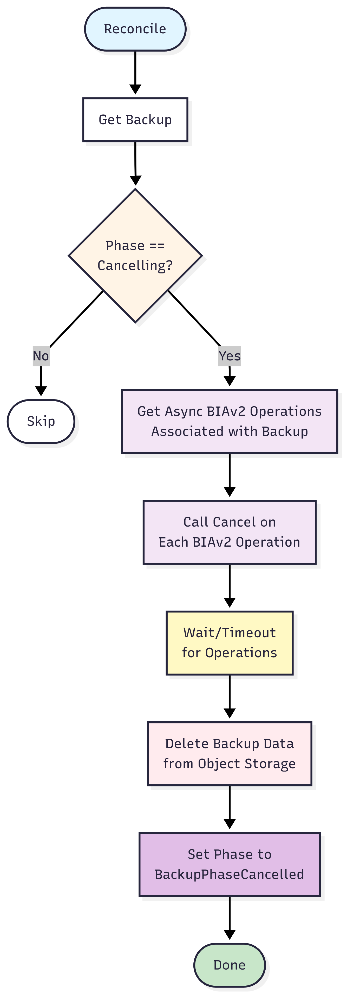

# Backup Cancellation Design

## Abstract
- This proposal introduces user-initiated backup cancellation functionality to Velero, allowing users to abort running backups through a new `cancel` field in the backup specification
    > backup.Spec.Cancel

- The design addresses GitHub issues [#9189](https://github.com/vmware-tanzu/velero/issues/9189
) and [#2098](https://github.com/vmware-tanzu/velero/issues/2098)
    - It is currently not possible to delete an in-progress backup: the deletion controller blocks it
    - Cancellation flow would allow this to happen

## Background
- Currently, Velero lacks the ability to cancel running backups, leading to several critical issues

- When users accidentally submit broad backup jobs (e.g., forgot to narrow resource selectors), the system becomes blocked and scheduled jobs accumulate

- Additionally, the backup deletion controller prevents running backups from being deleted

## Goals
- Enable users to cancel running backups through a `cancel` field in the backup specification

- Cleanly cancel all associated async operations (BackupItemAction operations, DataUploads)

- Delete backup data on 
    - object storage, 
    - csi native snapshots, 
    - backup tarball etc

    while keeping backup logs and backup associated data for inspection

- Provide clear backup phase transitions (WaitingForPluginOperations → Cancelling → Cancelled)

## Non Goals
- Cancelling backups that have already completed or failed

- Implementing cancellation for restore operations (future work)

## High-Level Design
- The solution introduces a new `cancel` boolean field to the backup specification that users can set to `true` to request cancellation
- The backup request will also have a `cancel` and `LastCancelCheck` fields

- Extend the backup request struct to include:
    - `Cancel` (bool): reflects whether cancellation has been requested.
    - `LastCancelCheck` (timestamp): records the last time cancellation status was checked.

- Cancellation check logic:
    1. If `LastCancelCheck` is zero, set it to the current time and continue as usual.
    2. If more than a configured interval (e.g., 1–3 seconds) has passed since `LastCancelCheck`:
        - Update `LastCancelCheck` to now.
        - Retrieve the latest backup object from the API.
        - Set `request.Cancel` to the current value of `backup.Spec.Cancel`.
    3. Always use the current value of `request.Cancel` to determine if cancellation is requested.

If backup processing is concurrent (multi-threaded), protect access to `request.Cancel` and `LastCancelCheck` with read/write mutexes to avoid race conditions.

- The points of detection for cancellation are
    - `backup_controller` -> `BackupWithResolver`
        - When each item is processed we run the cancel check logic
        - If true, exit processing
        - Find and cancel Pod Volume Backups associated with the backup using their cancel spec field
        - Transition to `PhaseBackupCancelling`

    - `backup_operations_controller` 
        - Transition to `PhaseBackupCancelling`

    - `backup_finalizer_controller` 
        - Transition to `PhaseBackupCancelling`

    - `backup_cancellation_controller` 
        - Call cancel func on BIAv2 operations
        - Delete backup data (subset of ops done in `backup_deletion_controller`)
        - We keep the backup resource and logs for inspection

## Detailed Design

ItemBlocks (Items) - No cancelling, just skip once we see cancel
PodVolumeBackups - Get and set spec to cancel, BackupWithResolvers waits for them to resolve before returning
Volume Snapshots 
    - Native: Synchronous, cannot do anything specific
    - CSI: async op, can call cancel on BIAv2 in backup_cancellation_controller
Async Ops - Call BIA.Cancel and a timeout 

Working backwards from most progressed to least progressed backups,

**backup_finalizer_controller**

At this point backup is almost done
Transition to `PhaseBackupCancelling`
- Finalizing does some metrics calls, could duplicate these in `backup_cancellation_controller`

**backup_operations_controller**

This is polling every 10 seconds to check progress of async BIA ops
Transition to `PhaseBackupCancelling`
- We will need to duplicate the way `backup_operations_controller` gets async ops in `backup_cancellation_controller`

**backup_controller**

Handles new backups, and so multiple points where detection could occur
- If before `BackupWithResolvers` is called
    - Nothing has happened, Transition to `PhaseBackupCancelling`
    - Nothing to cancel or delete
- Within `BackupWithResolvers`
    - Every `Item` processed for `ItemBlocks` will have a check as mentioned before
    - If true, we break out of the loop
        - Find Pod Volume Backup resources and cancel them (should this be moved to backup cancellation controller)
    - Native snapshots cannot be cancelled, synchronous
    - CSI snapshots are BIAv2, will be part of async ops
- After `BackupWithResolvers`
    - Transition to `PhaseBackupCancelling`

**backup_cancellation_controller**

Handles backups in `BackupPhaseCancelling`

- Find async ops associated with backup, call cancel on them
- Wait for some time, then proceed
- Delete backup data

When done, sets to `BackupPhaseCancelled`

**backup_deletion_controller**

Will now handle backups in Phase `BackupPhaseCancelled` when a `BackupDeleteRequest` is created for it

Delete as usual (Conflicts with deletions caused by `backup_cancellation_controller`?)

How will a `BackupDeleteRequest` start cancellation flow and come back (backoff and retry)

### Cancellation Flow

## Alternatives Considered

### Alternative 1: Deletion-Based Cancellation
Using backup deletion as the cancellation mechanism instead of a cancel field.
This was rejected because it doesn't allow users to preserve the backup object for inspection after cancellation, and deletion has different semantic meaning.

### Alternative 2: Timeout-Based Automatic Cancellation
Automatically cancelling backups after a configurable timeout.
This was considered out of scope for the initial implementation as it addresses a different use case than user-initiated cancellation.

## Security Considerations
The cancel field requires the same RBAC permissions as updating other backup specification fields.
No additional security considerations are introduced as the cancellation mechanism reuses existing operation cancellation pathways that are already secured.

## Compatibility
The new `cancel` field is optional and defaults to nil/false, ensuring backward compatibility with existing backup specifications.
Existing backups will continue to work without modification.
The new backup phases (`Cancelling`, `Cancelled`) are additive and don't affect existing phase transitions.

**Future Work**:

- Replacing logic that blocks deletion of in-progress backups with the cancellation flow, followed by usual deletion for a terminal phase (Cancelled)

