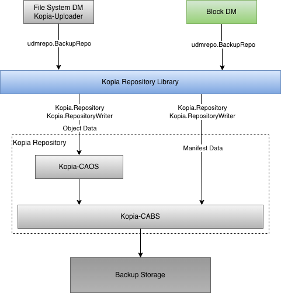
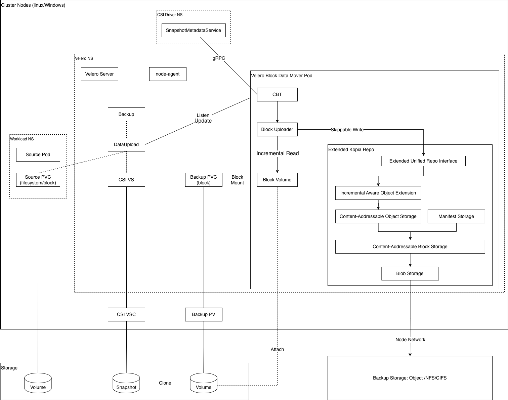
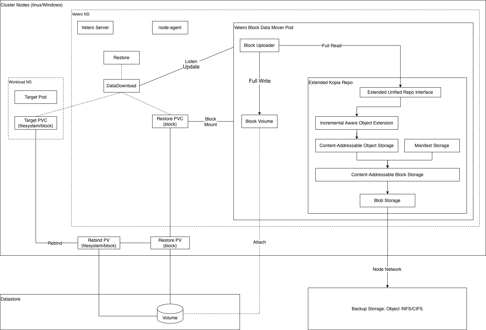
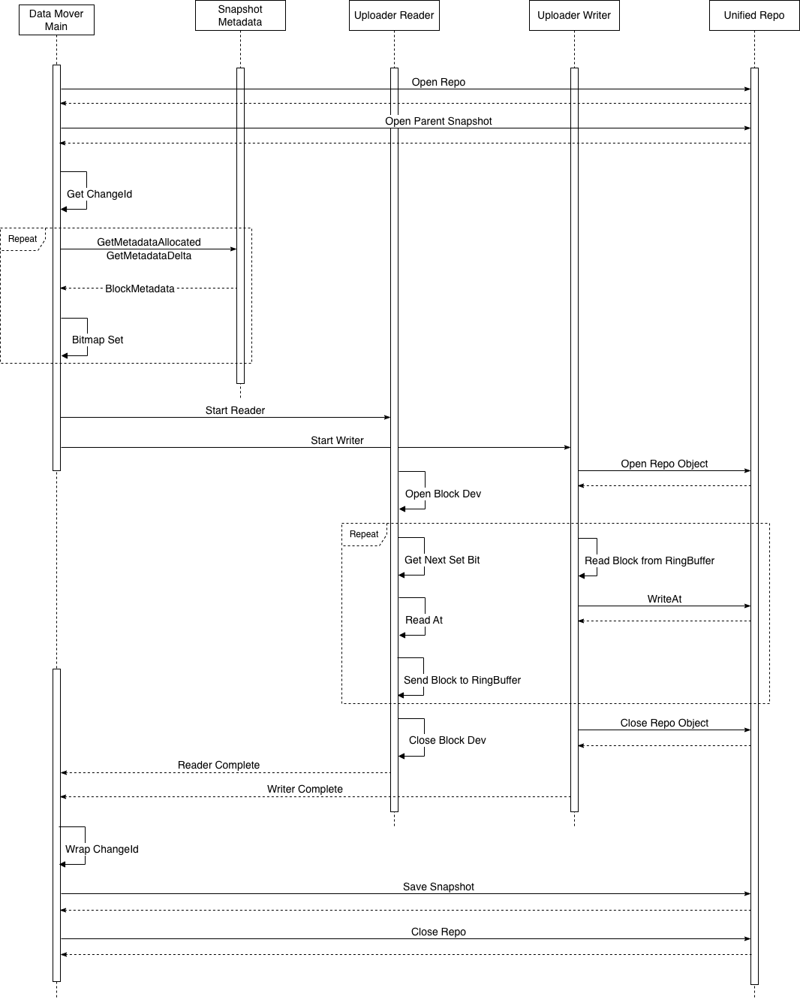
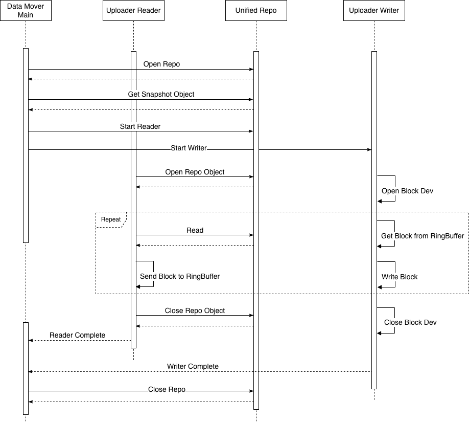
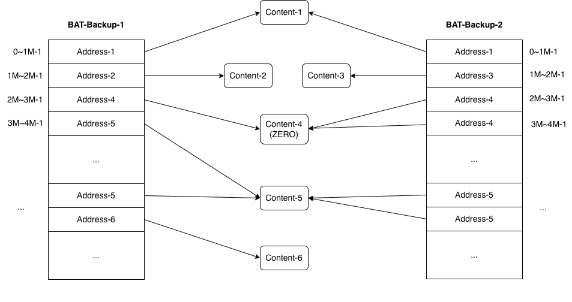

# Block Data Mover Design

## Glossary & Abbreviation

**Backup Storage**: The storage to store the backup data. Check [Unified Repository design][1] for details.  
**Backup Repository**: Backup repository is layered between BR data movers and Backup Storage to provide BR related features that is introduced in [Unified Repository design][1].  
**Velero Generic Data Path (VGDP)**: VGDP is the collective of modules that is introduced in [Unified Repository design][1]. Velero uses these modules to finish data transfer for various purposes (i.e., PodVolume backup/restore, Volume Snapshot Data Movement). VGDP modules include uploaders and the backup repository.  
**Velero Built-in Data Mover (VBDM)**: VBDM, which is introduced in [Volume Snapshot Data Movement design][2] and [Unified Repository design][1], is the built-in data mover shipped along with Velero, it includes Velero data mover controllers and VGDP.  
**Data Mover Pods**: Intermediate pods which hold VGDP and complete the data transfer. See [VGDP Micro Service for Volume Snapshot Data Movement][3] for details.   
**Change Block Tracking (CBT)**: CBT is the mechanism to track changed blocks, so that backups could back up the changed data only. CBT usually provides by the comupting/storage plateform.  
**TCO**: Total Cost of Ownership. This is a general criteria for products/solutions, but also means a lot for BR solutions. For example, this means what kind of backup storage (and its cost) it requires, the retention policy of backup copies, the ways to remove backup data redundancy, etc.  

## Background
At present, [CSI Snapshot Data Movement][2] which is implemented by VBDM, ships a file system uploader, so the backup/restore is done from file system only.  
However, once possible, block level backup/restore is better than file system level backup/restore:  
- Block level backup could leverage CBT to process minimual size of data so significantly reduce the overhead to network, backup repository and backup storage. As a result, TCO is significantly reduced.
- Block level backup/restore is performant in throughput and resource consumption, because it doesn't need to handle the complexity of the file system, especially for the case that huge number of small files in the file system.
- Block level backup/restore is less OS dependent because the uploader doesn't need the OS to be aware of the file system in the volume.

At present, [Kubernetes CBT API][4] is mature and close to Beta stage. Many plateform/storage has supported/is going to support it.  

Therefore, it is very important for Velero to deliver the block level backup/restore and recommend users to use it over the file system data mover as long as:  
- The volume is backed by block storage so block level access is possible
- The plateform supports CBT

Meanwhile, file system data mover is still valuable for below scenarios:
- The volume is backed by file storage, e.g., AWS EFS, Azure File, CephFS, VKS File Volume, etc.
- The volume is backed by block storage but CBT is not available
- The volume doesn't support CSI snapshot, so Velero fs-backup method is used

There are rich features delivered with VGDP, VBDM and [VGDP micro service][3], to reuse these features, block data mover should be built based on these modules.  

Velero VBDM supports linux and Windows nodes, however, Windows container doesn't support block mode volumes, so backing up/restoring from Windows nodes is not supported until Windows container removes this limitation. As a result, if there are both linux and Windows nodes in the cluster, block data mover can only run in linux nodes.  

## Goals

Add a block data mover to VBDM and support block level backup/restore for [CSI Snapshot Data Movement][2], which includes:  
- Support block level full backup for both `FileSystem` and `Block` mode volumes
- Support block level incremental backup for both `FileSystem` and `Block` mode volumes
- Support block level restore from full/incremental backup for both `FileSystem` and `Block` mode volumes
- Support block level backup/restore for both linux and Windows workloads
- Support all existing features, i.e., load concurrency, node selection, cache volume, deduplication, compression, encryption, etc. for the block data mover

## Non-Goals

- fs-backup does the backup/restore from file system level only, so block level backup/restore is not supported  
- Volumes that are backed by file system storages, can only be backed up/restored from file system level, so block level backup/restore is not supported
- Backing up/restoring from Windows nodes is not supported
- Block level incremental backup requires special capabilities of the backup repository, and Velero [Unified Repository][1] supports multiple kinds of backup repositories. The current design focus on Kopia repository only, block level incremental backup support of other repositories will be considered when the specific backup repository is integrated to [Velero Unified Repository][1]

## Architecture

### Data Path

Below shows the architecture of VGDP when integrating to Unified Repository (implemented by Kopia repository).  
A new block data mover will be added besides the existing file system data mover, the both data movers read/write data from/to the same backup repository through Unified Repo interface.  
Unified Repo interface and the backup repository needs to be enhanced to support incremental backups.  

 

### Backup

Below is the architecture for block data mover backup which is developed based on the existing VBDM:  



Below are the major changes based on the existing VBDM:  
**Exposer**: Exposer needs to create block mode backupPVC all the time regardless of the sourcePVC mode.   
**CBT**: This is a new layer to retrieve, transform and store the changed blocks, it interacts with CSI SnapshotMetadataService through gRPC.  
**Uploader**: A new block uploader is added. It interacts with CBT layer, holds special logics to make performant data read from block devices and holds special logics to write incremental data to Unified Repository.  
**Extended Kopia repo**: A new Incremental Aware Object Extension is added to Kopia's CAOS, so as to support incremental data write.  

### Restore

Below is architecture for block data mover restore which is developed based on the existing VBDM:    



Below are the major changes based on the existing VBDM:  
**Exposer**: While the restorePV is in block mode, exposer needs to rebind the restorePV to a targetPVC in either file system mode or block mode.    
**Uploader**: The same block uploader holds special logics to make performant data write to block devices and holds special logics to read  data from the backup chain in Unified repository.  

## Detailed Design

### Selectable Data Mover Type
At present, the backup accepts a `DataMover` parameter and when its value is empty or `velero`, VBDM is used.  
After block data mover is introduced, VBDM will have two types of data movers, Velero file system data mover and Velero block data mover.  
A new type string `velero-block` is introduced for Velero block data mover, that is, when `DataMover` is set as `velero-block`, Velero block data mover is used.  
Another new value `velero-fs` is introduced for Velero file system data mover, that is, when `DataMover` is set as `velero-fs`, Velero file system data mover is used.  
For backwards compatibility consideration, `velero` is preserved a valid value, it refers to the default data mover, and the default data mover may change among releases.  
When `DataMover` is empty or `velero`, the default data mover is used. At present, Velero file system data mover is the default data mover; we can change the default one to Velero block data mover in future releases.  

### Controllers
Backup controller and Restore controller are kept as is, async operations are still used to interact with VBDM with block data mover.  
DataUpload controller and DataDownload controller are almost kpet as is, with some minor changes to handle the data mover type and backup type appropriately and convey it to the exposers. With [VGDP Micro Service][3], the controllers are almost isolated from VGDP, so no major changes are required.  

### Exposer

#### CSI Snapshot Exposer
The existing CSI Snapshot Exposer is reused with some changes to decide the backupPVC volume mode by access mode. Specifically, for Velero block data mover, access mode is always `Block`, so the backupPVC volume mode is always `Block`.  
Once the backupPVC is created with correct volume mode, the existing code could create the backupPod and mount the backupPVC appropriately.  

#### Generic Restore Exposer
The existing Generic Restore Exposer is reused, but the workflow needs some changes.  
For block data mover, the restorePV is in Block mode all the time, whereas, the targetPVC may be in either file system mode or block mode.  
However, Kubernetes doesn't allow to bound a PV to a PVC with mismatch volume mode.  

Therefore, the workflow of ***Finish Volume Readiness*** as introduced in [Volume Snapshot Data Movement design][2] is changed as below:
- When restore completes and restorePV is created, set restorePV's `deletionPolicy` to `Retain`
- Create another rebindPV and copy restorePV's `volumeHandle`
- Delete restorePV
- Set the rebindPV's claim reference (the ```claimRef``` filed) to targetPVC
- Add the ```velero.io/dynamic-pv-restore``` label to the rebindPV

In this way, the targetPVC will be bound immediately by Kubernetes to rebindPV.   

These changes work for file system data mover as well, so the old workflow will be replaced, only the new workflow is kept.   

### VGDP

Below is the VGDP workflow during backup:  



Below is the VGDP workflow during restore:  



#### Unified Repo
For block data mover, one Unified Repo Object is created for each volume, and some metadata is also saved into Unified Repo to describe the volume.  
During the backup, the write conducts a skippable-write manner:
- For the data range that the write does not skip, object is written with the real data
- For the data range that is skipped, the data is either filled as ZERO or cloned from the parent object. Specifically, for a full backup, data is filled as ZERO; for an incremental backup, data is cloned from the parent object

To support incremental backup, `ObjectWriter` interface needs to extend to support `io.WriterAt`, so that uploader could conduct a skippable-write manner:
```go
type ObjectWriter interface {
	io.WriteCloser
	io.WriterAt

	// Seeker is used in the cases that the object is not written sequentially
	io.Seeker

	// Checkpoint is periodically called to preserve the state of data written to the repo so far.
	// Checkpoint returns a unified identifier that represent the current state.
	// An empty ID could be returned on success if the backup repository doesn't support this.
	Checkpoint() (ID, error)

	// Result waits for the completion of the object write.
	// Result returns the object's unified identifier after the write completes.
	Result() (ID, error)
}
```

To clone data from parent object, the caller needs to specify the parent object. To support this, `ObjectWriteOptions` is extended with `ParentObject`.  
The existing `AccessMode` could be used to indicate the data access type, either file system or block:  

```go
// ObjectWriteOptions defines the options when creating an object for write
type ObjectWriteOptions struct {
	FullPath     string 	// Full logical path of the object
	DataType     int    	// OBJECT_DATA_TYPE_*
	Description  string 	// A description of the object, could be empty
	Prefix       ID     	// A prefix of the name used to save the object
	AccessMode   int    	// OBJECT_DATA_ACCESS_*
	BackupMode   int    	// OBJECT_DATA_BACKUP_*
	AsyncWrites  int    	// Num of async writes for the object, 0 means no async write
	ParentObject ID     	// the parent object based on which incremental write will be done
}
```

To support non-Kopia uploader to save snapshots to Unified Repo, snapshot related methods will be added to `BackupRepo` interface:
```go
	// SaveSnapshot saves a repo snapshot
	SaveSnapshot(ctx context.Context, snapshot Snapshot) (ID, error)

	// GetSnapshot returns a repo snapshot from snapshot ID
	GetSnapshot(ctx context.Context, id ID) (Snapshot, error)

	// DeleteSnapshot deletes a repo snapshot
	DeleteSnapshot(ctx context.Context, id ID) error

	// ListSnapshot lists all snapshots in repo for the given source (if specified)
	ListSnapshot(ctx context.Context, source string) ([]Snapshot, error)
```

To support non-Kopia uploader to save metadata, which is used to describe the the backed up objects, some metadata related methods will be added to `BackupRepo` interface:
```go
	// WriteMetadata writes metadata to the repo, metadata is used to describe data, e.g., file system
	// dirs are saved as metadata
	WriteMetadata(ctx context.Context, meta *Metadata, opt ObjectWriteOptions) (ID, error)

	// ReadMetadata reads a metadata from repo by the metadata's object ID
	ReadMetadata(ctx context.Context, id ID) (*Metadata, error)
```

kopia-lib for Unified Repo will implement these interfaces by calling the corresponding Kopia repository functions.  

### Kopia Repository
CAOS of Kopia repository implements Unfied Repo's Objects. However, CAOS supports full and sequential write only.  
To make it support skippable write, a new Incremental Aware Object Extension is created based on the existing CAOS.  

#### Block Address Table
Kopia CAOS uses Block Address Table (BAT) to track objects. It will be reused for both full backups and incremental backups.  

 

For Incremental Aware Object Extension, one object represents one volume.  
For full backup, the skipped areas will be written as all ZERO by Incremental Aware Object Extension, since Kopia repository's interface doesn't support skippable write. But it is fine, the ZERO data will be deduplicated by Kopia repository so nothing is actually written to the backup storage.  
For incremental backup, Incremental Aware Object Extension clones the table entries from the parent object for the skipped areas; for the written area, Incremental Aware Object Extension writes the data to Kopia repository and generate new entries. Finally, Incremental Aware Object Extension generates a new block address table for the incremental object which covers its entire logical space.  

Incremental Aware Object Extension is automatically activated for block mode data access as set by `AccessMode` of `ObjectWriteOptions`.  

#### Deduplication
The Incremental Aware Object Extension uses fix-sized splitter for deduplication, this is good enough for block level backup, reasons:
- Not like a file, a disk write never inserts data to the middle of the disk, it only does in-place update or append. So the data never shifts between two disks or the same disk of two different backups
- File system IO to disk general aligned to a specific size, e.g., 4KB for NTFS and ext4, as long as the chunk size is a multiply of this size, it effectively reduces the case that one IO kills two deduplication chunks
- For the usage cases that the disk is used as raw block device without a file system, the IO is still conducted by aligning to a specific boundary

The chunk size is intentionally chosen as 1MB, reasons:
- 1MB is a multiply of 4KB for file systems or common block sizes for raw block device usages
- 1MB is the start boundary of partitions for modern operating systems, for both MBR and GPT, so partition metadata could be isolated to a separate chunk
- The more chunks are there, the more indexes in the repository, 1MB is a modreate value regarding to the overhead of indexes for Kopia repository

#### Benefits
Since the existing block address table(BAT) of CAOS is reused and kept as is, it brings below benefits:
- All the entries are still managed by Kopia CAOS, so Velero doesn't need to keep an extra data
- The objects written by Velero block uploader is still recgnozible by Kopia, for both full backup and incremental backup
- The existing data management in Kopia repository still works for objects generated by Velero block uploader, e.g., snapshot GC, repository maintenance, etc.

Most importantly, this solution is super perfromant:
- During incremental write, it doesn't copy any data from the parent object, instead, it only clones object block address entries
- During backup deletion, it doesn't need to move any data, it only deletes the BAT for the object  

#### Uploader behavior
The block uploader's skippable write must also be aligned to this 1MB boundary, because Incremental Aware Object Extension needs to clone the entries that have been skipped from the parent object.   
File system uploader is still using variable-sized deduplication, it is fine to keep data from the two uploaders into the same Kopia repository, though normally they won't be mutrally deduplicated.  
Volume could be resized; and volume size may not be aligned to 1MB boundary. The uploader need to handle the resize appropriately since Incremental Aware Object Extension cannot copy a BAT entry partially.  

#### CBT Layer
CBT provides below functionalities:
1. For a full backup, it provides the allocated data ranges. E.g., for a 1TB volume, there may be only 1MB of files, with this functionality, the uploader could skip the ranges without real data
2. For an incremental backup, it provides the changed data ranges based on the provided parent snapshot. In this way, the uploader could skip the unchanged data and achieves an incremental backup

For case 1, the uploader calls Unfied Repo Object's `WriteAt` method with the offset for the allocated data, ranges ahead of the offset will be filled as ZERO by unified repository.  
For case 2, the uploader calls Unfied Repo Object's `WriteAt` method with the offset for the changed data, ranges ahead of the offset will be cloned from the parent object unified repository.  

A changeId is stored with each backup, the next backup will retrieve the parent snapshot's changeId and use it to retrieve the CBT.  

The CBT retrieved from Kubernetes API are a list of `BlockMetadata`, each of range could be with fixed size or variable size.  
Block uploader needs to maintain its own granularity that is friendly to its backup repository and uploader, as mentioned above.  

From Kubernetes API, `GetMetadataAllocated` or `GetMetadataDelta` are called looply until all `BlockMetadata` are retrieved.  
On the other hand, considering the complexity in uploader, e.g., multiple stream between read and write, the workflow should be driven by the uploader instead of the CBT iterator, therefore, in practice, all the allocated/changed blocks should be retrieved and preserved before passing it to the uploader.  

As another fact, directly saving `BlockMetadata` list will be memory consuming.  

With all the above considerations, the `Bitmap` data structure is used to save the allocated/changed blocks, calling CBT Bitmap.  
CBT Bitmap chunk size could be set as 1MB or a multiply of it, but a larger chunk size would amplify the backup size, so 1MB size will be use.  

Finally, interactions among CSI Snapshot Metadata Service, CBT Layer and Uploader is like below:  

 

In this way, CBT layer and uploader are decoupled and CBT bitmap plays as a north bound parameter of the uploader.  

#### Block Uploader
Block uploader consists of the reader and writer which are running asynchronously.  
During backup, reader reads data from the block device and also refers to CBT Bitmap for allocated/changed blocks; writer writes data to the Unified Repo.
During restore, reader reads data from the Unified Repo; writer writes data to the block device.  
Reader and writer connects by a ring buffer, that is, reader pushs the block data to the ring buffer and writer gets data from the ring buffer and write to the target.  

To improve performance, block device is opened with direct IO, so that no data is going through the system cache unnecessarily.  

Uploader implementation is OS dependent, but since Windows container doesn't support block volumes, the current implementation is for linux only.  

#### ChangeId
ChangeId identifies the base that CBT is generated from, it must strictly map to the parent snapshot in the repository. Otherwise, there will be data corruption in the incremental backup.  
Therefore, ChangeId is saved together with the repository snapshot.  
The data mover always queries parent snapshot from Unified Repo together with the ChangeId. In this way, no mismatch would happen.  
Inside the uploader, the upper layer (DataUpload controller) could also provide the ChangeId as a mechanism of double confirmation. The received ChangeId would be re-evaluated against the one in the provided snapshot.    

#### Incremental Size
By the end of the backup, incremental size is also returned by the uploader, as same as Velero file system uploader. The size indicates how much data are unquie so processed by the uploader, based on the provided CBT.  

### Fallback to Full Backup
There are some occasions that the incremental backup won't continue, so the data mover fallbacks to full backup:
- `GetMetadataAllocated` or `GetMetadataDelta` returns error
- ChangeId is missing
- Parent snapshot is missing

### Volume Size Change
Incremental backup could continue when volume is resized.  
Block uploader supports to write disk with arbibrary size.  
When volume resize happens, block uploader needs to handle it appropriately in below ways:
- The new boundary should always be Max(oldSize, newSize)
- Always rewrite the tail between RoundDownTo1M(newSize) and newSize  

That is to say, the tail must be rewrite since Incremental Aware Object Extension cannot copy BAT entries halfly for the incremental backup.  

### Cancellation
The existing Cancellation mechanism is reused, so there is no change outside of the block uploader.  
Inside the uploader, cancellation checkpoints are embedded to the uploader reader and writer, so that the execution could quit in a reasonable time once cancellation happens.  

### Parallelism
Parallelism among data movers will reuse the existing mechanism --- load concurrency.  
Inside the data mover, uploader reader and writer are always running in parallel. The number of reader and writer is always 1.  
Sequaltial read/write of the volume is always optimized, there is no prove that multiple readers/writers are beneficial.  

### Progress Report
Progress report outside of the data mover will reuse the existing mechanism.  
Innside the data mover, progress update is embedded to the uploader writer.  
The progress struct is kept as is, Velero block data mover still supports `TotalBytes` and `BytesDone`:
```go
type Progress struct {
	TotalBytes int64 `json:"totalBytes,omitempty"`
	BytesDone  int64 `json:"doneBytes,omitempty"`
}
``` 

### Selectable Backup Type
For many reasons, a periodical full backup is required:  
- From user experience, a periodical full is required to make sure the data integrity among the incremental backups, e.g., every 1 week or 1 month

Therefore, backup type (full/incremental) should be supported in Velero's manual backup and backup schedule.  
Backup type will also be added to `volumeInfo.json` to support observability purposes.  

Backup TTL is still used for users to specify a backup's retention time. By default, both full and incremetnal backups are with 30 days retention, even though this is not so reasonable for the full backups. This could be enhanced when Velero supports sophisticated retention policy.  
As a workaround, users could create two schedules for the same scope of backup, one is for full backups, with less frequency and longer backup TTL; the other one is for incremental backups, with normal frequency and shorter backup TTL.  

#### File System Data Mover
At present, Velero file system data mover doesn't support selectable backup type, instead, incremental backups are always conducted once possible.  
From user experience this is not reasonable.  

Therefore, to solve this problem and to make it align with Velero block data mover, Velero file system data mover will support backup type as well.  

At present, the data path for Velero file system data mover has already supported it, we only need to expose this functionality to users.  

### Data Mover Selection
At present, in the Backup CRD, there is a `DataMover` field for users to specify the data mover to be used. This field will be kept, once it is set, all the data movements in the backup will use the specified data mover.  

However, this is not enough. In one backup, users may include volumes backed by both block storage and file system storage.  
To meet this requirement, VolumePolicy will be enhanced to support the `DataMover` action.  

The selected data mover for each volume should be updated to `volumeInfo.json`.  

### Backup Describe
Backup type should be added to backup description, this value could be retrieved from `volumeInfo.json`.  
The `DataMover` item in the existing backup description should be updated to reflect the actual data mover completing the backup, this information could be retrieved from `volumeInfo.json`.  

### Backup Sync
No more data is required for sync, so Backup Sync is kept as is.  

### Backup Deletion
As mentioned above, no data is moved when deleting a repo snapshot for Velero block data mover, so Backup Deletion is kept as is.  

### Restarts
Restarts mechanism is reused without any change.  

### Logging
Logging mechanism is not changed.  

### Backup CRD
A `backupType` field is added to Backup CRD, three values are supported `""`, `full` or `incremental`.  
`full` indicates the data mover to take a full backup.  
`""` fallbacks to `incremental` which indicates the data mover to take an incremental backup.  

```yaml
          spec:
            description: BackupSpec defines the specification for a Velero backup.
            properties:
              backupType:
                description: BackupType indicates the type of the backup
                enum:
                - full
                - incremental
                - ""
                type: string
```

### DataUpload CRD
A `parentSnapshot` field is added to the DataUpload CRD, below values are supported:  
- `""`: it fallbacks to `auto`
- `auto`: it means the data mover finds the recent snapshot of the same volume from Unified Repository and use it as the parent
- `none`: it means the data mover is not assigned with a parent snapshot, so it runs a full backup
- a specific snapshotID: it means the data mover use the specific snapshotID to find the parent snapshot. If it cannot be found, the data mover fallbacks to a full backup

The last option is for a backup plan, it will not be used for now and may be useful when Velero supports sophisticated retention policy. This means, Velero always finds the recent backup as the parent.  

When `backupType` of the Backup is `full`, the data mover controller sets `none` to `parentSnapshot` of DataUpload.  
When `backupType` of the Backup is `incremental`, the data mover controller sets `auto` to `parentSnapshot` of DataUpload. And `""` is just kept for backwards compatibility consideration.  

```yaml
          spec:
            description: DataUploadSpec is the specification for a DataUpload.
            properties:
              parentSnapshot:
                description: |-
                  ParentSnapshot specifies the parent snapshot that current backup is based on.
                  If its value is "" or "auto", the data mover finds the recent backup of the same volume as parent.
                  If its value is "none", the data mover will do a full backup
                  If its value is a specific snapshotID, the data mover finds the specific snapshot as parent.
                type: string
```

### DataDownload CRD
No change is required to DataDownload CRD.  

## Plugin Data Movers
The current design doesn't break anything for plugin data movers.  
The enhancement in VolumePolicy could also be used for plugin data movers. That is, users could select a plugin data mover through VolumePolicy as same as Velero built-in data movers.  

## Installation
No change to Installation.  

## Upgrade
No impacts to Upgrade. The new fields in the CRDs are all optional fields and have backwards compatible values.  

## CLI
Backup type parameter is added to Velero CLI as below:
```
velero backup create --full
velero schedule create --full
```
When the parameter is not specified, by default, Velero goes with incremental backups.  


[1]: Implemented/unified-repo-and-kopia-integration/unified-repo-and-kopia-integration.md
[2]: Implemented/volume-snapshot-data-movement/volume-snapshot-data-movement.md
[3]: Implemented/vgdp-micro-service/vgdp-micro-service.md
[4]: https://kubernetes.io/blog/2025/09/25/csi-changed-block-tracking/