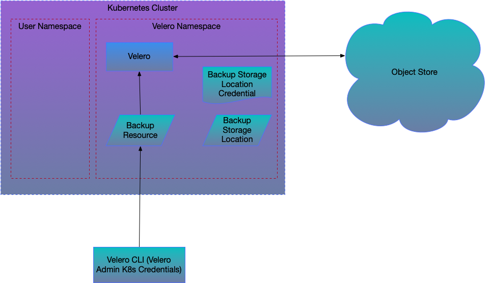
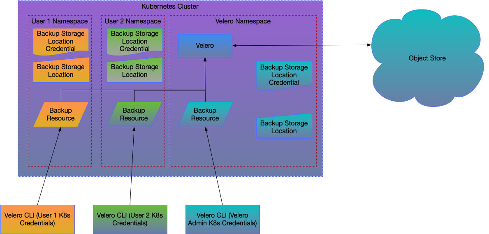

# Namespace scoped Multi-Tenancy design proposal
## Overview
Velero currently will backup anything within the cluster when a Backup resource is written into the
`velero` namespace.  A common pattern for Kubernetes is to allow multi-tenancy on a per-namespace basis,
given users/groups the permission to work with only a single namespace inside a cluster and maintaining
isolation between namespaces.  We would like to enable users to backup and restore their own namespaces
but not be able to affect other namespaces or backups taken by other users.

## Goals
* Enable per-namespace self-service backup/restore
* Provide the same level of isolation as Kubernetes RBAC control on the namespace
* Provide as many of the existing Velero features as possible in the multi-tenancy case
* Continue to support multiple Velero instances running in a cluster

## Design overview
Velero's security model is based around the ability to read and write resources into the Velero namespace.
Users with the permissions to write into the namespace Velero is running in are able to perform any Velero
operations.

A new "multi-tenancy" mode will be add for Velero.  If this is set, the Velero server will
watch for resources within namespaces.  The namespaces to watch will be configurable, with
wildcarding and could be all namespaces or only selected namespaces (in addition to the namespace
that Velero is installed in).

In order to use Velero as a tenant, the user would first need to configure a `BackupStorageLocation`
within their namespace.  This `BackupStorageLocation` will need to have credentials
present within the namespace.  When the Velero server recognizes the BSL it will initiate
the usual sync loop, but it will sync the `Backup` resources into the namespace that the
`BackupStorageLocation` is in.

Writing a `Backup` resource into a namespace will be recognized by Velero in the usual manner.
The `Backup` resource must reference a `BackupStorageLocation` in that namespace (this is a general
constraint, backup resources written into the main Velero namespace must refer to BSLs within
that namespace).  The backup request will be constrained to only work in the namespace and to exclude cluster scoped
resources.  Velero will execute the backup normally and send the backup output to the BSL referenced.

Writing a `Restore` resource into a namespace will be recognized by Velero in the usual way.  The `Backup`
resource that it references must exist in the namespace where the `Restore` resource was written.
The restore request will be constrained to only restore into the current namespace and to exclude cluster resources.

In order to restore into a new namespace, the namespace will need to exist.  The tenant can then write a `BackupStorageLocation`
into the namespace and the backups will be sync'd into it.  Once the `Backup` resource they wish to restore
from is present in the namespace

`Schedule` resources can be written into a tenant's namespace and will work the same way as `Backup` resources.

`DeleteRequest` resources can be written into a tenant's namespace and will be constrained to only be able to
delete `Backup` resources that exist in the tenant's namespace.

## Security model changes
The existing security model has four components
* Namespace security
* Velero privilege (requires cluster-admin)
* Backup Storage Location credentials (e.g. S3 credentials)
* Volume Snapshot credentials (e.g. EBS)

The Namespace RBAC rules are used to control access to the three other security components.
Users with write permission to the Velero namespace are able to 
## Tenant operations
* Backup namespace
  * Snapshot volumes and other (future) snapshottable resources scoped to their namespace
  * Backup volumes without snapshots (Restic/future)  
* Restore into namespace
* Schedule backups
* Monitor backup and restore operations
* Manage backups
* Restore from backups made in other namespaces/clusters (with credentials for those backups) with namespace-remapping

## Operations tenants cannot access
* Velero configuration
* Plugin installation
* Complete cluster backup/restore
* Create/restore into new namespace with Velero creating the namespace
* Management of backups in backup storage locations the tenant does not have credentials for

## Velero admin operations
* Backup/restore entire cluster or selected resources/namespaces (current functionality)
* Monitor backups - mechanism not defined
* Manage backups for all users - mechanism not defined

## Potential issues
### PVC isolation
PVCs can be statically provisioned to point to PVs.  What prevents a user from creating a PVC that points to a
PV that is used from another namespace and backing it up?
### Credentials attached to nodes
In cloud environments it is becoming common to tie credentials to the worker node and not expose them to the
Kubernetes cluster.  This makes the credential available to all users of the cluster.  If the credential for the object store
used for the Backup Storage Location is required to be handled Velero would need to implement an RBAC mechanism for 
backups stored in the object store.

###Snapshots
Snapshots can be created by Velero Volume Snapshotter plug-ins, the Velero Plug-in for vSphere or the CSI snapshotter.
Volume Snapshotters and the vSphere plug-in need a credential to connect with the storage system (e.g. AWS EBS) to take and manage snapshots.
Without individual controls on snapshots it will be possible to construct a backup with snapshot IDs that were not taken by
the tenant which would allow restore from (access to other users' data) and deletion of the snapshots.  It may be possible
in some storage system to use individual credentials for snapshotting and allow the storage system to control access.

CSI snapshots are namespace scoped and are created using the credential of the CSI driver.  CSI snapshot resources can be
statically provisioned which would allow the tenant to access and delete snapshots belonging to another tenant if the
snapshot IDs were known.

Requiring that the storage system snapshots only be used to take a point-in-time during the backup and then be extracted
and stored in the Backup Storage Location could alleviate these concerns.  This will require the Data Mover functionality
to be implemented.  This would need to be a setting for multi-tenant mode that storage of snapshots in the storage system
is not allowed.

###Restic security concerns
Velero runs Restic in a privileged container that has access to the filesystems of other containers.  It is important for
Velero to ensure that Restic cannot be spoofed into reading from a filesystem that does not belong to the tenant.

### Admin control/monitoring of all backup/restores
`Backup` resources are used to start backups, monitor their progress and provide the inventory of backups.  With this model
there is no longer a central list of backups to monitor or manage.  We should determine if backup admin control of the
backups is desirable and if so how this could be implemented.

### Parallelism
Velero can currently only execute one backup or restore at a time.  This would allow one tenant to run a long backup or
restore and prevent other tenants from executing backups or restores.  Some form of parallelism probably needs to be
implemented before this design is practical.