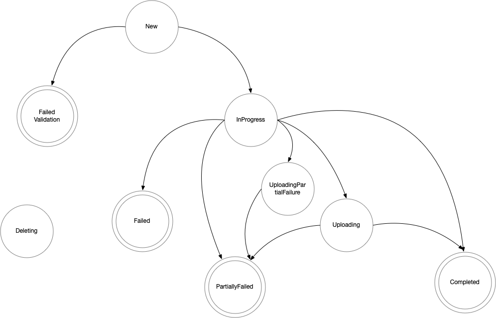

# Upload Progress Monitoring

Volume snapshotter plug-in are used by Velero to take snapshots of persistent volume contents. 
Depending on the underlying storage system, those snapshots may be available to use immediately, 
they may be uploaded to stable storage internally by the plug-in or they may need to be uploaded after
the snapshot has been taken. We would like for Velero to continue on to the next part of the backup as quickly
as possible but we would also like the backup to not be marked as complete until it is a usable backup.  We'd also
eventually like to bring the control of upload under the control of Velero and allow the user to make decisions
about the ultimate destination of backup data independent of the storage system they're using.

## Examples
AWS - AWS snapshots return quickly, but are then uploaded in the background and cannot be used until EBS moves
the data into S3 internally.

vSphere - The vSphere plugin takes a local snapshot and then the vSphere plugin uploads the data to S3.  The local
snapshot is usable before the upload completes.

Restic - Does not go through the volume snapshot path.  Restic backups will block Velero progress until completed.

## Goals

- Enable monitoring of operations that continue after snapshotting operations have completed
- Keep non-usable backups (upload/persistence has not finished) from appearing as completed
- Minimize change to volume snapshot and BackupItemAction plug-ins
- Introduce the ItemSnapshotter interface to supersede VolumeSnapshotter

## Models

### Internal configuration and management
In this model, movement of the snapshot to stable storage is under the control of the snapshot
plug-in.  Decisions about where and when the snapshot gets moved to stable storage are not
directly controlled by Velero.  This is the model for the current VolumeSnapshot plugins.

### Velero controlled management
In this model, the snapshot is moved to external storage under the control of Velero.  This
enables Velero to move data between storage systems.  This also allows backup partners to use
Velero to snapshot data and then move the data into their backup repository.

## Backup phases

Velero currently has backup phases "InProgress" and "Completed".  The backup moves to the Completed
phase when all of the volume snapshots have completed and the Kubernetes metadata has been written
into the object store.  However, the actual data movement may be happening in the background
after the backup has been marked "Completed".  The backup is not actually a stable backup until
the data has been persisted properly.  In some cases (e.g. AWS) the backup cannot be restored from
until the snapshots have been persisted.

Once the snapshots have been taken, however, it is possible for additional backups to be made without
interference.  Waiting until all data has been moved before starting the next backup will
slow the progress of the system without adding any actual benefit to the user.

A new backup phase, "Uploading" will be introduced.  When a backup has entered this phase, Velero
is free to start another backup.  The backup will remain in the "Uploading" phase until all data
has been successfully moved to persistent storage.  The backup will not fail once it reaches
this phase, it will continuously retry moving the data.  If the backup is deleted (cancelled), the plug-ins will
attempt to delete the snapshots and stop the data movement - this may not be possible with all
storage systems.

### State progression

### New
When a backup request is initially created, it is in the "New" phase.  

The next state is either "InProgress" or "FailedValidation"

### FailedValidation
If the backup request is incorrectly formed, it goes to the "FailedValidation" phase and terminates

### InProgress
When work on the backup begins, it moves to the "InProgress" phase.  It remains in the "InProgress"
phase until all pre/post execution hooks have been executed, all snapshots have been taken and the
Kubernetes metadata and backup info is safely written to the object store plug-in.

In the current implementation, Restic backups will move data during the "InProgress" phase.
In the future, it may be possible to combine a snapshot with a Restic (or equivalent) backup which
would allow for data movement to be handled in the "Uploading" phase,

The next phase is either "Completed", "Uploading", "Failed" or "PartiallyFailed".  Backups which 
would have a final phase of "Completed" or "PartiallyFailed" may move to the "Uploading" state.
A backup which will be marked "Failed" will go directly to
the "Failed" phase.  Uploads may continue in the background for snapshots that were taken by a "Failed"
backup, but no progress will not be monitored or updated.  When a "Failed" backup is deleted, all snapshots
will be deleted and at that point any uploads still in progress should be aborted.

### Uploading (new)
The "Uploading" phase signifies that the main part of the backup, including snapshotting has completed successfully
and and uploading is continuing.  In the event of an error during uploading, the phase will change to 
UploadingPartialFailure.  On success, the phase changes to Completed.  The backup cannot be
restored from when it is in the Uploading state.

### UploadingPartialFailure (new)
The "UploadingPartialFailure" phase signifies that the main part of the backup, including snapshotting has completed,
but there were partial failures either during the main part or during the uploading.  The backup cannot be
restored from when it is in the UploadingPartialFailure state.

### Failed
When a backup has had fatal errors it is marked as "Failed"  This backup cannot be restored from.

### Completed
The "Completed" phase signifies that the backup has completed, all data has been transferred to stable storage
and the backup is ready to be used in a restore.  When the Completed phase has been reached it is safe
to remove any of the items that were backed up.

### PartiallyFailed
The "PartiallyFailed" phase signifies that the backup has completed and at least part of the backup is usable.
Restoration from a PartiallyFailed backup will not result in a complete restoration but pieces may be available.

## Workflow

When a BackupAction is executed, any SnapshotItemAction or VolumeSnapshot plugins will return snapshot IDs.
The plugin should be able to provide status on
the progress for the snapshot and handle cancellation of the upload if the snapshot is deleted.
If the plugin is restarted, the snapshot ID should remain valid.

When all snapshots have been taken and Kubernetes resources have been persisted to the ObjectStorePlugin
the backup will either have fatal errors or will be at least partially usable.

If the backup has fatal errors it will move to the "Failed" state and finish. If a backup fails, the upload will not be
cancelled but it will not be monitored either.  For backups in any phase, all snapshots will be deleted when the backup
is deleted.  Plugins will cancel any data movement and
remove snapshots and other associated resources when the VolumeSnapshotter DeleteSnapshot method or 
DeleteItemAction Execute method is called.

Velero will poll the plugins for status on the snapshots when the backup exits the "InProgress" phase and
has no fatal errors.

If any snapshots are not complete, the backup will move to either Uploading or UploadingPartialFailure or Failed.

Post-snapshot operations may take a long time and Velero and its plugins may be restarted during 
this time.  Once a backup has moved into the Uploading or UploadingPartialFailure phase, another 
backup may be started.

While in the Uploading or UploadingPartialFailure phase, the snapshots and backup items will be periodically polled.
When all of the snapshots and backup items have reported success, the backup will move to the Completed or 
PartiallyFailed phase, depending on whether the backup was in the Uploading or UploadingPartialFailure phase.

The Backup resources will not be written to object storage until the backup has entered a final phase: 
Completed, Failed or PartialFailure
## Reconciliation of InProgress backups

InProgress backups will not have a `velero-backup.json` present in the object store.  During reconciliation, backups which
do not have a `velero-backup.json` object in the object store will be ignored.

## Plug-in API changes

### ItemSnapshotter plug-in

Currently CSI snapshots and the Velero Plug-in for vSphere are implemented as BackupItemAction plugins.  The majority of
BackupItemAction plugins do not take snapshots or upload data so rather than modify BackupItemAction we introduce a new
plug-ins, SnapshotItemAction.  ItemSnapshotter will be used in place of BackupItemAction for
the CSI snapshots and the Velero Plug-in for vSphere and will return a snapshot ID in addition to the item itself.  The existing
VolumeSnapshotter plugins will be converted into ItemSnapshotter plugins as well.

The ItemSnapshotter plugin identifier as well as the Item and Snapshot ID will be stored in the
`<backup-name>-itemsnapshots.json.gz`.  When checking for progress, this info will be used to select the appropriate
ItemSnapshotter plugin to query for progress.

_NotApplicable_ should only be returned if the ItemSnapshotter plugin should not be handling the item.  If the
ItemSnapshotter plugin should handle the item but, for example, the item/snapshot ID cannot be found to report progress, a
SnapshotItemProgressOutput struct with the error set appropriately (in this case _NotFound_) should be returned.

    // ItemSnapshotter handles snapshots on an individual item being backed up.
    type ItemSnapshotter interface {
    
    	// Init prepares the ItemSnapshotter for usage using the provided map of
    	// configuration key-value pairs. It returns an error if the ItemSnapshotter
    	// cannot be initialized from the provided config.
    	Init(config map[string]string) error
    
    	// AppliesTo returns information about which resources this action should be invoked for.
    	// An ItemSnapshotter's SnapshotItem method will only be invoked on items that match the returned
    	// selector. A zero-valued ResourceSelector matches all resources.
    	AppliesTo() (velero.ResourceSelector, error)
    
    	// AlsoHandles is called for each item this ItemSnapshotter should handle and returns any items
    	// which will be handled by this plugin when snapshotting the item.  These items will be excluded from the
    	// items being backed up.  AlsoHandles will be called before SnapshotItem is called.  For example, a database may expose
    	// a database resource that can be snapshotted. If the database uses a PVC that will be snapshotted/backed up as
    	// part of the database snapshot, that PVC should be returned when AlsoHandles is invoked.  This is different from
    	// AdditionalItems (returned in SnapshotItemOutput and CreateItemOutput) which are specifying additional resources
    	// that Velero should store in the backup or create.
    	AlsoHandles(input *AlsoHandlesInput) ([]velero.ResourceIdentifier, error)
    
    	// SnapshotItem causes the ItemSnapshotter to snapshot the specified item.  It may also
    	// perform arbitrary logic with the item being backed up, including mutating the item itself prior to backup.
    	// The item (unmodified or modified) should be returned, along with an optional slice of ResourceIdentifiers specifying
    	// additional related items that should be backed up.
    	// A caller can pass a context that includes a timeout.  If the time to take the snapshot exceeds the
    	// time in the context, the plugin may abort the snapshot.  The context timeout does not apply to upload
    	// time that occurs after SnapshotItem returns
    	SnapshotItem(ctx context.Context, input *SnapshotItemInput) (*SnapshotItemOutput, error)
    
    	// Progress will return the progress of a snapshot that is being uploaded
    	Progress(input *ProgressInput) (*ProgressOutput, error)
    
    	// DeleteSnapshot removes a snapshot
    	DeleteSnapshot(ctx context.Context, input *DeleteSnapshotInput) error
    
    	// CreateItemFromSnapshot creates a new item from the snapshot.  The item to restore from the
        // backup is passed in and may be modified during CreateItemFromSnapshot and the modified item
        // returned in CreateItemOutput.  This allows operations such as restoring a PVC to return a PVC
        // that points to a newly created PV.  AdditionalItems to restore may also be returned in CreateItemOutput
    	CreateItemFromSnapshot(ctx context.Context, input *CreateItemInput) (*CreateItemOutput, error)
    }

## Changes in Velero backup format

No changes to the existing format are introduced by this change.  A `<backup-name>-itemsnapshots.json.gz` file will be 
added that contains the items and snapshot IDs returned by ItemSnapshotter.SnapshotItem.  Also, the creation of the
`velero-backup.json` object will not occur until the backup moves to one of the terminal phases (_Completed_, 
_PartiallyFailed_, or _Failed_).  Reconciliation should ignore backups that do not have a `velero-backup.json` object.

The cluster that is creating the backup will have the Backup resource present and will be able to manage the backup
before the backup completes.

If the Backup resource is removed (e.g. Velero is uninstalled) before a backup completes and writes its 
`velero-backup.json` object, the other objects in the object store for the backup will be effectively orphaned.  This 
can currently happen but the current window is much smaller.

### `<backup-name>-itemsnapshots.json.gz`
The itemsnapshots file is similar to the existing `<backup-name>-volumesnapshots.json.gz`  Each snapshot taken via
_ItemSnapshotter_ will have a JSON record in the file.  Exact format TBD.

## CSI snapshots

For systems such as EBS, a snapshot is not available until the storage system has transferred the snapshot to
stable storage.  CSI snapshots expose the _readyToUse_ state that, in the case of EBS, indicates that the snapshot
has been transferred to durable storage and is ready to be used.  The CSI BackupItemProgress.Progress method will
poll that field and when completed, return completion.

## vSphere plug-in

The vSphere Plug-in for Velero uploads snapshots to S3 in the background.  This is also a BackupItemAction plug-in,
it will check the status of the Upload records for the snapshot and return progress.

## Backup workflow changes

The backup workflow remains the same until we get to the point where the `velero-backup.json` object is written.
At this point, we will queue the backup to a finalization go-routine.  The next backup may then begin.  It will
then run across all items and call _ItemSnapshotter.Progress_ for any that match with a BackupItemProgress.

If all backup items have finished uploading (either successfully or failed), the backup will be completed
and the backup will move to the appropriate terminal phase and upload the `velero-backup.json` object to the object store
and the backup will be complete.

If any of the snapshots or backup items are still being processed, the phase of the backup will be set to the appropriate
phase (_Uploading_ or _UploadingPartialFailure_).  In the event that any of the upload progress checks return an error, the
phase will move to _UploadingPartialFailure_.  The backup will then be requeued and will be rechecked again after some 
time has passed.

## Restart workflow
On restart, the Velero server will scan all Backup resources.  Any Backup resources which are in the _InProgress_ phase
will be moved to the _Failed_ phase.  Any Backup resources in the _Uploading_ or _UploadingPartialFailure_ phase will
be treated as if they have been requeued and progress checked and the backup will be requeued or moved to a terminal
phase as appropriate.

# Implementation tasks

ItemSnapshotter new plugin interface  
New backup phases  
Defer uploading `velero-backup.json`  
AWS EBS plug-in UploadProgress implementation  
Upload monitoring  
Implementation of `<backup-name>-itemsnapshots.json.gz` file  
Restart logic  
CSI plug-in ItemSnapshotter implementation  
vSphere plug-in ItemSnapshotter implementation (vSphere plug-in team)  

# Future Ephemeral/Durable snapshot tracking
Futures are here for reference, they may change radically when actually implemented.

Some storage systems have the ability to provide different levels of protection for snapshots.  These are termed "Ephemeral"
and "Durable".  Currently, Velero expects snapshots to be Durable (they should be able to survive the destruction of the
cluster and the storage it is using).  In the future we would like the ability to take advantage of snapshots that are
Ephemeral.  For example, vSphere snapshots are Ephemeral (they reside in the same datastore as the virtual disk).  The Velero
Plug-in for vSphere uses a vSphere local/ephemeral snapshot to get a consistent snapshot, then uploads the data to S3 to
make it Durable.  In the current design, upload progress will not be complete until the snapshot is ready to use and
Durable.  It is possible, however, to restore data from a vSphere snapshot before it has been made Durable, and this is a
capability we'd like to expose in the future.  Other storage systems implement this functionality as well.  We will be moving
the control of the data movement from the vSphere plug-in into Velero.

Some storage system, such as EBS, are only capable of creating Durable snapshots.  There is no usable intermediate
Ephemeral stage, however there is a time when a snapshot has been taken but is not yet
usable.

For a Velero backup, users should be able to specify whether they want a Durable backup or a Ephemeral backup (Ephemeral backups
may consume less resources, be quicker to restore from and are suitable for things like backing up a cluster before upgrading
software).  We can introduce three snapshot states - Creating, Ephemeral and Durable.  A snapshot would be created with a
desired state, Ephemeral or Durable.  When the snapshot reaches the desired or higher state (e.g. request was for Ephemeral but
snapshot went to Durable as on EBS), then the snapshot would be completed.
