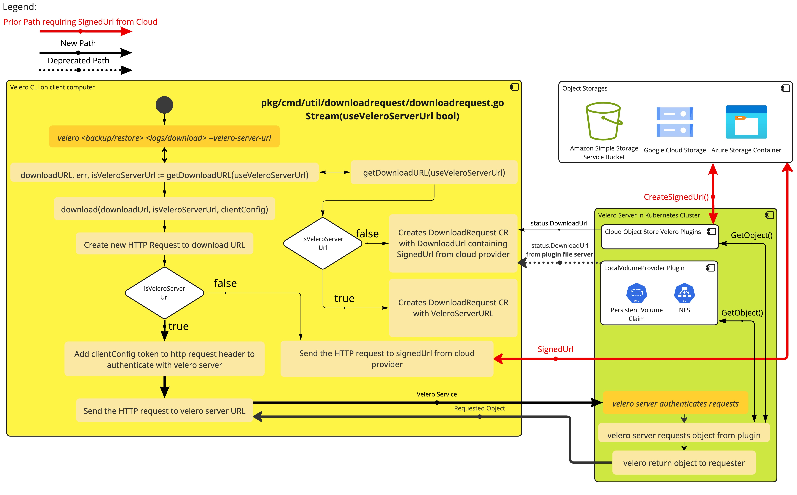

# Velero Endpoint Download Client

## Abstract

<!-- One to two sentences that describes the goal of this proposal and the problem being solved by the proposed change.
The reader should be able to tell by the title, and the opening paragraph, if this document is relevant to them. -->
Velero data is stored in an object store.
Velero CLI users currently download data from object stores directly using their [pre-signed URL capability](https://docs.aws.amazon.com/AmazonS3/latest/userguide/using-presigned-url.html) to download data.
This assumes the object store is able to generate directly accessible from the client side. This is not always true for scenarios such as on-cluster object-store/NFS/PVC storage which may lack pre-signed URL capability.
Some object store may also save the data in non object stores in the future so an object store may not be available for the CLI to download from.

This design proposes to add a new endpoint on the Velero server that CLI users can connect to and download data from without having to connect to an object store directly.

## Background
Velero CLI commands such as following download data from the object store directly today.
```
velero backup download
velero describe
velero backup logs
```
We want commands to work even when the object store is not directly accessible from the client side. Examples include in-cluster minio, file system store, nfs server.
Even if the object store is accessible from the client side, today things like cacert and insecure-skip-tls-verify flags are specified manually from the client even though the Velero server already has the information.

This design allows velero CLI to request files from any object store plugin that velero server can call GetObject() without creating a signedUrl first.
## Goals
- Enable Velero CLI users to download data from the Velero server without having to create signedUrl for scenarios where the storage provider is not able to create signedUrl accessible from the velero CLI client side.

## Non Goals
- Making the download server the default way to download data from object store.

## High-Level Design
Create an endpoint on the Velero server that CLI can use to download data from without requiring signed URL from object store directly when configured explicitly or as a fallback.

The direct download from signedUrl will still be the default behavior for Velero CLI.

### Velero Download Server URL generation using Service to Expose Download Server

Upon enabling Download Server API, Velero will create a service of type that user specifies, which will expose the download server to the outside world. The download server will proxy requested data from the object store and stream it back to the client using one of the available service types (ClusterIP/NodePort/LoadBalancer). User can also pre-create a service named `velero` to use the pre-created service to expose the download server.

If the service can also be reached via a fully qualified domain name (FQDN) such as when user created [Ingress](https://kubernetes.io/docs/concepts/services-networking/ingress/) for the service, user can pass the FQDN to velero during install time with `velero install --veleroServerFQDN=dnsNameToVeleroServerService.com`. Velero Download Server will use FQDN in-place of values from created service (ie. NodePort/Cluster IP).

If using Ingress, the FQDN should match `ingress.spec.rules.host` field that the user wants to use to access the download server. Ingress HTTP path should be set to `/` to allow all requests to be proxied to the download server. There may be future enhancements after initial implementation to allow values other than `/` for the path to support multiple velero namespaces on the same cluster.

This approach may also [work on KinD clusters](https://kind.sigs.k8s.io/docs/user/loadbalancer/)

The current DownloadRequest CR status `downloadURL` field will be populated to use the Download Server URL instead of the signed object store URL when `BSL.spec.downloadViaVeleroServer` is set to true.

Velero will be updated to download data from the object store and stream it back to the client.

The Velero CLI will still default to `downloadURL` from DownloadRequest but can fallback or forced to `veleroServerURL` which is served via the Velero server.

If velero CLI attempted request from veleroServerURL at the specified FQDN and failed, and velero CLI command was executed inside velero server pod (`alias velero='kubectl exec -it deployment/velero -- velero'`), velero CLI will attempt to use the service name (cluster.local address) to connect to the download server.

[](VeleroDownloadServer.jpg)

## Detailed Design
<!-- A detailed design describing how the changes to the product should be made.

The names of types, fields, interfaces, and methods should be agreed on here, not debated in code review.
The same applies to changes in CRDs, YAML examples, and so on.

Ideally the changes should be made in sequence so that the work required to implement this design can be done incrementally, possibly in parallel. -->

<!-- What we do with the download url -->
The DownloadRequest Status struct will be updated to contain VeleroServerURL, a url to the velero server instance that will retrieve the intended file via the velero server.

The Velero CLI may use the VeleroServerURL to download data from the Velero server when DownloadURL is not populated, unreachable, or explicitly requested via `--veleroServerUrl`.

When using VeleroServerURL, Velero CLI will send current kubeconfig to the download server via HTTP Authorization Header for velero server to authenticate and authorize the request.

Velero Server will use [SubjectAccessReview](https://kubernetes.io/docs/reference/kubernetes-api/authorization-resources/subject-access-review-v1/) and [TokenReview](https://kubernetes.io/docs/reference/kubernetes-api/authentication-resources/token-review-v1/) APIs to verify user and authorize the request.

Once kubeconfig token sent via HTTP header is validated, the Velero Download Server will get data from the object store plugin using `GetObject()` method and stream it back to the client with status 200. If not found, 404. If unauthorized, it will return 403 Forbidden.

If `--insecure` is passed to Velero CLI commands that uses downloadRequest.url such as logs, the request made will be via HTTPS with insecure skip verify to the velero download server.

The following flags can be reused/inherited from current velero CLI for HTTPS requests to download api server as well.
    `--cacert` string              Path to a certificate bundle to use when verifying TLS connections.
    `--insecure-skip-tls-verify`   If true, the object store's TLS certificate will not be checked for validity. This is insecure and susceptible to man-in-the-middle attacks. Not recommended for production

### CRD changes
Here we add a new field called *veleroServerURL* that velero CLI can opt to use when DownloadURL is unreachable or not desired
```go
// DownloadRequestStatus is the current status of a DownloadRequest.
type DownloadRequestStatus struct {
	// Phase is the current state of the DownloadRequest.
	// +optional
	Phase DownloadRequestPhase `json:"phase,omitempty"`

	// DownloadURL contains the pre-signed URL for the target file.
	// +optional
	DownloadURL string `json:"downloadURL,omitempty"`

	// VeleroServerURL contains the URL to the velero server to indirectly request file from backup storage location
	VeleroServerURL string `json:"veleroServerURL,omitempty"`

	// Expiration is when this DownloadRequest expires and can be deleted by the system.
	// +optional
	// +nullable
	Expiration *metav1.Time `json:"expiration,omitempty"`
}
```
### HTTPS Server Certificates
Velero server will generate a self-signed certificate for HTTPS server endpoint. The certificate will be stored in a secret in the same namespace as the Velero server. The secret will be named `velero-download-server-certs`.

The Velero server will use the certificate and key from the secret to serve the HTTPS server.

Velero client will use the certificate from the secret to verify the HTTPS server.
## Alternatives Considered
<!-- If there are alternative high level or detailed designs that were not pursued they should be called out here with a brief explanation of why they were not pursued. -->
TBD

## Security Considerations
<!-- If this proposal has an impact to the security of the product, its users, or data stored or transmitted via the product, they must be addressed here. -->
Since this design may enable self service non-admin users to download data from the Velero server in the future, we need to make sure that only authorized user for a specific backup/restore/storage location can download those data from the Velero server.

There will need to be tests to make sure that only authorized users can download data from the Velero server.

Need to ensure that HTTPS is used because we do not want to send kubeconfig to the Velero server over unencrypted HTTP.

## Compatibility
A discussion of any compatibility issues that need to be considered

We want this implementation to be adoptable by the [replicatedhq/local-volume-provider](https://github.com/replicatedhq/local-volume-provider/) plugin

## Implementation
A description of the implementation, timelines, and any resources that have agreed to contribute.

## Open Issues
<!-- A discussion of issues relating to this proposal for which the author does not know the solution. This section may be omitted if there are none. -->

Whether we want to ability to limit certain user/SAs from accessing certain BSLs, this would require a new RBAC role to be created and assigned to the user/SA for access validation.
