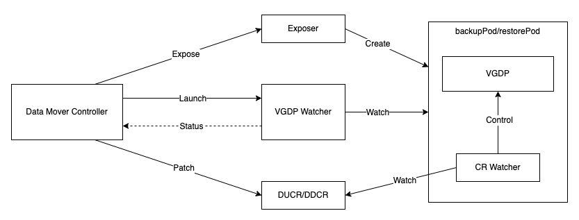
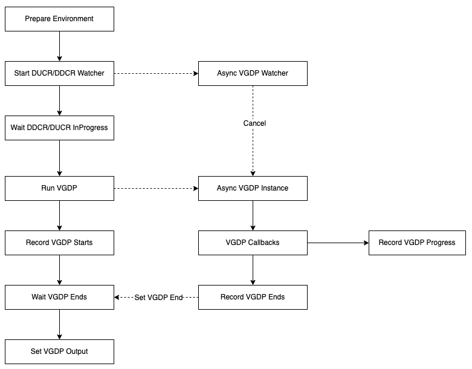
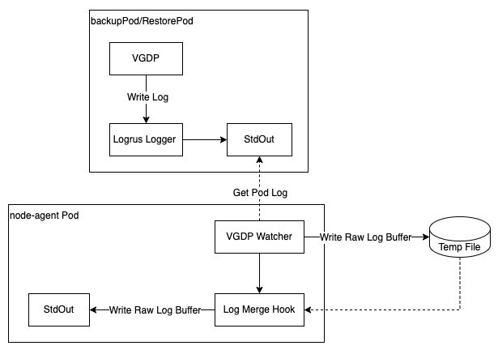

# VGDP Micro Service For Volume Snapshot Data Movement

## Glossary & Abbreviation

**VGDP**: The collective of modules that is introduced in [Unified Repository design][1]. Velero uses these modules to finish data transmission for various purposes. It includes uploaders and the backup repository.  
**Volume Snapshot Data Movement**: The backup/restore method introduced in [Volume Snapshot Data Movement design][2]. It backs up snapshot data from the volatile and limited production environment into the durable, heterogeneous and scalable backup storage.  
**VBDM**: Velero Built-in Data Mover as introduced in [Volume Snapshot Data Movement design][2], it is the built-in data mover shipped along with Velero.  
**Exposer**: Exposer is introduced in [Volume Snapshot Data Movement design][2] and is used to expose the volume snapshots/target volumes for VGDP to access locally.  

## Background
As the architecture introduced in [Volume Snapshot Data Movement design][2], VGDP instances are running inside the node-agent pods, however, more and more use cases require to run the VGDP instances in dedicated pods, or in another word, make them as micro services, the benefits are as below:
- This avoids VGDP to access volume data through host path, while host path access involves privilege escalations in some environments (e.g., must run under privileged mode), which makes challenge to users.    
- This enable users to to control resource (i.e., cpu, memory) request/limit in a granular manner, e.g., control them per backup/restore of a volume
- This increases the resilience, crash of one VGDP activity won't affect others
- In the cases that the backup storage must be represented by a Kubernetes persistent volumes (i.e., nfs storage, [COSI][3]), this avoids to dynamically mount the persistent volumes to node-agent pods and cause node-agent pods to restart (this is not accepted since node-agent lose it current state after its pods restart)  
- This prevents unnecessary full backup. Velero's fs uploaders support file level incremental backup by comparing the file name and metadata. However, at present the files are visited by host path, while pod and PVC's ID are part of the host path, so once the pod is recreated, the same file is regarded as a different file since the pod's ID has been changed. If the fs uploader is in a dedicated pod and files are visited by pod's volume path, files' full path are not changed after pod restarts, so incremental backups could continue.  

## Goals
- Create a solution to make VGDP instances as micro services
- Modify the VBDM to offload the VGDP work from node-agent to the VGDP micro service
- Create the mechanism for VBDM to control and monitor the VGDP micro services in various scenarios

## Non-Goals
- The current solution covers Volume Snapshot Data Movement backup/restore type only, even though VGDP is also used by pod volume backup. It is less possible to do this for pod volume backup, since it must run inside the source workload pods.  
- The current solution covers VBDM only. 3rd data movers still follow the **Replacement** section of [Volume Snapshot Data Movement design][2]. That is, 3rd data movers handle the DUCR/DDCR on their own and they are free to make themselves micro service style or monolith service style.  


## Overview
The solution is based on [Volume Snapshot Data Movement design][2], the architecture is followed as is and existing components are not changed unless it is necessary.  
Below lists the changed components, why and how:  
**Exposer**: Exposer is to expose the snapshot/target volume as a path/device name/endpoint that are recognizable by VGDP. Varying from the type of snapshot/target volume, a pod may be created as part of the expose. Now, since we run the VGDP instance in a separate pod, a pod is created anyway, we assume exposer creates a pod all the time and make the appropriate exposing configurations to the pod so that VGDP instance could access the snapshot/target volume locally inside the pod. The pod is still called as backupPod or restorePod.  
Then we need to change the command the backupPod/restorePod is running, the command launches VGDP-MS (VGDP Micro Service, see below) when the container starts up.  
For CSI snapshot, the backupPod/restorePod is created as the result of expose, the only thing left is to change the backupPod/restorePod's image.  
**VBDM**: VBDM contains the data mover controller, while the controller calls the Exposer and launches the VGDP instances.  Now, since the VGDP instance is launched by the backupPod/restorePod, the controller should not launch the VGDP instance again. However, the controller still needs to monitor and control the VGDP instance. Moreover, in order to avoid any contest situations, the controller is still the only place to update DUCRs and DDCRs.    

Besides the changes to above existing components, we need to add below new components:  
**VGDP Watcher**: We create a new module to help the data mover controller to watch activities of the VGDP instance in the backupPod/restorePod. VGDP Watcher is a part of VBDM.  
**VGDP-MS**: VGDP Micro Service is the binary for the command backupPod/restorePod runs. It accepts the parameters and then launches the VGDP instance according to the request type, specifically, backup or restore. VGDP-MS also runs other modules to sync-up with the data mover controller. VGDP-MS is also a part of VBDM.  

Below diagram shows how these components work together:  
  

The [Node-agent concurrency][4] is still used to control the concurrency of VGDP micro services. When there are too many volumes in the backup/restore, which takes too much computing resources(CPU, memory, etc.) or Kubernetes resources(pods, PVCs, PVs, etc.), users could set the concurrency in each node so as to control the total number of concurrent VGDP micro services in the cluster.  

## Detailed Design
### Exposer
At present, the exposer creates backupPod/restorePod and sets ```velero-helper pause``` as the command run by backupPod/restorePod.  
Now, VGDP-MS command will be used, and the ```velero``` image will be running inside the backupPod/restorePod. The command is like below:  
```velero data-mover backup --volume-path xxx --volume-mode xxx --data-upload xxx --resource-timeout xxx --log-format xxx --log-level xxx```  
Or:  
```velero data-mover restore --volume-path xxx --volume-mode xxx --data-download xxx --resource-timeout xxx --log-format xxx --log-level xxx```  

The first one is for backup and the other one is for restore.  
Below are the parameters of the commands:  
**volume-path**: Deliver the full path inside the backupPod/restorePod for the volume to be backed up/restored.  
**volume-mode**: Deliver the mode for the volume be backed up/restored, at present either ```Filesystem``` mode or ```Block``` mode.  
**data-upload**: DUCR for this backup.  
**data-download**: DDCR for this backup. 
**resource-timeout**: resource-timeout is used to control the timeout for operations related to resources. It has the same meaning with the resource-timeout for node-agent.  
**log-format** and **log-level**: This is to control the behavior of log generation inside VGDP-MS. 

In order to have the same capability and permission with node-agent, below pod configurations are inherited from node-agent and set to backupPod/restorePod's spec:
- Volumes: Some configMaps will be mapped as volumes to node-agent, so we add the same volumes of node-agent to the backupPod/restorePod
- Environment Variables
- Security Contexts  
We may not actually need all the capabilities in the VGDP-MS as the node-agent. At present, we just duplicate all of them, if we find any problem in future, we can filter out the capabilities that are not required by VGDP-MS.  
The backupPod/restorePod is not run in Privileged mode as it is not required since the volumes are visisted by pod path.  
The root user is still required, especially by the restore (in order to restore the file system attributes, owners, etc.), so we will use root user for backupPod/restorePod.  
We set backupPod/restorePod's ```RestartPolicy``` to ```RestartPolicyNever```, so that once VGDP-MS terminates in any reason, backupPod/restorePod won't restart and the DUCR/DDCR is marked as one of the terminal phases (Completed/Failed/Cancelled) accordingly.  


### VGDP Watcher
#### Dual mode event watch
The primary task of VGDP Watcher is to watch the status change from backupPod/restorePod or the VGDP instance, so as to inform the data mover controller in below situations:
- backupPod/restorePod starts
- VGDP instance starts
- Progress update
- VGDP instance completes/fails/cancelled
- backupPod/restorePod stops

We use two mechanism to make the watch:  
**Pod Phases**: VGDP Watcher watches the backupPod/restorePod's phases updated by Kubernetes. That is, VGDP Watcher creates an informer to watch the pod resource for the backupPod/restorePod and detect that the pod reaches to one of the terminated phases (i.e., PodSucceeded, PodFailed). We also check the availability & status of the backupPod/restorePod at the beginning of the watch so as to detect the starting of the backupPod/restorePod.  
**Custom Kubernetes Events**: VGDP-MS generates Kubernetes events and associates them to the DUCR/DDCR at the time of VGDP instance starting/stopping and progress update, then VGDP Watcher creates another informer to watch the Event resource associated to the DUCR/DDCR.  

Pod Phases watch covers the entire lifecycle of the backupPod/restorePod, but we don't know the status of the VGDP instance through it; and it can only deliver information by then end of the pod lifecycle.   
Custom Event watch generates details of the VGDP instances and the events could be generated any time; but it cannot generate notifications before VGDP starts or in the case that VGDP crashes or shutdown abnormally.  

Therefore, we adopt the both mechanisms to VGDP Watcher. In the end, there will be two sources generating the result of VGDP-MS:  
- The termination message of backupPod/restorePod
- The message along with the VGDP Instance Completes/Fails/Cancelled event  

On the one hand, in some cases only the backupPod/restorePod's termination message is available, e.g., the backupPod/restorePod crashes or or backupPod/restorePod quits before VGDP instance is started. So we refer to the first mechanism to get the notifications.  
On the other hand, if they are both available, we have the results from them for mutual verification.   

Conclusively, under the help of VGDP Watcher, data mover controller starts VGDP-MS controllably and waits until VGDP-MS ends under any circumstances.   

#### AsyncBR adapter
VGDP Watcher needs to notify the data mover controller when one of the watched event happens, so that the controller could do the operations as if it receives the same callbacks from VGDP as the current behavior. In order not to break the existing code logics of data mover controllers, we make VGDP Watcher as an adapter of AsyncBR which is the interface implemented by VGDP and called by the data mover controller.  
Since the parameters to call VGDP Watcher is different from the ones to call VGDP, we change the AsyncBR interface to hide some parameters from one another, the new interface is as below:  
```
type AsyncBR interface {
	// Init initializes an asynchronous data path instance
	Init(ctx context.Context, res *exposer.ExposeResult, param interface{}) error

	// StartBackup starts an asynchronous data path instance for backup
	StartBackup(dataMoverConfig map[string]string, param interface{}) error

	// StartRestore starts an asynchronous data path instance for restore
	StartRestore(snapshotID string, dataMoverConfig map[string]string) error

	// Cancel cancels an asynchronous data path instance
	Cancel()

	// Close closes an asynchronous data path instance
	Close(ctx context.Context)
}
```
Some parameters are hidden into ```param```, but the functions and calling logics are not changed.  

VGDP Watcher should be launched by the data mover controller before VGDP instance starts, otherwise, multiple corner problems may happen. E.g., VGDP-MS may run the VGDP instance immediately after the backupPod/restorePod is launched and completes it before the data mover controller starts VGDP Watcher, as a result, multiple informs are missed from VGDP Watcher.  
Therefore, the controller launches VGDP Watcher first and then set the DUCR/DDCR to ```InProgress```; on the other hand, VGDP-MS waits DUCR/DDCR turns to ```InProgress``` before running the VGDP instance.  

### VGDP-MS
VGDP-MS is represented by ```velero data-mover``` subcommand and has its own subcommand ```backup``` and ```restore```.  
Below diagram shows the VGDP-MS workflow:  
  

**Start DUCR/DDCR Watcher**: VGDP-MS needs to watch the corresponding DUCR/DDCR so as to react on some events happening to the DUCR/DDCR. E.g., when the data movement is cancelled, a ```Cancel``` flag is set to the DUCR/DDCR, by watching the DUCR/DDCR, VGDP-MS is able to see it and cancel the VGDP instance.  
**Wait DUCR/DDCR InProgress**: As mentioned above, VGDP-MS won't start the VGDP instance until DUCR/DDCR turns to ```InProgress```, by which time VGDP Watcher has been started.  
**Record VGDP Starts**: This generates the VGDP Instance Starts event.  
**VGDP Callbacks**: When VGDP comes to one of the terminal states (i.e., completed, failed, cancelled), the corresponding callback is called.  
**Record VGDP Ends**: This generates the VGDP Instance Completes/Fails/Cancelled event, and also generates backupPod/restorePod termination message.    
**Record VGDP Progress**: This periodically generates/updates the Progress event with totalBytes/bytesDone to indicate the progress of the data movement.  
**Set VGDP Output**: This writes the termination message to the backupPod/restorePod's termination log (by default, it is written to ```/dev/termination-log```).  

If VGDP completes, VGDP Instance Completes event and backupPod/restorePod termination shares the same message as below:  
```
type BackupResult struct {
	SnapshotID    string              `json:"snapshotID"`
	EmptySnapshot bool                `json:"emptySnapshot"`
	Source        exposer.AccessPoint `json:"source,omitempty"`
}
```
```
type RestoreResult struct {
	Target exposer.AccessPoint `json:"target,omitempty"`
}
```  
``` 
type AccessPoint struct {
	ByPath  string                        `json:"byPath"`
	VolMode uploader.PersistentVolumeMode `json:"volumeMode"`
}
``` 

The existing VGDP result structures are actually being reused, we just add the json markers so that they can be marshalled.  

As mentioned above, once VGDP-MS ends in any way, the backupPod/restorePod terminates and never restarts, so the end of VGDP-MS means the end of DU/DD.  

For Progress update, the existing Progress structure is being reused:  
``` 
type Progress struct {
	TotalBytes int64 `json:"totalBytes,omitempty"`
	BytesDone  int64 `json:"doneBytes,omitempty"`
}
``` 

### Log Collection
During the running of VGDP instance, some logs are generated which are important for troubleshooting. This includes all the logs generated by the uploader and repository. Therefore, it is important to collect these logs.  
On the other hand, the logs are now generated in the backupPod/restorePod, while the backupPod/restorePod is deleted immediately after the data movement completes. Therefore, by default, ```velero debug``` is not able to collect these logs.  

As a solution, we use logrus's hook mechanism to redirect the backupPod/restorePod's logs into node-agent's log, so that ```velero debug``` could collect VGDP logs as is without any changes.  

Below diagram shows how VGDP logs are redirected:  
 

This log redirecting mechanism is thread safe since the hook acquires the write lock before writing the log buffer, so it guarantees that in the node-agent log there is no corruptions after redirecting the log, and the redirected logs and the original node-agent logs are not projected into each other.     

### Resource Control
The CPU/memory resource of backupPod/restorePod is configurable, which means users are allowed to configure resources per volume backup/restore.  
By default, the [Best Effort policy][5] is used, and users are allowed to change it through the ConfigMap specified by `velero node-agent` CLI's parameter `--node-agent-configmap`. Specifically, we add below structures to the ConfigMap:  
``` 
type Configs struct {
	// PodResources is the resource config for various types of pods launched by node-agent, i.e., data mover pods.
	PodResources *PodResources `json:"podResources,omitempty"`
}

type PodResources struct {
	CPURequest    string `json:"cpuRequest,omitempty"`
	MemoryRequest string `json:"memoryRequest,omitempty"`
	CPULimit      string `json:"cpuLimit,omitempty"`
	MemoryLimit   string `json:"memoryLimit,omitempty"`
}
```
The string values must mactch Kubernetes Quantity expressions; for each resource, the "request" value must not be larger than the "limit" value. Otherwise, if any one of the values fail, all the resource configurations will be ignored.  

The configurations are loaded by node-agent at start time, so users can change the values in the configMap any time, but the changes won't effect until node-agent restarts.    


## node-agent
node-agent is still required. Even though VGDP is now not running inside node-agent, node-agent still hosts the data mover controller which reconciles DUCR/DDCR and operates DUCR/DDCR in other steps before the VGDP instance is started, i.e., Accept, Expose, etc.  
Privileged mode and root user are not required for node-agent anymore by Volume Snapshot Data Movement, however, they are still required by PVB(PodVolumeBackup) and PVR(PodVolumeRestore). Therefore, we will keep the node-agent deamonset as is, for any users who don't use PVB/PVR and have concern about the privileged mode/root user, they need to manually modify the deamonset spec to remove the dependencies.  

## CRD Changes
There is no changes to any CRD.  

## Installation Changes
No changes to installation, the backupPod/restorePod's configurations are all inherited from node-agent.  

## Upgrade
Upgrade is not impacted.  

## CLI
CLI is not changed.


[1]: ../Implemented/unified-repo-and-kopia-integration/unified-repo-and-kopia-integration.md
[2]: ../volume-snapshot-data-movement/volume-snapshot-data-movement.md
[3]: https://kubernetes.io/blog/2022/09/02/cosi-kubernetes-object-storage-management/
[4]: ../Implemented/node-agent-concurrency.md
[5]: https://kubernetes.io/docs/concepts/workloads/pods/pod-qos/

