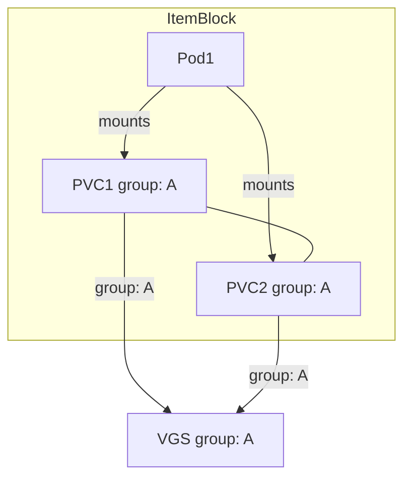
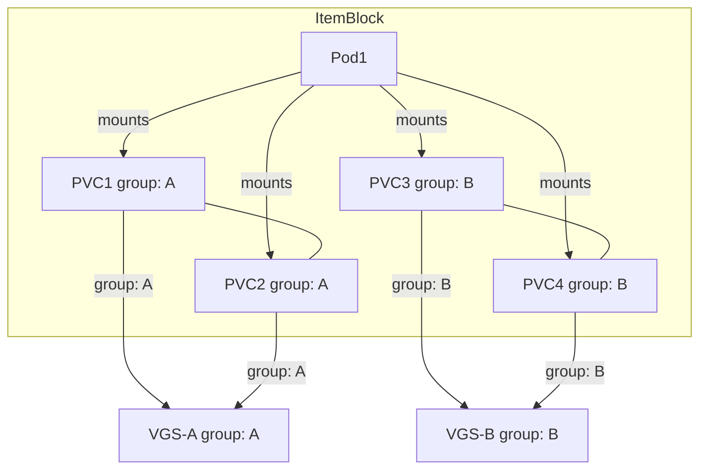
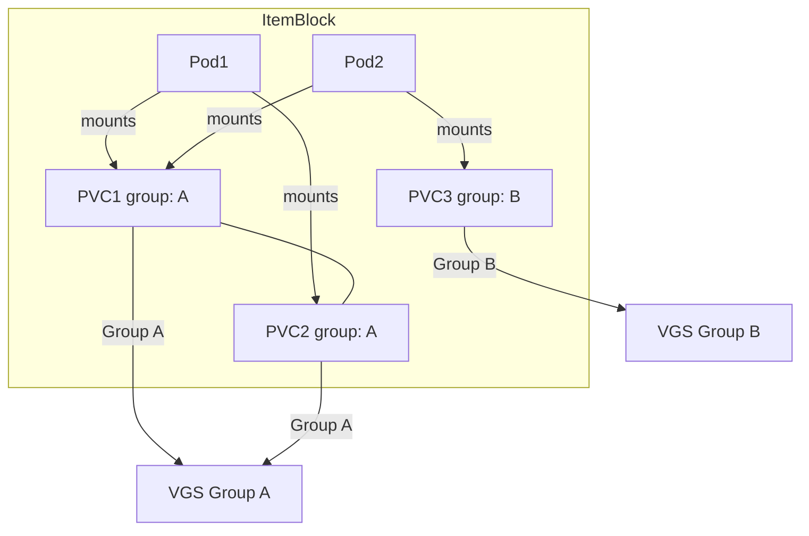
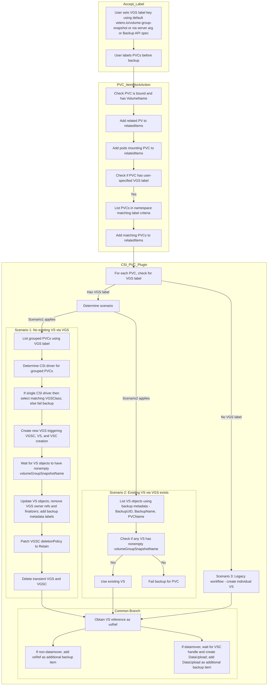

# Add Support for VolumeGroupSnapshots

This proposal outlines the design and implementation plan for incorporating VolumeGroupSnapshot support into Velero. The enhancement will allow Velero to perform consistent, atomic snapshots of groups of Volumes using the new Kubernetes [VolumeGroupSnapshot API](https://kubernetes.io/blog/2024/12/18/kubernetes-1-32-volume-group-snapshot-beta/). This capability is especially critical for stateful applications that rely on multiple volumes to ensure data consistency, such as databases and analytics workloads.

## Glossary & Abbreviation

Terminology used in this document:
- VGS: VolumeGroupSnapshot
- VS: VolumeSnapshot
- VGSC: VolumeGroupSnapshotContent
- VSC: VolumeSnapshotContent
- VGSClass: VolumeGroupSnapshotClass
- VSClass: VolumeSnapshotClass

## Background

Velero currently enables snapshot-based backups on an individual Volume basis through CSI drivers. However, modern stateful applications often require multiple volumes for data, logs, and backups. This distributed data architecture increases the risk of inconsistencies when volumes are captured individually. Kubernetes has introduced the VolumeGroupSnapshot(VGS) API [(KEP-3476)](https://github.com/kubernetes/enhancements/pull/1551), which allows for the atomic snapshotting of multiple volumes in a coordinated manner. By integrating this feature, Velero can offer enhanced disaster recovery for multi-volume applications, ensuring consistency across all related data.

## Goals
- Ensure that multiple related volumes are snapshotted simultaneously, preserving consistency for stateful applications via VolumeGroupSnapshots(VGS) API.
- Integrate VolumeGroupSnapshot functionality into Velero’s existing backup and restore workflows.
- Allow users to opt in to volume group snapshots via specifying the group label.

## Non-Goals
- The proposal does not require a complete overhaul of Velero’s CSI integration, it will extend the current mechanism to support group snapshots.
- No any changes pertaining to execution of Restore Hooks

## High-Level Design

### Backup workflow:
#### Accept the label to be used for VGS from the user:
  - Accept the label from the user, we will do this in 3 ways:
    - Firstly, we will have a hard-coded default label key like `velero.io/volume-group-snapshot` that the users can directly use on their PVCs.
    - Secondly, we will let the users override this default VGS label via a velero server arg, `--volume-group-nsaphot-label-key`, if needed.
    - And Finally we will have the option to override the default label via Backup API spec, `backup.spec.volumeGroupSnapshotLabelKey`
    - In all the instances, the VGS label key will be present on the backup spec, this makes the label key accessible to plugins during the execution of backup operation.
  - This label will enable velero to filter the PVC to be included in the VGS spec.
  - Users will have to label the PVCs before invoking the backup operation.
  - This label would act as a group identifier for the PVCs to be grouped under a specific VGS.
  - It will be used to collect the PVCs to be used for a particular instance of VGS object.  

**Note:** 
  - Modifying or adding VGS label on PVCs during an active backup operation may lead to unexpected or undesirable backup results. To avoid inconsistencies, ensure PVC labels remain unchanged throughout the backup execution.
  - Label Key Precedence: When determining which label key to use for grouping PVCs into a VolumeGroupSnapshot, Velero applies overrides in the following order (highest to lowest):
    - Backup API spec (`backup.spec.volumeGroupSnapshotLabelKey`)
    - Server flag (`--volume-group-snapshot-label-key`)
    - Built-in default (`velero.io/volume-group-snapshot`)

    Whichever key wins this precedence is then injected into the Backup spec so that all Velero plugins can uniformly discover and use it during the backup execution.
#### Changes to the Existing PVC ItemBlockAction plugin:
  - Currently the PVC IBA plugin is applied to PVCs and adds the RelatedItems for the particular PVC into the ItemBlock.
  - At first it checks whether the PVC is bound and VolumeName is non-empty.
  - Then it adds the related PV under the list of relatedItems.
  - Following on, the plugin adds the pods mounting the PVC as relatedItems.
  - Now we need to extend this PVC IBA plugin to add the PVCs to be grouped for a particular VGS object, so that they are processed together under an ItemBlock by Velero.
      - First we will check if the PVC that is being processed by the plugin has the user specified VGS label.
      - If it is present then we will execute a List call in the namespace with the label as a matching criteria and see if this results in any PVCs (other than the current one).
      - If there are PVCs matching the criteria then we add the PVCs to the relatedItems list.
      - This helps in building the ItemBlock we need for VGS processing, i.e. we have the relevant pods and PVCs in the ItemBlock.

**Note:** The ItemBlock to VGS relationship will not always be 1:1. There might be scenarios when the ItemBlock might have multiple VGS instances associated with it.
Lets go over some ItemBlock/VGS scenarios that we might encounter and visualize them for clarity:
1. Pod Mounts: Pod1 mounts both PVC1 and PVC2.  
   Grouping: PVC1 and PVC2 share the same group label (group: A)  
   ItemBlock: The item block includes Pod1, PVC1, and PVC2.  
   VolumeGroupSnapshot (VGS): Because PVC1 and PVC2 are grouped together by their label, they trigger the creation of a single VGS (labeled with group: A).  


2. Pod Mounts: Pod1 mounts each of the four PVCs.  
   Grouping:  
     Group A: PVC1 and PVC2 share the same grouping label (group: A).  
     Group B: PVC3 and PVC4 share the grouping label (group: B)   
   ItemBlock: All objects (Pod1, PVC1, PVC2, PVC3, and PVC4) are collected into a single item block.   
   VolumeGroupSnapshots:  
      PVC1 and PVC2 (group A) point to the same VGS (VGS (group: A)).      
      PVC3 and PVC4 (group B) point to a different VGS (VGS (group: B)).    


3. Pod Mounts: Pod1 mounts both PVC1 and PVC2, Pod2 mounts PVC1 and PVC3.  
   Grouping:   
     Group A: PVC1 and PVC2  
     Group B: PVC3  
   ItemBlock: All objects-Pod1, Pod2, PVC1, PVC2, and PVC3, are collected into a single item block.  
   VolumeGroupSnapshots:  
     PVC1 and PVC2 (group A) point to the same VGS (VGS (group: A)).   
     PVC3 (group B) point to a different VGS (VGS (group: B)).  


#### Updates to CSI PVC plugin:
The CSI PVC plugin now supports obtaining a VolumeSnapshot (VS) reference for a PVC in three ways, and then applies common branching for datamover and non‑datamover workflows:

- Scenario 1: PVC has a VGS label and no VS (created via the VGS workflow) exists for its volume group:
    - Determine VGSClass: The plugin will pick `VolumeGroupSnapshotClass` by following the same tier based precedence as it does for individual `VolumeSnapshotClasses`:
      - Default by Label: Use the one VGSClass labeled
      ```yaml
      metadata:
        labels:
        velero.io/csi-volumegroupsnapshot-class: "true"

      ```
      whose `spec.driver` matches the CSI driver used by the PVCs.
      - Backup‑level Override: If the Backup CR has an annotation
      ```yaml
      metadata:
        annotations:
        velero.io/csi-volumegroupsnapshot-class_<driver>: <className>
      ```
      (with <driver> equal to the PVCs’ CSI driver), use that class.
      - PVC‑level Override: Finally, if the PVC itself carries an annotation
      ```yaml
      metadata:
        annotations:
        velero.io/csi-volume-group-snapshot-class: <className>
      ```
      and that class exists, use it.
      At each step, if the plugin finds zero or multiple matching classes, VGS creation is skipped and backup fails.
    - Create VGS: The plugin creates a new VolumeGroupSnapshot (VGS) for the PVC’s volume group. This action automatically triggers creation of the corresponding VGSC, VS, and VSC objects.
    - Wait for VS Status: The plugin waits until each VS (one per PVC in the group) has its `volumeGroupSnapshotName` populated. This confirms that the snapshot controller has completed its work. `CSISnapshotTimeout` will be used here.
    - Update VS Objects: Once the VS objects are provisioned, the plugin updates them by removing VGS owner references and VGS-related finalizers, and by adding backup metadata labels (including BackupName, BackupUUID, and PVC name). These labels are later used to detect an existing VS when processing another PVC of the same group.
    - Patch and Cleanup: The plugin patches the deletionPolicy of the VGSC to "Retain" (ensuring that deletion of the VGSC does not remove the underlying VSC objects or storage snapshots) and then deletes the temporary VGS and VGSC objects.
        
- Scenario 2: PVC has a VGS label and a VS created via an earlier VGS workflow already exists:
    - The plugin lists VS objects in the PVC’s namespace using backup metadata labels (BackupUID, BackupName, and PVCName).
    - It verifies that at least one VS has a non‑empty `volumeGroupSnapshotName` in its status.
    - If such a VS exists, the plugin skips creating a new VGS (or VS) and proceeds with the legacy workflow using the existing VS.
    - If a VS is found but its status does not indicate it was created by the VGS workflow (i.e. its `volumeGroupSnapshotName` is empty), the backup for that PVC is failed, resulting in a partially failed backup.
- Scenario 3: PVC does not have a VGS label:
    - The legacy workflow is followed, and an individual VolumeSnapshot (VS) is created for the PVC.
- Common Branching for Datamover and Non‑datamover Workflows:
    - Once a VS reference (`vsRef`) is determined—whether through the VGS workflow (Scenario 1 or 2) or the legacy workflow (Scenario 3)—the plugin then applies the common branching:
        - Non‑datamover Case: The VS reference is directly added as an additional backup item.
            
        - Datamover Case: The plugin waits until the VS’s associated VSC snapshot handle is ready (using the configured CSISnapshotTimeout), then creates a DataUpload for the VS–PVC pair. The resulting DataUpload is then added as an additional backup item.





Restore workflow:

- No changes required for the restore workflow.

## Detailed Design

Backup workflow:
- Accept the label to be used for VGS from the user as a server argument:
    - Set a default VGS label key to be used:
    ```go
    // default VolumeGroupSnapshot Label
	defaultVGSLabelKey = "velero.io/volume-group-snapshot"
    
    ```
    - Add this as a server flag and pass it to backup reconciler, so that we can use it during the backup request execution.
    ```go
    flags.StringVar(&c.DefaultVGSLabelKey, "volume-group-snapshot-label-key", c.DefaultVGSLabelKey, "Label key for grouping PVCs into VolumeGroupSnapshot")
    ```

    - Update the Backup CRD to accept the VGS Label Key as a spec value:
    ```go
    // VolumeGroupSnapshotLabelKey specifies the label key to be used for grouping the PVCs under
	// an instance of VolumeGroupSnapshot, if left unspecified velero.io/volume-group-snapshot is used
	// +optional
	VolumeGroupSnapshotLabelKey string `json:"volumeGroupSnapshotLabelKey,omitempty"`
    ```
    - Modify the [`prepareBackupRequest` function](https://github.com/openshift/velero/blob/8c8a6cccd78b78bd797e40189b0b9bee46a97f9e/pkg/controller/backup_controller.go#L327) to set the default label key as a backup spec if the user does not specify any value:
    ```go
    if len(request.Spec.VolumeGroupSnapshotLabelKey) == 0 {
		// set the default key value
		request.Spec.VolumeGroupSnapshotLabelKey = b.defaultVGSLabelKey
	}
    ```

- Changes to the Existing [PVC ItemBlockAction plugin](https://github.com/vmware-tanzu/velero/blob/512199723ff95d5016b32e91e3bf06b65f57d608/pkg/itemblock/actions/pvc_action.go#L64) (Update the GetRelatedItems function):
```go
// Retrieve the VGS label key from the Backup spec.
	vgsLabelKey := backup.Spec.VolumeGroupSnapshotLabelKey
	if vgsLabelKey != "" {
		// Check if the PVC has the specified VGS label.
		if groupID, ok := pvc.Labels[vgsLabelKey]; ok {
			// List all PVCs in the namespace with the same label key and value (i.e. same group).
			pvcList := new(corev1api.PersistentVolumeClaimList)
			if err := a.crClient.List(context.Background(), pvcList, crclient.InNamespace(pvc.Namespace), crclient.MatchingLabels{vgsLabelKey: groupID}); err != nil {
				return nil, errors.Wrap(err, "failed to list PVCs for VGS grouping")
			}
			// Add each matching PVC (except the current one) to the relatedItems.
			for _, groupPVC := range pvcList.Items {
				if groupPVC.Name == pvc.Name {
					continue
				}
				a.log.Infof("Adding grouped PVC %s to relatedItems for PVC %s", groupPVC.Name, pvc.Name)
				relatedItems = append(relatedItems, velero.ResourceIdentifier{
					GroupResource: kuberesource.PersistentVolumeClaims,
					Namespace:     groupPVC.Namespace,
					Name:          groupPVC.Name,
				})
			}
		}
	} else {
		a.log.Info("No VolumeGroupSnapshotLabelKey provided in backup spec; skipping PVC grouping")
	}
```

- Updates to [CSI PVC plugin](https://github.com/vmware-tanzu/velero/blob/512199723ff95d5016b32e91e3bf06b65f57d608/pkg/backup/actions/csi/pvc_action.go#L200) (Update the Execute method):
```go
func (p *pvcBackupItemAction) Execute(
    item runtime.Unstructured,
    backup *velerov1api.Backup,
) (
    runtime.Unstructured,
    []velero.ResourceIdentifier,
    string,
    []velero.ResourceIdentifier,
    error,
) {
    p.log.Info("Starting PVCBackupItemAction")

    // Validate backup policy and PVC/PV
    if valid := p.validateBackup(*backup); !valid {
        return item, nil, "", nil, nil
    }

    var pvc corev1api.PersistentVolumeClaim
    if err := runtime.DefaultUnstructuredConverter.FromUnstructured(item.UnstructuredContent(), &pvc); err != nil {
        return nil, nil, "", nil, errors.WithStack(err)
    }
    if valid, item, err := p.validatePVCandPV(pvc, item); !valid {
        if err != nil {
            return nil, nil, "", nil, err
        }
        return item, nil, "", nil, nil
    }

    shouldSnapshot, err := volumehelper.ShouldPerformSnapshotWithBackup(
        item,
        kuberesource.PersistentVolumeClaims,
        *backup,
        p.crClient,
        p.log,
    )
    if err != nil {
        return nil, nil, "", nil, err
    }
    if !shouldSnapshot {
        p.log.Debugf("CSI plugin skip snapshot for PVC %s according to VolumeHelper setting", pvc.Namespace+"/"+pvc.Name)
        return nil, nil, "", nil, nil
    }

    var additionalItems []velero.ResourceIdentifier
    var operationID string
    var itemToUpdate []velero.ResourceIdentifier

    // vsRef will be our common reference to the VolumeSnapshot (VS)
    var vsRef *corev1api.ObjectReference

    // Retrieve the VGS label key from the backup spec.
    vgsLabelKey := backup.Spec.VolumeGroupSnapshotLabelKey

    // Check if the PVC has the user-specified VGS label.
    if group, ok := pvc.Labels[vgsLabelKey]; ok && group != "" {
        p.log.Infof("PVC %s has VGS label with group %s", pvc.Name, group)
        // --- VGS branch ---
        // 1. Check if a VS created via a VGS workflow exists for this PVC.
        existingVS, err := p.findExistingVSForBackup(backup.UID, backup.Name, pvc.Name, pvc.Namespace)
        if err != nil {
            return nil, nil, "", nil, err
        }
        if existingVS != nil && existingVS.Status.VolumeGroupSnapshotName != "" {
            p.log.Infof("Existing VS %s found for PVC %s in group %s; skipping VGS creation", existingVS.Name, pvc.Name, group)
            vsRef = &corev1api.ObjectReference{
                Namespace: existingVS.Namespace,
                Name:      existingVS.Name,
            }
        } else {
            // 2. No existing VS via VGS; execute VGS creation workflow.
            groupedPVCs, err := p.listGroupedPVCs(backup, pvc.Namespace, vgsLabelKey, group)
            if err != nil {
                return nil, nil, "", nil, err
            }
            pvcNames := extractPVCNames(groupedPVCs)
            // Determine the CSI driver used by the grouped PVCs.
            driver, err := p.determineCSIDriver(groupedPVCs)
            if err != nil {
                return nil, nil, "", nil, errors.Wrap(err, "failed to determine CSI driver for grouped PVCs")
            }
            if driver == "" {
                return nil, nil, "", nil, errors.New("multiple CSI drivers found for grouped PVCs; failing backup")
            }
            // Retrieve the appropriate VGSClass for the CSI driver.
            vgsClass := p.getVGSClassForDriver(driver)
            p.log.Infof("Determined CSI driver %s with VGSClass %s for PVC group %s", driver, vgsClass, group)

            newVGS, err := p.createVolumeGroupSnapshot(backup, pvc, pvcNames, vgsLabelKey, group, vgsClass)
            if err != nil {
                return nil, nil, "", nil, err
            }
            p.log.Infof("Created new VGS %s for PVC group %s", newVGS.Name, group)
            
            // Wait for the VS objects created via VGS to have volumeGroupSnapshotName in status.
            if err := p.waitForVGSAssociatedVS(newVGS, pvc.Namespace, backup.Spec.CSISnapshotTimeout.Duration); err != nil {
                return nil, nil, "", nil, err
            }
            // Update the VS objects: remove VGS owner references and finalizers; add backup metadata labels.
            if err := p.updateVGSCreatedVS(newVGS, backup); err != nil {
                return nil, nil, "", nil, err
            }
            // Patch the VGSC deletionPolicy to Retain.
            if err := p.patchVGSCDeletionPolicy(newVGS, pvc.Namespace); err != nil {
                return nil, nil, "", nil, err
            }
            // Delete the VGS and VGSC
            if err := p.deleteVGSAndVGSC(newVGS, pvc.Namespace); err != nil {
                return nil, nil, "", nil, err
            }
            // Fetch the VS that was created for this PVC via VGS.
            vs, err := p.getVSForPVC(backup, pvc, vgsLabelKey, group)
            if err != nil {
                return nil, nil, "", nil, err
            }
            vsRef = &corev1api.ObjectReference{
                Namespace: vs.Namespace,
                Name:      vs.Name,
            }
        }
    } else {
        // Legacy workflow: PVC does not have a VGS label; create an individual VS.
        vs, err := p.createVolumeSnapshot(pvc, backup)
        if err != nil {
            return nil, nil, "", nil, err
        }
        vsRef = &corev1api.ObjectReference{
            Namespace: vs.Namespace,
            Name:      vs.Name,
        }
    }

    // --- Common Branch ---
    // Now we have vsRef populated from one of the above cases.
    // Branch further based on backup.Spec.SnapshotMoveData.
    if boolptr.IsSetToTrue(backup.Spec.SnapshotMoveData) {
        // Datamover case:
        operationID = label.GetValidName(
            string(velerov1api.AsyncOperationIDPrefixDataUpload) + string(backup.UID) + "." + string(pvc.UID),
        )
        dataUploadLog := p.log.WithFields(logrus.Fields{
            "Source PVC":     fmt.Sprintf("%s/%s", pvc.Namespace, pvc.Name),
            "VolumeSnapshot": fmt.Sprintf("%s/%s", vsRef.Namespace, vsRef.Name),
            "Operation ID":   operationID,
            "Backup":         backup.Name,
        })
        // Retrieve the current VS using vsRef
        vs := &snapshotv1api.VolumeSnapshot{}
        if err := p.crClient.Get(context.TODO(), crclient.ObjectKey{Namespace: vsRef.Namespace, Name: vsRef.Name}, vs); err != nil {
            return nil, nil, "", nil, errors.Wrapf(err, "failed to get VolumeSnapshot %s", vsRef.Name)
        }
        // Wait until the VS-associated VSC snapshot handle is ready.
        _, err := csi.WaitUntilVSCHandleIsReady(
            vs,
            p.crClient,
            p.log,
            true,
            backup.Spec.CSISnapshotTimeout.Duration,
        )
        if err != nil {
            dataUploadLog.Errorf("Failed to wait for VolumeSnapshot to become ReadyToUse: %s", err.Error())
            csi.CleanupVolumeSnapshot(vs, p.crClient, p.log)
            return nil, nil, "", nil, errors.WithStack(err)
        }
        dataUploadLog.Info("Starting data upload of backup")
        dataUpload, err := createDataUpload(
            context.Background(),
            backup,
            p.crClient,
            vs,
            &pvc,
            operationID,
        )
        if err != nil {
            dataUploadLog.WithError(err).Error("Failed to submit DataUpload")
            if deleteErr := p.crClient.Delete(context.TODO(), vs); deleteErr != nil && !apierrors.IsNotFound(deleteErr) {
                dataUploadLog.WithError(deleteErr).Error("Failed to delete VolumeSnapshot")
            }
            return item, nil, "", nil, nil
        }
        dataUploadLog.Info("DataUpload submitted successfully")
        itemToUpdate = []velero.ResourceIdentifier{
            {
                GroupResource: schema.GroupResource{
                    Group:    "velero.io",
                    Resource: "datauploads",
                },
                Namespace: dataUpload.Namespace,
                Name:      dataUpload.Name,
            },
        }
        annotations[velerov1api.DataUploadNameAnnotation] = dataUpload.Namespace + "/" + dataUpload.Name
        // For the datamover case, add the dataUpload as an additional item directly.
        vsRef = &corev1api.ObjectReference{
            Namespace: dataUpload.Namespace,
            Name:      dataUpload.Name,
        }
        additionalItems = append(additionalItems, velero.ResourceIdentifier{
            GroupResource: schema.GroupResource{
                Group:    "velero.io",
                Resource: "datauploads",
            },
            Namespace: dataUpload.Namespace,
            Name:      dataUpload.Name,
        })
    } else {
        // Non-datamover case:
        // Use vsRef for snapshot purposes.
        additionalItems = append(additionalItems, convertVSToResourceIdentifiersFromRef(vsRef)...)
        p.log.Infof("VolumeSnapshot additional item added for VS %s", vsRef.Name)
    }

    // Update PVC metadata with common labels and annotations.
    labels := map[string]string{
        velerov1api.VolumeSnapshotLabel: vsRef.Name,
        velerov1api.BackupNameLabel:     backup.Name,
    }
    annotations := map[string]string{
        velerov1api.VolumeSnapshotLabel:                 vsRef.Name,
        velerov1api.MustIncludeAdditionalItemAnnotation: "true",
    }
    kubeutil.AddAnnotations(&pvc.ObjectMeta, annotations)
    kubeutil.AddLabels(&pvc.ObjectMeta, labels)

    p.log.Infof("Returning from PVCBackupItemAction with %d additionalItems to backup", len(additionalItems))
    for _, ai := range additionalItems {
        p.log.Debugf("%s: %s", ai.GroupResource.String(), ai.Name)
    }

    pvcMap, err := runtime.DefaultUnstructuredConverter.ToUnstructured(&pvc)
    if err != nil {
        return nil, nil, "", nil, errors.WithStack(err)
    }

    return &unstructured.Unstructured{Object: pvcMap},
        additionalItems, operationID, itemToUpdate, nil
}


```

## Implementation

This design proposal is targeted for velero 1.16.

The implementation of this proposed design is targeted for velero 1.17.

**Note:**
- VGS support isn't a requirement on restore. The design does not have any VGS related elements/considerations in the restore workflow.

## Requirements and Assumptions
- Kubernetes Version:
  - Minimum: v1.32.0 or later, since the VolumeGroupSnapshot API goes beta in 1.32.
  - Assumption: CRDs for `VolumeGroupSnapshot`, `VolumeGroupSnapshotClass`, and `VolumeGroupSnapshotContent` are already installed.

- VolumeGroupSnapshot API Availability:
  - If the VGS API group (`groupsnapshot.storage.k8s.io/v1beta1`) is not present, Velero backup will fail.

- CSI Driver Compatibility
  - Only CSI drivers that implement the VolumeGroupSnapshot admission and controller support this feature.
  - Upon VGS creation, we assume the driver will atomically snapshot all matching PVCs; if it does not, the plugin may time out.

## Performance Considerations
- Use VGS if you have many similar volumes that must be snapped together and you want to minimize API/server load.
- Use individual VS if you have only a few volumes, or want one‐volume failures to be isolated.

## Testing Strategy

- Unit tests: We will add targeted unit tests to cover all new code paths—including existing-VS detection, VGS creation, legacy VS fallback, and error scenarios.
- E2E tests: For E2E we would need, a Kind cluster with a CSI driver that supports group snapshots, deploy an application with multiple PVCs, execute a Velero backup and restore, and verify that VGS is created, all underlying VS objects reach ReadyToUse, and every PVC is restored successfully.