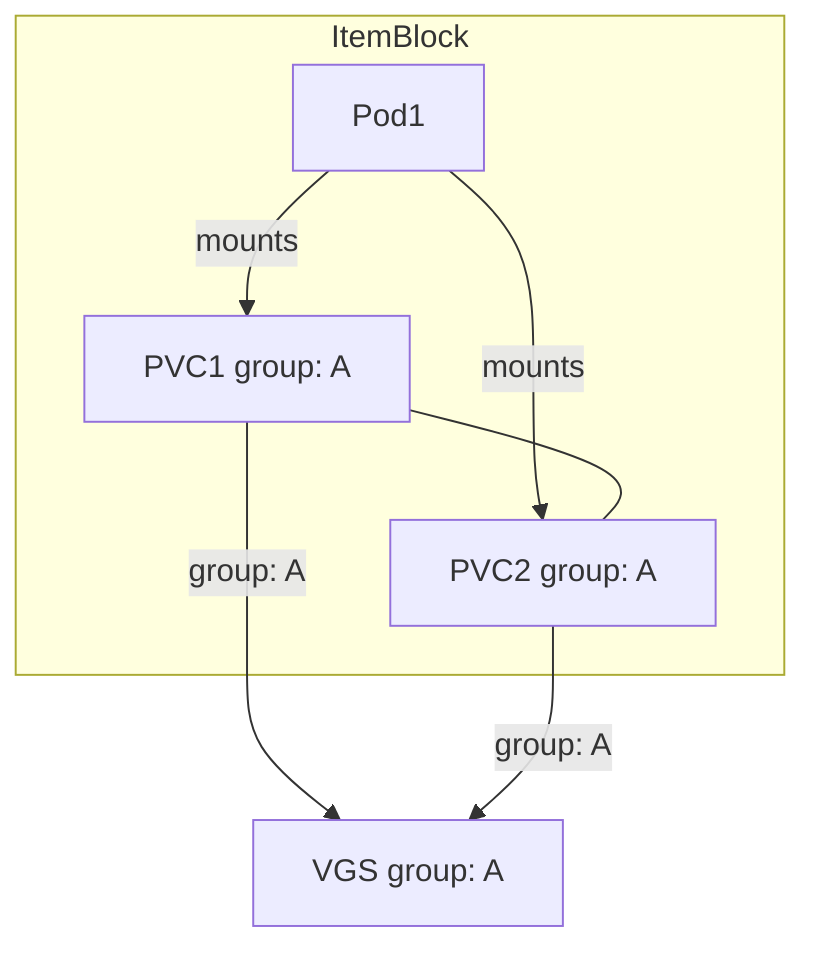
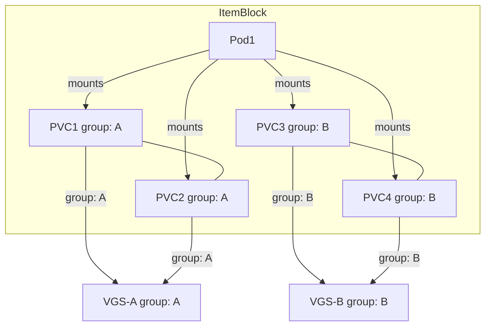
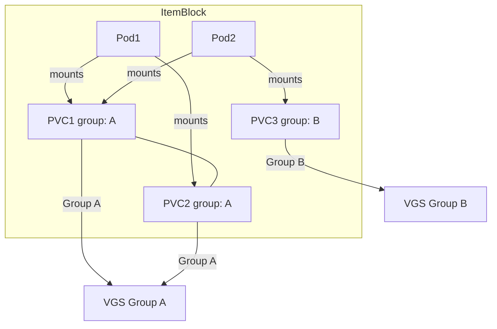
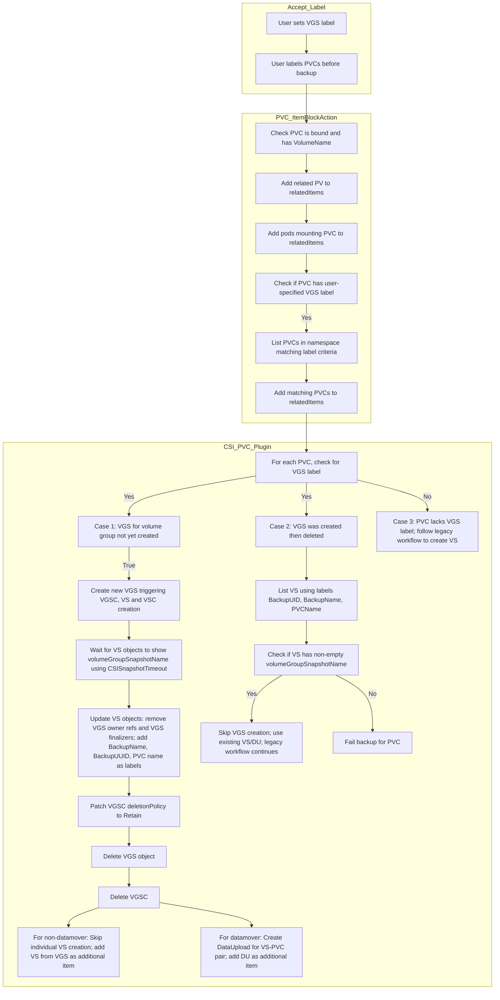

# Add Support for VolumeGroupSnapshots

This proposal outlines the design and implementation plan for incorporating VolumeGroupSnapshot support into Velero. The enhancement will allow Velero to perform consistent, atomic snapshots of groups of Volumes using the new Kubernetes [VolumeGroupSnapshot API](https://kubernetes.io/blog/2024/12/18/kubernetes-1-32-volume-group-snapshot-beta/). This capability is especially critical for stateful applications that rely on multiple volumes to ensure data consistency, such as databases and analytics workloads.

## Background

Velero currently enables snapshot-based backups on an individual Volume basis through CSI drivers. However, modern stateful applications often require multiple volumes for data, logs, and backups. This distributed data architecture increases the risk of inconsistencies when volumes are captured individually. Kubernetes has introduced the VolumeGroupSnapshot(VGS) API [(KEP-3476)](https://github.com/kubernetes/enhancements/pull/1551), which allows for the atomic snapshotting of multiple volumes in a coordinated manner. By integrating this feature, Velero can offer enhanced disaster recovery for multi-volume applications, ensuring consistency across all related data.

## Goals
- Ensure that multiple related volumes are snapshotted simultaneously, preserving consistency for stateful applications via VolumeGroupSnapshots(VGS) API.
- Integrate VolumeGroupSnapshot functionality into Velero’s existing backup and restore workflows.
- Allow users to opt in to volume group snapshots via specifying the group label.

## Non-Goals
- The proposal does not require a complete overhaul of Velero’s CSI integration, it will extend the current mechanism to support group snapshots.
- No any changes pertaining to execution of Restore Hooks

## High-Level Design

### Backup workflow:
#### Accept the label to be used for VGS from the user:
  - Accept the label from the user, we will do this in 3 ways:
        - Firstly, we will have a hard-coded default label key like `velero.io/volume-group-snapshot` that the users can directly use on their PVCs.
        - Secondly, we will let the users override this default VGS label via a velero server arg, `--volume-group-nsaphot-label-key`, if needed.
        - And Finally we will have the option to override the default label via Backup API spec, `backup.spec.volumeGroupSnapshotLabelKey`
        - In all the instances, the VGS label key will be present on the backup spec, this makes the label key accessible to plugins during the execution of backup operation.
  - This label will enable velero to filter the PVC to be included in the VGS spec.
  - Users will have to label the PVCs before invoking the backup operation.
  - This label would act as a group identifier for the PVCs to be grouped under a specific VGS.
  - It will be used to collect the PVCs to be used for a particular instance of VGS object.  
**Note:** Modifying or adding VGS label on PVCs during an active backup operation may lead to unexpected or undesirable backup results. To avoid inconsistencies, ensure PVC labels remain unchanged throughout the backup execution.

#### Changes to the Existing PVC ItemBlockAction plugin:
  - Currently the PVC IBA plugin is applied to PVCs and adds the RelatedItems for the particular PVC into the ItemBlock.
  - At first it checks whether the PVC is bound and VolumeName is non-empty.
  - Then it adds the related PV under the list of relatedItems.
  - Following on, the plugin adds the pods mounting the PVC as relatedItems.
  - Now we need to extend this PVC IBA plugin to add the PVCs to be grouped for a particular VGS object, so that they are processed together under an ItemBlock by Velero.
      - First we will check if the PVC that is being processed by the plugin has the user specified VGS label.
      - If it is present then we will execute a List call in the namespace with the label as a matching criteria and see if this results in any PVCs (other than the current one).
      - If there are PVCs matching the criteria then we add the PVCs to the relatedItems list.
      - This helps in building the ItemBlock we need for VGS processing, i.e. we have the relevant pods and PVCs in the ItemBlock.

**Note:** The ItemBlock to VGS relationship will not always be 1:1. There might be scenarios when the ItemBlock might have multiple VGS instances associated with it.
Lets go over some ItemBlock/VGS scenarios that we might encounter and visualize them for clarity:
1. Pod Mounts: Pod1 mounts both PVC1 and PVC2.  
   Grouping: PVC1 and PVC2 share the same group label (group: A)  
   ItemBlock: The item block includes Pod1, PVC1, and PVC2.  
   VolumeGroupSnapshot (VGS): Because PVC1 and PVC2 are grouped together by their label, they trigger the creation of a single VGS (labeled with group: A).  


2. Pod Mounts: Pod1 mounts each of the four PVCs.  
   Grouping:  
     Group A: PVC1 and PVC2 share the same grouping label (group: A).  
     Group B: PVC3 and PVC4 share the grouping label (group: B)   
   ItemBlock: All objects (Pod1, PVC1, PVC2, PVC3, and PVC4) are collected into a single item block.   
   VolumeGroupSnapshots:  
      PVC1 and PVC2 (group A) point to the same VGS (VGS (group: A)).      
      PVC3 and PVC4 (group B) point to a different VGS (VGS (group: B)).    


3. Pod Mounts: Pod1 mounts both PVC1 and PVC2, Pod2 mounts PVC1 and PVC3.  
   Grouping:   
     Group A: PVC1 and PVC2  
     Group B: PVC3  
   ItemBlock: All objects-Pod1, Pod2, PVC1, PVC2, and PVC3, are collected into a single item block.  
   VolumeGroupSnapshots:  
     PVC1 and PVC2 (group A) point to the same VGS (VGS (group: A)).   
     PVC3 (group B) point to a different VGS (VGS (group: B)).  


#### Updates to CSI PVC plugin:
- When a PVC has a VGS label and no VS (created via VGS) exists:
    - Create VGS: 
      - This triggers creation of the corresponding VGSC, VS, and VSC objects.
    - Wait for VS Status: 
      - Wait until each VS (one per PVC in the group) has its volumeGroupSnapshotName set. This confirms that the snapshot controller has done its work.
    - Update VS Objects:
      - Remove owner references and VGS-related finalizers from the VS objects (decoupling them to prevent cascading deletion).
      - Add backup metadata (BackupName, BackupUUID, PVC name) as labels. This metadata is later used to skip re-creating a VGS when another PVC of the same group is processed.
    - Patch and Cleanup:
      - Patch the VGSC deletionPolicy to Retain so that when you delete the VGSC, the underlying VSC (and the storage snapshots) remain.
      - Delete the temporary VGS and VGSC objects.
    - Branching:
      - For non‑datamover cases, skip the creation of an individual VS (since it was created via VGS) and add the VS objects as additional items.
      - For datamover cases, create DataUploads for the VS–PVC pair (using the VS created by the VGS workflow) and add those as additional items.
    
- When a PVC has a VGS label and a VS created via an earlier VGS workflow already exists:
  - List VS objects in the PVC’s namespace using labels (BackupUUID, BackupName, PVCName).
  - Verify that a VS exists and that its status shows a non‑empty volumeGroupSnapshotName.
  - If so, skip VGS (and VS) creation and continue with the legacy workflow. 
  - If a VS is found but it wasn’t created by the VGS workflow (i.e. it lacks the volumeGroupSnapshotName), then the backup for that PVC is failed, resulting in a partially failed backup.

- When a PVC does not have a VGS label:
  - The legacy workflow is followed, creating an individual VolumeSnapshot as before.





Restore workflow:

- No changes required for the restore workflow.

## Detailed Design

Backup workflow:
- Accept the label to be used for VGS from the user as a server argument:
    - Set a default VGS label key to be used:
    ```go
    // default VolumeGroupSnapshot Label
	defaultVGSLabelKey = "velero.io/volume-group-snapshot"
    
    ```
    - Add this as a server flag and pass it to backup reconciler, so that we can use it during the backup request execution.
    ```go
    flags.StringVar(&c.DefaultVGSLabelKey, "volume-group-snapshot-label-key", c.DefaultVGSLabelKey, "Label key for grouping PVCs into VolumeGroupSnapshot")
    ```

    - Update the Backup CRD to accept the VGS Label Key as a spec value:
    ```go
    // VolumeGroupSnapshotLabelKey specifies the label key to be used for grouping the PVCs under
	// an instance of VolumeGroupSnapshot, if left unspecified velero.io/volume-group-snapshot is used
	// +optional
	VolumeGroupSnapshotLabelKey string `json:"volumeGroupSnapshotLabelKey,omitempty"`
    ```
    - Modify the [`prepareBackupRequest` function](https://github.com/openshift/velero/blob/8c8a6cccd78b78bd797e40189b0b9bee46a97f9e/pkg/controller/backup_controller.go#L327) to set the default label key as a backup spec if the user does not specify any value:
    ```go
    if len(request.Spec.VolumeGroupSnapshotLabelKey) == 0 {
		// set the default key value
		request.Spec.VolumeGroupSnapshotLabelKey = b.defaultVGSLabelKey
	}
    ```

- Changes to the Existing [PVC ItemBlockAction plugin](https://github.com/vmware-tanzu/velero/blob/512199723ff95d5016b32e91e3bf06b65f57d608/pkg/itemblock/actions/pvc_action.go#L64) (Update the GetRelatedItems function):
```go
// Retrieve the VGS label key from the Backup spec.
	vgsLabelKey := backup.Spec.VolumeGroupSnapshotLabelKey
	if vgsLabelKey != "" {
		// Check if the PVC has the specified VGS label.
		if groupID, ok := pvc.Labels[vgsLabelKey]; ok {
			// List all PVCs in the namespace with the same label key and value (i.e. same group).
			pvcList := new(corev1api.PersistentVolumeClaimList)
			if err := a.crClient.List(context.Background(), pvcList, crclient.InNamespace(pvc.Namespace), crclient.MatchingLabels{vgsLabelKey: groupID}); err != nil {
				return nil, errors.Wrap(err, "failed to list PVCs for VGS grouping")
			}
			// Add each matching PVC (except the current one) to the relatedItems.
			for _, groupPVC := range pvcList.Items {
				if groupPVC.Name == pvc.Name {
					continue
				}
				a.log.Infof("Adding grouped PVC %s to relatedItems for PVC %s", groupPVC.Name, pvc.Name)
				relatedItems = append(relatedItems, velero.ResourceIdentifier{
					GroupResource: kuberesource.PersistentVolumeClaims,
					Namespace:     groupPVC.Namespace,
					Name:          groupPVC.Name,
				})
			}
		}
	} else {
		a.log.Info("No VolumeGroupSnapshotLabelKey provided in backup spec; skipping PVC grouping")
	}
```

- Updates to [CSI PVC plugin](https://github.com/vmware-tanzu/velero/blob/512199723ff95d5016b32e91e3bf06b65f57d608/pkg/backup/actions/csi/pvc_action.go#L200) (Update the Execute method):
```go
func (p *pvcBackupItemAction) Execute(
	item runtime.Unstructured,
	backup *velerov1api.Backup,
) (
	runtime.Unstructured,
	[]velero.ResourceIdentifier,
	string,
	[]velero.ResourceIdentifier,
	error,
) {
	p.log.Info("Starting PVCBackupItemAction")

	if valid := p.validateBackup(*backup); !valid {
		return item, nil, "", nil, nil
	}

	var pvc corev1api.PersistentVolumeClaim
	if err := runtime.DefaultUnstructuredConverter.FromUnstructured(
		item.UnstructuredContent(), &pvc,
	); err != nil {
		return nil, nil, "", nil, errors.WithStack(err)
	}

	if valid, item, err := p.validatePVCandPV(pvc, item); !valid {
		if err != nil {
			return nil, nil, "", nil, err
		}
		return item, nil, "", nil, nil
	}

	shouldSnapshot, err := volumehelper.ShouldPerformSnapshotWithBackup(
		item,
		kuberesource.PersistentVolumeClaims,
		*backup,
		p.crClient,
		p.log,
	)
	if err != nil {
		return nil, nil, "", nil, err
	}
	if !shouldSnapshot {
		p.log.Debugf("CSI plugin skip snapshot for PVC %s according to VolumeHelper setting", pvc.Namespace+"/"+pvc.Name)
		return nil, nil, "", nil, nil
	}

	var additionalItems []velero.ResourceIdentifier
	operationID := ""
	var itemToUpdate []velero.ResourceIdentifier

	// vsRef will be used to apply common labels/annotations
	var vsRef *corev1api.ObjectReference

	// VGS branch: check if PVC has the VGS label key set on it.
	vgsLabelKey := backup.Spec.VolumeGroupSnapshotLabelKey
	if group, ok := pvc.Labels[vgsLabelKey]; ok && group != "" {
		p.log.Infof("PVC %s has VGS label with group %s", pvc.Name, group)
		// First, check if a VS created via a VGS workflow exists for this PVC.
		existingVS, err := p.findExistingVSForBackup(backup.UID, backup.Name, pvc.Name, pvc.Namespace)
		if err != nil {
			return nil, nil, "", nil, err
		}
		if existingVS != nil && existingVS.Status.VolumeGroupSnapshotName != "" {
			p.log.Infof("Existing VS %s found for PVC %s in group %s; skipping VGS creation", existingVS.Name, pvc.Name, group)
			vsRef = &corev1api.ObjectReference{
				Namespace: existingVS.Namespace,
				Name:      existingVS.Name,
			}
			additionalItems = append(additionalItems, velero.ResourceIdentifier{
				GroupResource: schema.GroupResource{
					Group:    "snapshot.storage.k8s.io",
					Resource: "volumesnapshots",
				},
				Namespace: existingVS.Namespace,
				Name:      existingVS.Name,
			})
		} else {
			// No existing VS found for the group; execute VGS creation workflow.
			groupedPVCs, err := p.listGroupedPVCs(backup, pvc.Namespace, vgsLabelKey, group)
			if err != nil {
				return nil, nil, "", nil, err
			}
			pvcNames := extractPVCNames(groupedPVCs)
			newVGS, err := p.createVolumeGroupSnapshot(backup, pvc, pvcNames, vgsLabelKey, group)
			if err != nil {
				return nil, nil, "", nil, err
			}
			p.log.Infof("Created new VGS %s for PVC group %s", newVGS.Name, group)
			
			// Wait for the VS objects created via VGS to have VolumeGroupSnapshotName in status.
			if err := p.waitForVGSAssociatedVS(newVGS, pvc.Namespace, backup.Spec.CSISnapshotTimeout.Duration); err != nil {
				return nil, nil, "", nil, err
			}
			// Update VS objects: remove VGS owner references and finalizers; add BackupName, BackupUUID and PVC name as labels.
			if err := p.updateVGSCreatedVS(newVGS, backup); err != nil {
				return nil, nil, "", nil, err
			}
			// Patch the VGSC deletionPolicy to Retain.
			if err := p.patchVGSCDeletionPolicy(newVGS, pvc.Namespace); err != nil {
				return nil, nil, "", nil, err
			}
			// Delete the VGS and VGSC objects to prevent cascading deletion.
			if err := p.deleteVGSAndVGSC(newVGS, pvc.Namespace); err != nil {
				return nil, nil, "", nil, err
			}
			
			// Branch based on datamover flag.
			if !boolptr.IsSetToTrue(backup.Spec.SnapshotMoveData) {
				// Non-datamover: list VS objects created via VGS and use them.
				vsList, err := p.listVSForVGSGroup(backup, pvc.Namespace, vgsLabelKey, group)
				if err != nil {
					return nil, nil, "", nil, err
				}
				if len(vsList) == 0 {
					return nil, nil, "", nil, errors.New("no VS objects found for VGS group " + group)
				}
				vsRef = &corev1api.ObjectReference{
					Namespace: vsList[0].Namespace,
					Name:      vsList[0].Name,
				}
				additionalItems = append(additionalItems, convertVSToResourceIdentifiers(vsList)...)
			} else {
				// Datamover: retrieve the VS for the PVC and create a DataUpload.
				vs, err := p.getVSForPVC(backup, pvc, vgsLabelKey, group)
				if err != nil {
					return nil, nil, "", nil, err
				}
				operationID = label.GetValidName(string(velerov1api.AsyncOperationIDPrefixDataUpload) + string(backup.UID) + "." + string(pvc.UID))
				dataUploadLog := p.log.WithFields(logrus.Fields{
					"Source PVC":     fmt.Sprintf("%s/%s", pvc.Namespace, pvc.Name),
					"VolumeSnapshot": fmt.Sprintf("%s/%s", vs.Namespace, vs.Name),
					"Operation ID":   operationID,
					"Backup":         backup.Name,
				})
				// Wait until VS associated VSC snapshot handle is created.
				_, err = csi.WaitUntilVSCHandleIsReady(
					vs,
					p.crClient,
					p.log,
					true,
					backup.Spec.CSISnapshotTimeout.Duration,
				)
				if err != nil {
					dataUploadLog.Errorf("Fail to wait VolumeSnapshot turned to ReadyToUse: %s", err.Error())
					csi.CleanupVolumeSnapshot(vs, p.crClient, p.log)
					return nil, nil, "", nil, errors.WithStack(err)
				}
				dataUploadLog.Info("Starting data upload of backup")
				dataUpload, err := createDataUpload(
					context.Background(),
					backup,
					p.crClient,
					vs,
					&pvc,
					operationID,
				)
				if err != nil {
					dataUploadLog.WithError(err).Error("failed to submit DataUpload")
					if deleteErr := p.crClient.Delete(context.TODO(), vs); deleteErr != nil {
						if !apierrors.IsNotFound(deleteErr) {
							dataUploadLog.WithError(deleteErr).Error("fail to delete VolumeSnapshot")
						}
					}
					return item, nil, "", nil, nil
				} else {
					itemToUpdate = []velero.ResourceIdentifier{
						{
							GroupResource: schema.GroupResource{
								Group:    "velero.io",
								Resource: "datauploads",
							},
							Namespace: dataUpload.Namespace,
							Name:      dataUpload.Name,
						},
					}
					annotations[velerov1api.DataUploadNameAnnotation] = dataUpload.Namespace + "/" + dataUpload.Name
					dataUploadLog.Info("DataUpload is submitted successfully.")
				}
				vsRef = &corev1api.ObjectReference{
					Namespace: dataUpload.Namespace,
					Name:      dataUpload.Name,
				}
				additionalItems = append(additionalItems, velero.ResourceIdentifier{
					GroupResource: schema.GroupResource{
						Group:    "velero.io",
						Resource: "datauploads",
					},
					Namespace: dataUpload.Namespace,
					Name:      dataUpload.Name,
				})
			}
		}
	} else {
		// Legacy workflow: PVC does not have a VGS label; create an individual VolumeSnapshot.
		vs, err := p.createVolumeSnapshot(pvc, backup)
		if err != nil {
			return nil, nil, "", nil, err
		}
		vsRef = vs
		additionalItems = []velero.ResourceIdentifier{
			{
				GroupResource: kuberesource.VolumeSnapshots,
				Namespace:     vs.Namespace,
				Name:          vs.Name,
			},
		}
	}

	labels := map[string]string{
		velerov1api.VolumeSnapshotLabel: vsRef.Name,
		velerov1api.BackupNameLabel:     backup.Name,
	}

	annotations := map[string]string{
		velerov1api.VolumeSnapshotLabel:                 vsRef.Name,
		velerov1api.MustIncludeAdditionalItemAnnotation: "true",
	}

	kubeutil.AddAnnotations(&pvc.ObjectMeta, annotations)
	kubeutil.AddLabels(&pvc.ObjectMeta, labels)

	p.log.Infof("Returning from PVCBackupItemAction with %d additionalItems to backup", len(additionalItems))
	for _, ai := range additionalItems {
		p.log.Debugf("%s: %s", ai.GroupResource.String(), ai.Name)
	}

	pvcMap, err := runtime.DefaultUnstructuredConverter.ToUnstructured(&pvc)
	if err != nil {
		return nil, nil, "", nil, errors.WithStack(err)
	}

	return &unstructured.Unstructured{Object: pvcMap},
		additionalItems, operationID, itemToUpdate, nil
}

```

## Implementation

This design proposal is targeted for velero 1.16.

The implementation of this proposed design is targeted for velero 1.17.

