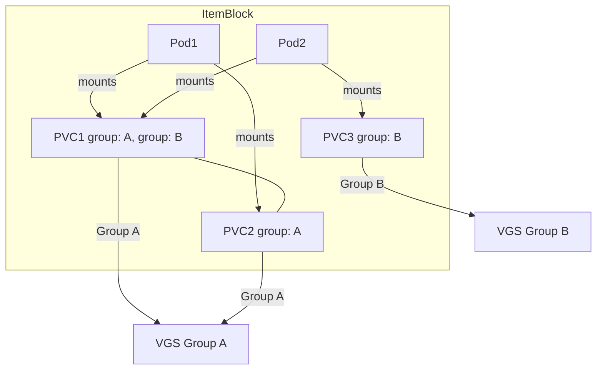
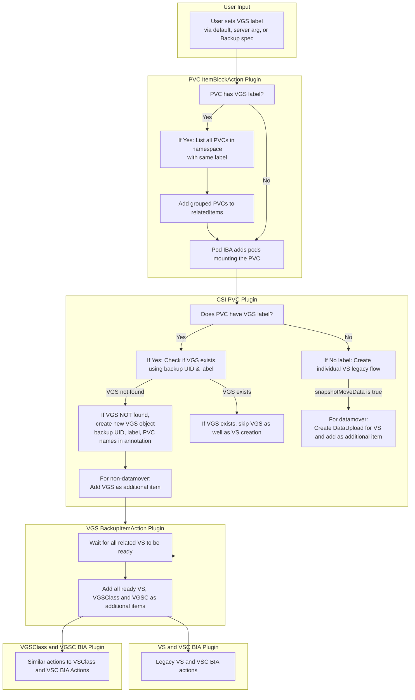

# Add Support for VolumeGroupSnapshots

This proposal outlines the design and implementation plan for incorporating VolumeGroupSnapshot support into Velero. The enhancement will allow Velero to perform consistent, atomic snapshots of groups of Volumes using the new Kubernetes [VolumeGroupSnapshot API](https://kubernetes.io/blog/2024/12/18/kubernetes-1-32-volume-group-snapshot-beta/). This capability is especially critical for stateful applications that rely on multiple volumes to ensure data consistency, such as databases and analytics workloads.

## Background

Velero currently enables snapshot-based backups on an individual Volume basis through CSI drivers. However, modern stateful applications often require multiple volumes for data, logs, and backups. This distributed data architecture increases the risk of inconsistencies when volumes are captured individually. Kubernetes has introduced the VolumeGroupSnapshot(VGS) API [(KEP-3476)](https://github.com/kubernetes/enhancements/pull/1551), which allows for the atomic snapshotting of multiple volumes in a coordinated manner. By integrating this feature, Velero can offer enhanced disaster recovery for multi-volume applications, ensuring consistency across all related data.

## Goals
- Ensure that multiple related volumes are snapshotted simultaneously, preserving consistency for stateful applications via VolumeGroupSnapshots(VGS) API.
- Integrate VolumeGroupSnapshot functionality into Velero’s existing backup and restore workflows.
- Allow users to opt in to volume group snapshots via specifying the group label.

## Non-Goals
- The proposal does not require a complete overhaul of Velero’s CSI integration, it will extend the current mechanism to support group snapshots.
- No any changes pertaining to execution of Restore Hooks

## High-Level Design

### Backup workflow:
#### Accept the label to be used for VGS from the user:
  - Accept the label from the user, we will do this in 3 ways:
        - Firstly, we will have a hard-coded default label key like `velero.io/volume-group-snapshot` that the users can directly use on their PVCs.
        - Secondly, we will let the users override this default VGS label via a velero server arg, `--volume-group-nsaphot-label-key`, if needed.
        - And Finally we will have the option to override the default label via Backup API spec, `backup.spec.volumeGroupSnapshotLabelKey`
        - In all the instances, the VGS label key will be present on the backup spec, this makes the label key accessible to plugins during the execution of backup operation.
  - This label will enable velero to filter the PVC to be included in the VGS spec.
  - Users will have to label the PVCs before invoking the backup operation.
  - This label would act as a group identifier for the PVCs to be grouped under a specific VGS.
  - It will be used to collect the PVCs to be used for a particular instance of VGS object.  
**Note:** Modifying or adding VGS label on PVCs during an active backup operation may lead to unexpected or undesirable backup results. To avoid inconsistencies, ensure PVC labels remain unchanged throughout the backup execution.

#### Changes to the Existing PVC ItemBlockAction plugin:
  - Currently the PVC IBA plugin is applied to PVCs and adds the RelatedItems for the particular PVC into the ItemBlock.
  - At first it checks whether the PVC is bound and VolumeName is non-empty.
  - Then it adds the related PV under the list of relatedItems.
  - Following on, the plugin adds the pods mounting the PVC as relatedItems.
  - Now we need to extend this PVC IBA plugin to add the PVCs to be grouped for a particular VGS object, so that they are processed together under an ItemBlock by Velero.
      - First we will check if the PVC that is being processed by the plugin has the user specified VGS label.
      - If it is present then we will execute a List call in the namespace with the label as a matching criteria and see if this results in any PVCs (other than the current one).
      - If there are PVCs matching the criteria then we add the PVCs to the relatedItems list.
      - This helps in building the ItemBlock we need for VGS processing, i.e. we have the relevant pods and PVCs in the ItemBlock.

**Note:** The ItemBlock to VGS relationship will not always be 1:1. There might be scenarios when the ItemBlock might have multiple VGS instances associated with it.
Lets go ove some ItemBlock/VGS scenarios that we might encounter and visualize them for clarity:
1. Pod Mounts: Pod1 mounts both PVC1 and PVC2.  
   Grouping: PVC1 and PVC2 share the same group label (group: A)  
   ItemBlock: The item block includes Pod1, PVC1, and PVC2.  
   VolumeGroupSnapshot (VGS): Because PVC1 and PVC2 are grouped together by their label, they trigger the creation of a single VGS (labeled with group: A).  


2. Pod Mounts: Pod1 mounts each of the four PVCs.  
   Grouping:  
     Group A: PVC1 and PVC2 share the same grouping label (group: A).  
     Group B: PVC3 and PVC4 share the grouping label (group: B)   
   ItemBlock: All objects (Pod1, PVC1, PVC2, PVC3, and PVC4) are collected into a single item block.   
   VolumeGroupSnapshots:  
      PVC1 and PVC2 (group A) point to the same VGS (VGS (group: A)).      
      PVC3 and PVC4 (group B) point to a different VGS (VGS (group: B)).    


3. Pod Mounts: Pod1 mounts both PVC1 and PVC2, Pod2 mounts PVC1 and PVC3.  
   Grouping:   
     Group A: PVC1 and PVC2  
     Group B: PVC1 and PVC3  
   ItemBlock: All objects-Pod1, Pod2, PVC1, PVC2, and PVC3, are collected into a single item block.  
   VolumeGroupSnapshots:  
     PVC1 and PVC2 (group A) point to the same VGS (VGS (group: A)).   
     PVC3 (group B) point to a different VGS (VGS (group: B)).  


#### Updates to CSI PVC plugin:
  - This is the plugin which creates VolumeSnapshots for the CSI PVCs if required.
  - We might encounter the following cases:
    - PVC has VGS label and VGS already exists:
      - We can check if VGS exists by listing the VGS in the namespace using the backup UUID 
        along with the label used for the VGS (we will be creating VGS with backup UUID and user specified VGS  group label) and see if the PVC is part of any of the existing VGS for the particular backup operation we are currently in.
      - If not then create the VGS object with the required labels (in this case backup UUID and the user specified VGS group label) and also add the PVC names (that are included in the VGS) as 
        annotations. (This will be useful for our VGS restore operation where we would need PVC resource identifiers).
      - For non-datamover case:
        - Once VGS is created, add the VGS as an additional item to be included in the backup.
        - The VGS BIA plugin will add the related VS as additional items later.
      - For datamover case:
        - We need to bypass creation of VS but need to create DataUploads for the VS instance that got created due to VGS creation.
        - Fetch the correct VS instances that got created via VGS and is related to the current PVC.
        - Finally create DataUpload object for this VS/PVC pair.
        - Add the DataUpload as an additional item.
    - PVC has VGS label and VGS exists:
      - In this case we do not want to re-create VGS object.
      - The required VS/DU for the PVC already exists as VGS instance exists for the PVC and backup UUID.
    - PVC does not possess VGS label:
      - Create VS and follow the existing legacy workflow.


#### Add a new VolumeGroupSnapshot(VGS) BIA plugin
  - We need this plugin only for non-datamover case.
  - For a particular instance of VGS, this plugin will wait for all the related VS instances to be in ready state.
  - And once they are ready, add all the VS instances as additional items for the backup.
  - This plugin will also add VolumeGroupSnapshotClass(VGSClass) and VolumeGroupSnapshotContent(VGSC) as additional items to be included in the backup.

### Add a new VolumeGroupSnapshotClass(VGSClass) BIA plugin
  - We need this plugin only for non-datamover case.
  - This plugin will be similar to the VSClass plugin.
  - This will check if the VGSClass has any lister secret annotations and then add it as an additional item.

### Add a new VolumeGroupSnapshotContent(VGSC) BIA Plugin
  - We need this plugin only for non-datamover case.
  - This will also be similar to the VSC plugin
  - This will check if the VGSC has any delete secret annotations and then add it as an additional item.




Restore workflow (WIP):

- Update the Default Resource Restore priority for Velero restore
    - Modify the default priority so that VGS, VGSClass are restored earlier than Pods and PVCs.

- Add a new VGS RIA plugin
    - This plugin will skip restore of the VGS resource.
    - It will add the PVCs of the VGS as additional Items.
    - The PVC identifiers will be obtained from the VGS annotation that we added during the backup workflow.


## Detailed Design

Backup workflow:
- Accept the label to be used for VGS from the user as a server argument:
    - Set a default VGS label key to be used:
    ```go
    // default VolumeGroupSnapshot Label
	defaultVGSLabelKey = "velero.io/volume-group-snapshot"
    
    ```
    - Add this as a server flag and pass it to backup reconciler, so that we can use it during the backup request execution.
    ```go
    flags.StringVar(&c.DefaultVGSLabelKey, "volume-group-snapshot-label-key", c.DefaultVGSLabelKey, "Label key for grouping PVCs into VolumeGroupSnapshot")
    ```

    - Update the Backup CRD to accept the VGS Label Key as a spec value:
    ```go
    // VolumeGroupSnapshotLabelKey specifies the label key to be used for grouping the PVCs under
	// an instance of VolumeGroupSnapshot, if left unspecified velero.io/volume-group-snapshot is used
	// +optional
	VolumeGroupSnapshotLabelKey string `json:"volumeGroupSnapshotLabelKey,omitempty"`
    ```
    - Modify the [`prepareBackupRequest` function](https://github.com/openshift/velero/blob/8c8a6cccd78b78bd797e40189b0b9bee46a97f9e/pkg/controller/backup_controller.go#L327) to set the default label key as a backup spec if the user does not specify any value:
    ```go
    if len(request.Spec.VolumeGroupSnapshotLabelKey) == 0 {
		// set the default key value
		request.Spec.VolumeGroupSnapshotLabelKey = b.defaultVGSLabelKey
	}
    ```

- Changes to the Existing [PVC ItemBlockAction plugin](https://github.com/vmware-tanzu/velero/blob/512199723ff95d5016b32e91e3bf06b65f57d608/pkg/itemblock/actions/pvc_action.go#L64) (Update the GetRelatedItems function):
```go
// Retrieve the VGS label key from the Backup spec.
	vgsLabelKey := backup.Spec.VolumeGroupSnapshotLabelKey
	if vgsLabelKey != "" {
		// Check if the PVC has the specified VGS label.
		if groupID, ok := pvc.Labels[vgsLabelKey]; ok {
			// List all PVCs in the namespace with the same label key and value (i.e. same group).
			pvcList := new(corev1api.PersistentVolumeClaimList)
			if err := a.crClient.List(context.Background(), pvcList, crclient.InNamespace(pvc.Namespace), crclient.MatchingLabels{vgsLabelKey: groupID}); err != nil {
				return nil, errors.Wrap(err, "failed to list PVCs for VGS grouping")
			}
			// Add each matching PVC (except the current one) to the relatedItems.
			for _, groupPVC := range pvcList.Items {
				if groupPVC.Name == pvc.Name {
					continue
				}
				a.log.Infof("Adding grouped PVC %s to relatedItems for PVC %s", groupPVC.Name, pvc.Name)
				relatedItems = append(relatedItems, velero.ResourceIdentifier{
					GroupResource: kuberesource.PersistentVolumeClaims,
					Namespace:     groupPVC.Namespace,
					Name:          groupPVC.Name,
				})
			}
		}
	} else {
		a.log.Info("No VolumeGroupSnapshotLabelKey provided in backup spec; skipping PVC grouping")
	}
```

- Updates to [CSI PVC plugin](https://github.com/vmware-tanzu/velero/blob/512199723ff95d5016b32e91e3bf06b65f57d608/pkg/backup/actions/csi/pvc_action.go#L200) (Update the Execute method):
```go
// Retrieve the VGS label key from the backup spec.
	vgsLabelKey := backup.Spec.VolumeGroupSnapshotLabelKey
	// Check if the PVC has the specified VGS label key.
	if group, ok := pvc.Labels[vgsLabelKey]; ok && group != "" {
		// PVC is marked for group snapshot.
		existingVGS := p.findExistingVGS(backup.UID, vgsLabelKey, group, pvc.Namespace)
		if existingVGS == nil {
			// No existing VGS found; list all PVCs in the same group.
			groupedPVCs, err := p.listGroupedPVCs(backup, pvc.Namespace, vgsLabelKey, group)
			if err != nil {
				return nil, nil, "", nil, err
			}
			// Extract the names of all grouped PVCs.
			pvcNames := extractPVCNames(groupedPVCs)
			// Create a new VGS object with the backup UID and group.
			newVGS, err := p.createVolumeGroupSnapshot(backup, pvc, pvcNames, vgsLabelKey, group)
			if err != nil {
				return nil, nil, "", nil, err
			}
			p.log.Infof("Created new VGS %s for PVC group %s", newVGS.Name, group)
			additionalItems = append(additionalItems, velero.ResourceIdentifier{
				GroupResource: schema.GroupResource{
					Group:    "snapshot.storage.k8s.io",
					Resource: "volumegroupsnapshots",
				},
				Namespace: newVGS.Namespace,
				Name:      newVGS.Name,
			})
		} else {
			// Existing VGS found; skip creating an individual VS.
			p.log.Infof("PVC %s is part of existing VGS %s, skipping individual VolumeSnapshot creation", pvc.Name, existingVGS.Name)
		}
	} else {
		// PVC is not part of a VGS group; create an individual VolumeSnapshot.
    
    //.
    //.
    //.
    }

// helper functions used

// findExistingVGS checks for an existing VolumeGroupSnapshot (VGS) for the given backup UID and group in the namespace.
func (p *pvcBackupItemAction) findExistingVGS(backupUID types.UID, vgsLabelKey, group, namespace string) *VolumeGroupSnapshot {
	var vgsList VolumeGroupSnapshotList
	err := p.crClient.List(
		context.TODO(),
		&vgsList,
		crclient.InNamespace(namespace),
		crclient.MatchingLabels{
			"backup-uid": string(backupUID),
			vgsLabelKey:  group,
		},
	)
	if err != nil {
		p.log.Errorf("Error listing VGS: %v", err)
		return nil
	}
	if len(vgsList.Items) > 0 {
		return &vgsList.Items[0]
	}
	return nil
}

// listGroupedPVCs returns all PVCs in the given namespace that have the specified VGS label key and group value.
func (p *pvcBackupItemAction) listGroupedPVCs(backup *velerov1api.Backup, namespace, vgsLabelKey, group string) ([]corev1api.PersistentVolumeClaim, error) {
	var pvcList corev1api.PersistentVolumeClaimList
	err := p.crClient.List(context.TODO(), &pvcList, crclient.InNamespace(namespace), crclient.MatchingLabels{vgsLabelKey: group})
	if err != nil {
		return nil, err
	}
	return pvcList.Items, nil
}

func (p *pvcBackupItemAction) createVolumeGroupSnapshot(
	backup *velerov1api.Backup,
	pvc corev1api.PersistentVolumeClaim,
	pvcNames []string,
	vgsLabelKey, group string,
) (*VolumeGroupSnapshot, error) {
	// Generate a name for the new VGS object.
	name := fmt.Sprintf("vgs-%s-%d", string(backup.UID), time.Now().Unix())
	
	// Construct the VGS object
	vgs := &VolumeGroupSnapshot{
		TypeMeta: metav1.TypeMeta{
			Kind:       "VolumeGroupSnapshot",
			APIVersion: "groupsnapshot.storage.k8s.io/v1beta1",
		},
		ObjectMeta: metav1.ObjectMeta{
			Name:      name,
			Namespace: pvc.Namespace,
			Annotations: map[string]string{
				"pvcList": strings.Join(pvcNames, ","),
			},
			Labels: map[string]string{
				velerov1api.BackupUIDLabel: string(backup.UID),
				vgsLabelKey:  group,
			},
		},
		Spec: VolumeGroupSnapshotSpec{
			// we will use default VGSClass for now
			Source: VolumeGroupSnapshotSource{
				Selector: metav1.LabelSelector{
					MatchLabels: map[string]string{
						vgsLabelKey: group,
					},
				},
			},
		},
	}

	// Create the VGS object
	if err := p.crClient.Create(context.TODO(), vgs); err != nil {
		return nil, err
	}
	return vgs, nil
}

// extractPVCNames returns a slice of PVC names from the provided list.
func extractPVCNames(pvcs []corev1api.PersistentVolumeClaim) []string {
	names := []string{}
	for _, pvc := range pvcs {
		names = append(names, pvc.Name)
	}
	return names
}

```

- Add a new VolumeGroupSnapshot(VGS) BIA plugin
```go
// AppliesTo specifies that this plugin applies to VolumeGroupSnapshot objects.
func (p *vgsBackupItemAction) AppliesTo() (velero.ResourceSelector, error) {
	return velero.ResourceSelector{
		IncludedResources: []string{"volumegroupsnapshots"},
	}, nil
}

// Execute waits for all related VolumeSnapshot (VS) instances to be ready, then adds them
// along with the VolumeGroupSnapshotClass as additional backup items.
func (p *vgsBackupItemAction) Execute(
	item runtime.Unstructured,
	backup *velerov1api.Backup,
) (
	runtime.Unstructured,
	[]velero.ResourceIdentifier,
	string,
	[]velero.ResourceIdentifier,
	error,
) {
	p.log.Infof("Starting VGS backup plugin Execute for item: %s", item.GetName())

	// Convert the unstructured object to a VolumeGroupSnapshot.
	var vgs VolumeGroupSnapshot
	if err := runtime.DefaultUnstructuredConverter.FromUnstructured(item.UnstructuredContent(), &vgs); err != nil {
		return nil, nil, "", nil, errors.Wrap(err, "unable to convert item to VolumeGroupSnapshot")
	}

	// Wait until all related VolumeSnapshots are ready.
	p.log.Infof("Waiting for all related VolumeSnapshots for VGS %s to be ready", vgs.Name)
	ready, err := waitForGroupedVolumeSnapshots(&vgs, vgs.Namespace, p.log)
	if err != nil {
		return nil, nil, "", nil, errors.Wrap(err, "error waiting for grouped VolumeSnapshots")
	}
	if !ready {
		p.log.Infof("Not all related VolumeSnapshots are ready for VGS %s", vgs.Name)
		return item, nil, "", nil, nil
	}

	// Retrieve the related VolumeSnapshot instances.
	groupedVS := getGroupedVolumeSnapshots(&vgs, vgs.Namespace)
	var additionalItems []velero.ResourceIdentifier
	for _, vs := range groupedVS {
		additionalItems = append(additionalItems, velero.ResourceIdentifier{
			GroupResource: schema.GroupResource{
				Group:    "snapshot.storage.k8s.io",
				Resource: "volumesnapshots",
			},
			Namespace: vs.Namespace,
			Name:      vs.Name,
		})
	}

	// Add the VolumeGroupSnapshotClass as an additional item.
	// Here we assume that the VGS spec defines the class name.
    // We will be using the default VGSClass for now
	vgsClassName := vgs.Spec.VolumeGroupSnapshotClassName
	additionalItems = append(additionalItems, velero.ResourceIdentifier{
		GroupResource: schema.GroupResource{
			Group:    "snapshot.storage.k8s.io",
			Resource: "volumegroupsnapshotclasses",
		},
		Namespace: "",
		Name:      vgsClassName,
	})

	p.log.Infof("VGS %s ready; adding %d additional items to backup", vgs.Name, len(additionalItems))
	return item, additionalItems, "", nil, nil
}
```

Restore workflow:

- Update the [Default Resource Restore priority](https://github.com/vmware-tanzu/velero/blob/512199723ff95d5016b32e91e3bf06b65f57d608/pkg/cmd/server/config/config.go#L116) for Velero restore
```go
defaultRestorePriorities = types.Priorities{
		HighPriorities: []string{
			"customresourcedefinitions",
			"namespaces",
			"storageclasses",
            // updated list from here
            "volumegroupsnaoshotclass.snapshot.k8s.io",
            "volumegroupsnapshots.snapshot.storage.k8s.io",
			"volumesnapshotclass.snapshot.storage.k8s.io",
			"volumesnapshotcontents.snapshot.storage.k8s.io",
			"volumesnapshots.snapshot.storage.k8s.io",
			"datauploads.velero.io",
			"persistentvolumes",
			"persistentvolumeclaims",
```
- Add a VGS RIA plugin
```go

// AppliesTo returns a selector that matches VolumeGroupSnapshot resources.
func (p *vgsRestoreItemAction) AppliesTo() (velero.ResourceSelector, error) {
	return velero.ResourceSelector{
		IncludedResources: []string{"volumegroupsnapshots"},
	}, nil
}


// Execute skips restoring the VGS resource and extracts the PVC identifiers from the "pvcList" annotation,
// adding each PVC as an additional restore item.
func (p *vgsRestoreItemAction) Execute(
	input *velero.RestoreItemActionExecuteInput,
) (*velero.RestoreItemActionExecuteOutput, error) {
	p.log.Info("Starting VGS RestoreItemAction")

	// Convert the backup VGS object to an unstructured type.
	// We use input.ItemFromBackup as the backed-up version of the VGS.
	var vgs unstructured.Unstructured
	vgs.SetUnstructuredContent(input.ItemFromBackup.UnstructuredContent())

	// Retrieve the pvcList annotation.
	annotations := vgs.GetAnnotations()
	pvcListStr, ok := annotations["pvcList"]
	if !ok || pvcListStr == "" {
		p.log.Infof("No pvcList annotation found on VGS %s", vgs.GetName())
		return &velero.RestoreItemActionExecuteOutput{SkipRestore: true}, nil
	}

	// Parse the comma-separated list of PVC names.
	pvcNames := strings.Split(pvcListStr, ",")
	var additionalItems []velero.ResourceIdentifier
	namespace := vgs.GetNamespace()
	for _, pvcName := range pvcNames {
		pvcName = strings.TrimSpace(pvcName)
		if pvcName == "" {
			continue
		}
		additionalItems = append(additionalItems, velero.ResourceIdentifier{
			GroupResource: schema.GroupResource{
				Group:    "", 
				Resource: "persistentvolumeclaims",
			},
			Namespace: namespace,
			Name:      pvcName,
		})
	}

	p.log.Infof("Skipping restore of VGS %s and adding %d PVC(s) as additional restore items", vgs.GetName(), len(additionalItems))

	// Return output indicating that the VGS resource itself should be skipped,
	// and providing the list of PVCs to be restored as additional items
	return &velero.RestoreItemActionExecuteOutput{
		SkipRestore:     true,
		AdditionalItems: additionalItems,
	}, nil
}
```
## Implementation

This design proposal is targeted for velero 1.16.

The implementation of this proposed design is targeted for velero 1.17.

## Open Questions

How to handle VGSC ? Do we need VGSC for non-datamover operations ?
