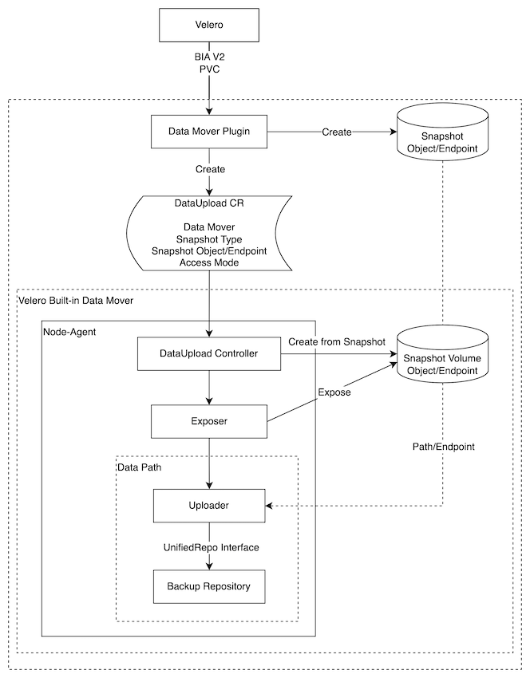
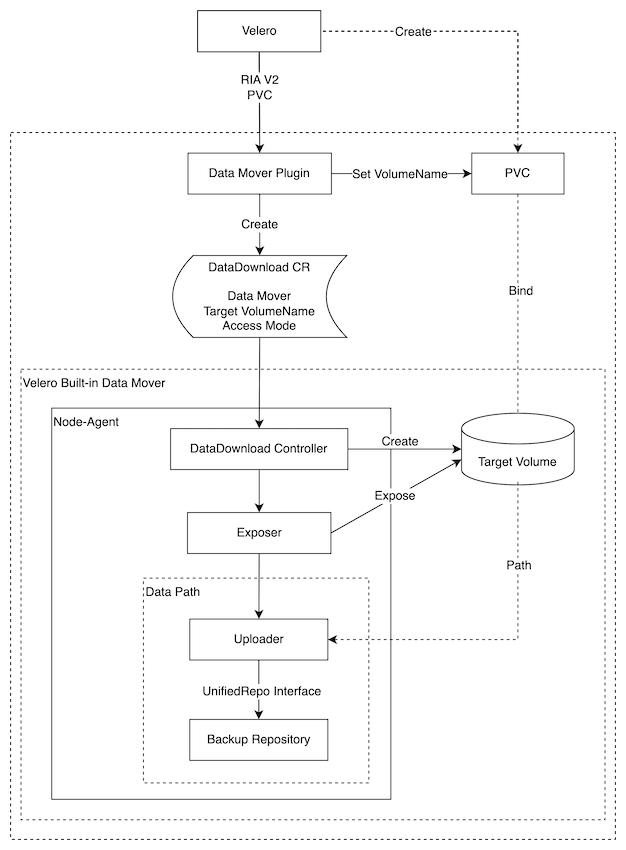
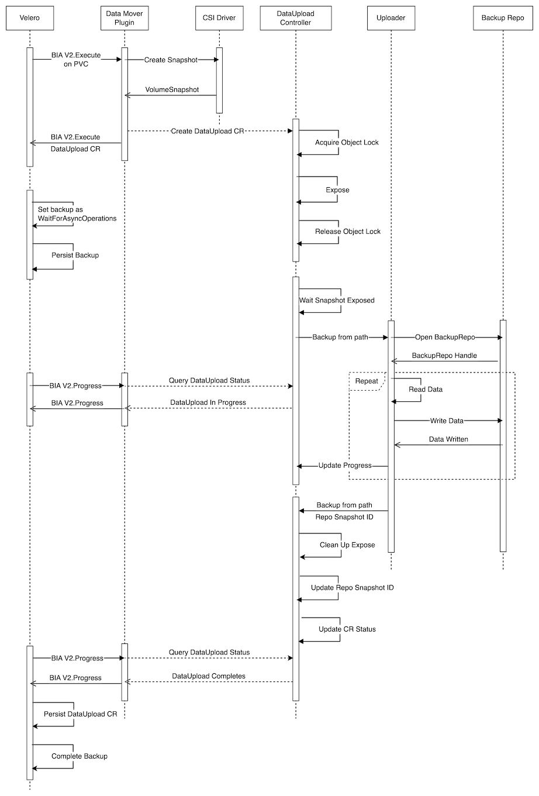
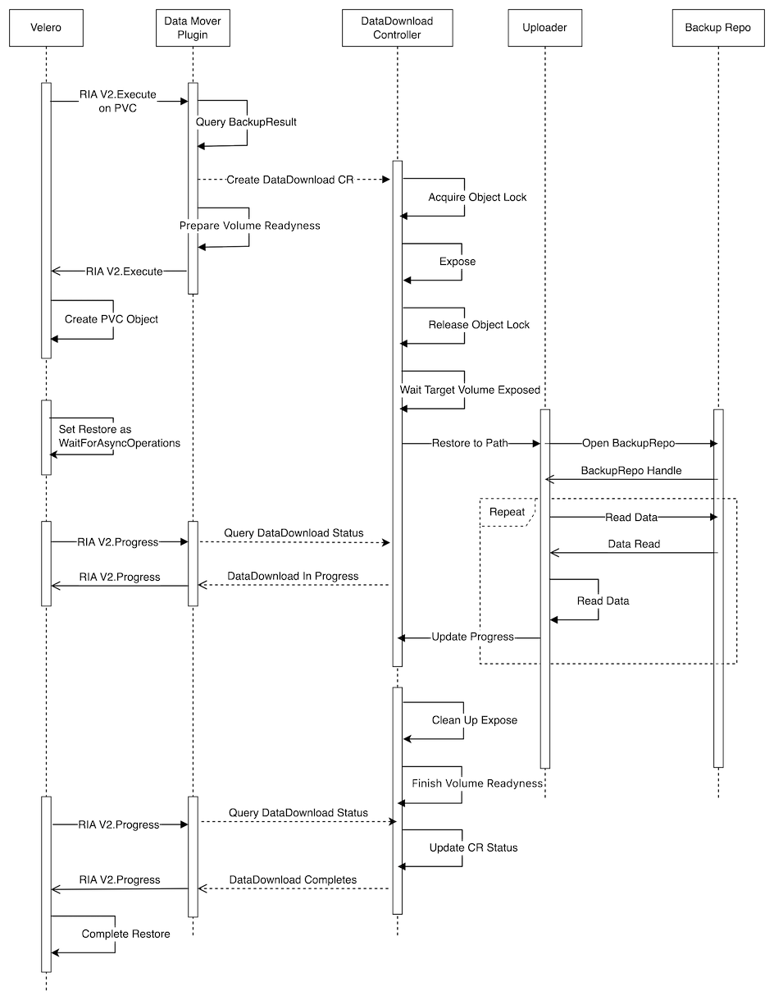
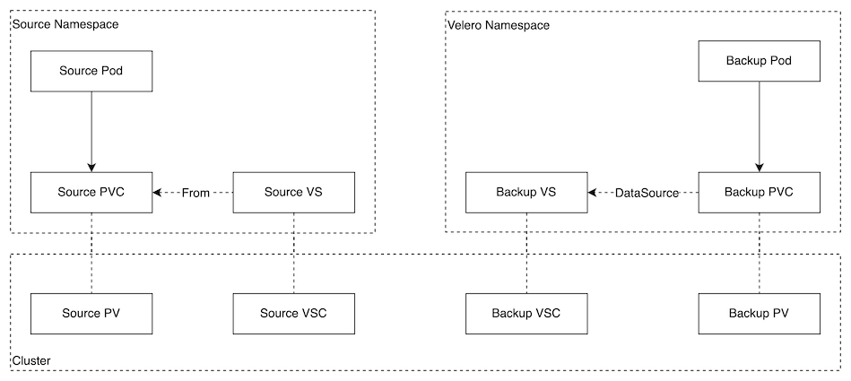
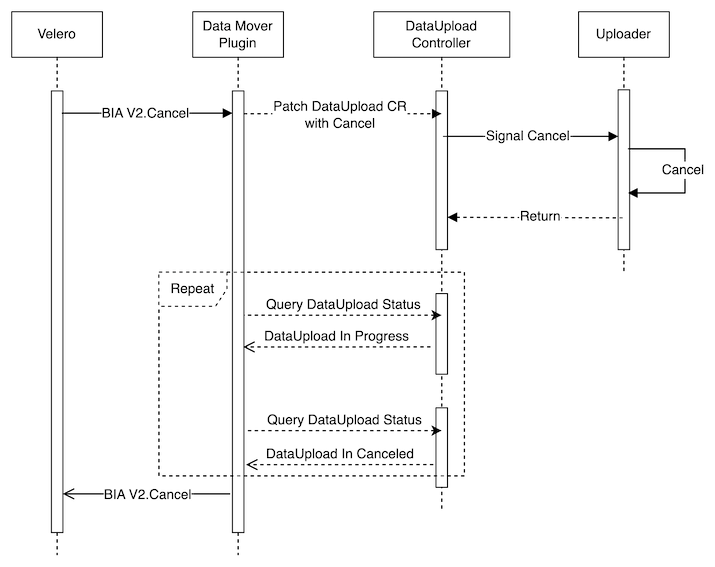

# Volume Snapshot Data Movement Design

## Glossary & Abbreviation

**BR**: Backup & Restore  
**Backup Storage**: See the same definition in [Unified Repository design][1].  
**Backup Repository**: See the same definition in [Unified Repository design][1].  
**BIA/RIA V2**: Backup Item Action/Restore Item Action V2 that supports asynchronized operations, see the [general progress monitoring design][2] for details.  

## Background

As a Kubernetes BR solution, Velero is pursuing the capability to back up data from the volatile and limited production environment into the durable, heterogeneous and scalable backup storage. This relies on two parts:  

- Data Movement: Move data from various production workloads, including the snapshots of the workloads or volumes of the workloads
- Data Persistency and Management: Persistent the data in backup storage and manage its security, redundancy, accessibility, etc. through backup repository. This has been covered by the [Unified Repository design][1]

At present, Velero supports moving file system data from PVs through Pod Volume Backup (a.k.a. file system backup). However, it backs up the data from the live file system, so it should be the last option when more consistent data movement (i.e., moving data from snapshot) is not available.  

Moreover, we would like to create a general workflow to variations during the data movement, e.g., data movement plugins, different snapshot types, different snapshot accesses and different data accesses. 

## Goals

- Create components and workflows for Velero to move data based on volume snapshots
- Create components and workflows for Velero built-in data mover
- Create the mechanism to support data mover plugins from third parties
- Implement CSI snapshot data movement on file system level
- Support different data accesses, i.e., file system level and block level
- Support different snapshot types, i.e., CSI snapshot, volume snapshot API from storage vendors
- Support different snapshot accesses, i.e., through PV generated from snapshots, and through direct access API from storage vendors
- Reuse the existing Velero generic data path as creatd in [Unified Repository design][1]

## Non-Goals

- The implementation details of block level access will be included in a future design
- Most of the components are generic, but the Exposer is snapshot type specific or snapshot access specific. The current design covers the implementation details for exposing CSI snapshot to host path access only, for other types or accesses, we may need a separate design
- The current workflow focuses on snapshot-based data movements. For some application/SaaS level data sources, snapshots may not be taken explicitly. We don’t take them into consideration, though we believe that some workflows or components may still be reusable.

## Architecture of Volume Snapshot Data Movement

## Workflows  

Here are the diagrams that illustrate components and workflows for backup and restore respectively.  
For backup, we intend to create an extensive architecture for various snapshot types, snapshot accesses and various data accesses. For example, the snapshot specific operations are isolated in Data Mover Plugin and Exposer. In this way, we only need to change the two modules for variations. Likely, the data access details are isolated into uploaders, so different uploaders could be plugged into the workflow seamlessly.  

For restore, we intend to create a generic workflow that could for all backups. This means the restore is backup source independent. Therefore, for example, we can restore a CSI snapshot backup to another cluster with no CSI facilities or with CSI facilities different from the source cluster.  
We still have the Exposer module for restore and it is to expose the target volume to the data path. Therefore, we still have the flexibility to introduce different ways to expose the target volume.  
Likely, the data downloading details are isolated in uploaders, so we can still create multiple types of uploaders.  

Below is the backup workflow:  
  

Below is the restore workflow:  
  

## Components
Below are the generic components in the data movement workflow:  

**Velero**: Velero controls the backup/restore workflow, it calls BIA/RIA V2 to backup/restore an object that involves data movement, specifically, a PVC or a PV.  
**BIA/RIA V2**: BIA/RIA V2 are the protocols between Velero and the data mover plugins. They support asynchronized operations so that Velero backup/restore is not marked as completion until the data movement is done and in the meantime, Velero is free to process other backups during the data movement.  
**Data Mover Plugin (DMP)**: DMP implement BIA/RIA V2 and it invokes the corresponding data mover by creating the DataUpload/DataDownload CRs. DMP is also responsible to take snapshot of the source volume, so it is a snapshot type specific module. For CSI snapshot data movement, the CSI plugin could be extended as a DMP, this also means that the CSI plugin will fully implement BIA/RIA V2 and support some more methods like Progress, Cancel, etc.  
**DataUpload CR (DUCR)/ DataDownload CR (DDCR)**: DUCR/DDCR are Kubernetes CRs that act as the protocol between data mover plugins and data movers. The parties who want to provide a data mover need to watch and process these CRs.  
**Data Mover (DM)**: DM is a collective of modules to finish the data movement, specifically, data upload and data download. The modules may include the data mover controllers to reconcile DUCR/DDCR and the data path to transfer data.  

DMs take the responsibility to handle DUCR/DDCRs, Velero provides a built-in DM and meanwhile Velero supports plugin DMs. Below shows the components for the built-in DM:  

**Velero Built-in Data Mover (VBDM)**: VBDM is the built-in data mover shipped along with Velero, it includes Velero data mover controllers and Velero generic data path.  
**Node-Agent**: Node-Agent is an existing Velero module that will be used to host VBDM.  
**Exposer**: Exposer is to expose the snapshot/target volume as a path/device name/endpoint that are recognizable by Velero generic data path. For different snapshot types/snapshot accesses, the Exposer may be different. This isolation guarantees that when we want to support other snapshot types/snapshot accesses, we only need to replace with a new Exposer and keep other components as is.  
**Velero Generic Data Path (VGDP)**: VGDP is the collective of modules that is introduced in [Unified Repository design][1]. Velero uses these modules to finish data transmission for various purposes. In includes uploaders and the backup repository.  
**Uploader**: Uploader is the module in VGDP that reads data from the source and writes to backup repository for backup; while read data from backup repository and write to the restore target for restore. At present, only file system uploader is supported. In future, the block level uploader will be added. For file system uploader, only Kopia uploader will be used, Restic will not be integrated with VBDM.   

## Replacement
3rd parties could integrate their own data movement into Velero by replacing VBDM with their own DMs. The DMs should process DUCR/DDCRs appropriately and finally put them into one of the terminal states as shown in the DataUpload CRD and DataDownload CRD sections.  
Theoretically, replacing the DMP is also allowed. In this way, the entire workflow is customized, so this is out of the scope of this design.  

# Detailed Design

## Backup Sequence
Below are the data movement actions and sequences during backup:  
 

Below are actions from Velero and DMP:

**BIA Execute**  
This the existing logic in Velero. For a source PVC/PV, Velero delivers it to the corresponding BackupItemAction plugin, the plugin then takes the related actions to back it up.  
For example, the existing CSI plugin takes a CSI snapshot to the volume represented by the PVC and then returns additional items (i.e., VolumeSnapshot, VolumeSnapshotContent and VolumeSnapshotClass) for Velero to further backup.  
To support data movement, we will use BIA V2 which supports asynchronized operation management. Here is the Execute method from BIA V2:  
```
Execute(item runtime.Unstructured, backup *api.Backup) (runtime.Unstructured, []velero.ResourceIdentifier, string, []velero.ResourceIdentifier, error)
```
Besides ```additionalItem``` (as the 2nd return value), Execute method will return one more resource list called ```itemToUpdate```, which means the items to be updated  and persisted when the async operation completes. For details, visit [general progress monitoring design][2].   
Specifically, this mechanism will be used to persist DUCR into the persisted backup data, in another words, DUCR will be returned as ```itemToUpdate``` from Execute method. DUCR contains all the information the restore requires, so during restore, DUCR will be extracted from the backup data.  
Additionally, in the same way, a DMP could add any other items into the persisted backup data.  
Execute method also returns the ```operationID``` which uniquely identifies the asynchronized operation. This ```operationID``` is generated by plugins. The [general progress monitoring design][2] doesn't restrict the format of the ```operationID```, for Velero CSI plugin, the ```operationID``` is a combination of the backup CR UID and the source PVC (represented by the ```item``` parameter) UID.  

**Create Snapshot**  
The DMP creates a snapshot of the requested volume and deliver it to DM through DUCR. After that, the DMP leaves the snapshot and its related objects (e.g., VolumeSnapshot and VolumeSnapshotContent for CSI snapshot) to the DM, DM then has full control of the snapshot and its related objects, i.e., deciding whether to delete the snapshot or its related objects and when to do it.  
This also indicates that the DUCR should contain the snapshot type specific information because different snapshot types may have their unique information.  
For Velero built-in implementation, the existing logics to create the snapshots will be reused, specifically, for CSI snapshot, the related logics in CSI plugin are fully reused.  

**Create DataUpload CR**  
A DUCR is created for as the result of each Execute call, then Execute method will return and leave DUCR being processed asynchronously.  

**Set Backup As WaitForAsyncOperations**  
**Persist Backup**  
After ```Execute``` returns, the backup is set to ```WaitingForPluginOperations```, and then Velero is free to process other items or backups.  
Before Velero moves to other items/backups, it will persist the backup data. This is the same as the existing behavior.  
The backup then is left as ```WaitForAsyncOperations``` until the DM completes or timeout.  

**BIA Progress**  
Velero keeps monitoring the status of the backup by calling BIA V2’s Progress method. Below is the Progress method from BIA V2:
```
Progress(operationID string, backup *api.Backup) (velero.OperationProgress, error)
```
On the call of this method, DMP will query the DUCR’s status. Some critical progress data is transferred from DUCR to the ```OperationProgress``` which is the return value of BIA V2’s Progress method. For example, NCompleted indicates the size/number of data that have been completed and NTotal indicates the total size/number of data.  
When the async operation completes, the Progress method returns an OperationProgress with ```Completed``` set as true. Then Velero will persist DUCR as well as any other items returned by DUP as ```itemToUpdate```.  
Finally, then backup is as ```Completed```.  
To help BIA Progress find the corresponding DUCR, the ```operationID``` is saved along with the DUCR as a label ```velero.io/async-operation-id```.  

DUCRs are handled by the data movers, so how to handle them are totally decided by the data movers. Below covers the details of VBDM, plugging data movers should have their own actions and workflows.  

**Persist DataUpload CR**  
As mentioned above, the DUCR will be persisted when it is completed under the help of BIA V2 async operation finalizing mechanism.   
This means the backup tarball will be uploaded twice, this is as the designed behavior of [general progress monitoring design][2].  

Conclusively, as a result of the above executions:
- A DataUpload CR is created and persisted to the backup tarball. The CR will be left there after the backup completes because the CR includes many information connecting to the backup that may be useful to end users or upper level modules.  
- A snapshot as well as the objects representing it are created. For CSI snapshot, a VolumeSnapshot object and a VolumeSnapshotContent object is created. The DMP leaves the snapshot as well as its related objects to DM for further processing.  

VBDM creates a Data Uploader Controller to handle the DUCRs in node-agent daemonset, therefore, on each node, there will be an instance of this controller. The controller connects to the backup repository and calls the uploader. Below are the VBDM actions.  

**Acquire Object Lock**  
**Release Object Lock**  
There are multiple instances of Data Uploader Controllers and when a DUCR is created, there should be only one of the instances handle the CR.  
Therefore, an operation called “Acquired Object Lock” is used to reach a consensus among the controller instances so that only one controller instance takes over the CR and tries the next action – Expose for the CR.  
After the CR is completed in the Expose phase, the CR is released with the operation of “Release Object Lock”.  
We fulfil the “Acquired Object Lock” and “Release Object Lock” under the help of Kubernetes API server and the etcd in the background, which guarantees strong write consistency among all the nodes.  

**Expose**  
For some kinds of snapshot, it may not be usable directly after it is taken. For example, a CSI snapshot is represented by the VolumeSnapshot and VolumeSnapshotContent object, if we don’t do anything, we don’t see any PV really exists in the cluster, so VGDP has no way to access it. Meanwhile, when we have a PV representing the snapshot data, we still need a way to make it accessible by the VGDP.  
The details of the expose process are snapshot specific, and for one kind of snapshot, we may have different methods to expose it to VGDP. Later, we will have a specific section to explain the current design of the Exposer.  

**Backup From Data Path**  
After a snapshot is exposed, VGDP will be able to access the snapshot data, so the controller calls the uploader to start the data backup.  
To support cancellation and concurrent backup, the call to the VGDP is done asynchronously. How this asynchronization is implemented may be related to the Exposer. as the current design of Exposer, the asynchronization is implemented by the controller with go routines.    

We keep VGDP reused for VBDM, so everything inside VGDP are kept as is. For details of VGDP, refer to the [Unified Repository design][1].  

**Update Repo Snapshot ID**
When VGDP completes backup, it returns an ID that represent the root object saved into the backup repository for this backup, through the root object, we will be able to enumerate the entire backup data.  
This Repo Snapshot ID will be saved along with the DUCR.  

## DataUpload CRD
Below are the essential fields of DataUpload CRD. The CRD covers below information:
- The information to manipulate the specified snapshot
- The information to manipulate the specified data mover
- The information to manipulate the specified backup repository
- The progress of the current data upload
- The result of the current data upload once it finishes

For snapshot manipulation:
- ```snapshotType``` indicates the type of the snapshot, at present, the only valid value is ```CSI```.  
- If ```snapshotType``` is ```CSI```, ```csiSnapshot``` which is a pointer to a ```CSISnapshotSpec``` must not be absent. 
- ```CSISnapshotSpec``` specifies the information of the CSI snapshot, e.g., ```volumeSnapshot``` is the name of VolumeSnapshot object representing the CSI snapshot; ```storageClass``` specifies the name of the StorageClass of the source PVC, which will be used to create the backupPVC during the data upload.

For data mover manipulation:
- ```datamover``` indicates the name of the data mover, if it is empty or ```velero```, it means the built-in data mover will be used for this data upload  

For backup repository manipulation, ```backupStorageLocation``` is the name of the related BackupStorageLocation, where we can find all the required information.

For the progress, it includes the ```totalBytes``` and ```doneBytes``` so that other modules could easily cuclulate a progress.  

For data upload result, ```snapshotID``` in the ```status``` field is the Repo Snapshot ID. Data movers may have their private outputs as a result of the DataUpload, they will be put in the ```dataMoverResult``` map of the ```status``` field.  

Here are the statuses of DataUpload CRD and their descriptions:
- New: The DUCR has been created but not processed by a controller
- Accepted: the Object lock has been acquired for this DUCR and the elected controller is trying to expose the snapshot
- Prepared: the snapshot has been exposed, the related controller is starting to process the upload
- InProgress: the data upload is in progress
- Canceling: the data upload is being canceled
- Canceled: the data upload has been canceled
- Completed: the data upload has completed
- Failed: the data upload has failed

Below is the full spec of DataUpload CRD:
```
apiVersion: apiextensions.k8s.io/v1alpha1
kind: CustomResourceDefinition
metadata:
  labels:
    component: velero
  name: datauploads.velero.io
spec:
  conversion:
    strategy: None
  group: velero.io
  names:
    kind: DataUpload
    listKind: DataUploadList
    plural: datauploads
    singular: dataupload
  scope: Namespaced
  versions:
  - additionalPrinterColumns:
    - description: DataUpload status such as New/InProgress
      jsonPath: .status.phase
      name: Status
      type: string
    - description: Time duration since this DataUpload was started
      jsonPath: .status.startTimestamp
      name: Started
      type: date
    - description: Completed bytes
      format: int64
      jsonPath: .status.progress.bytesDone
      name: Bytes Done
      type: integer
    - description: Total bytes
      format: int64
      jsonPath: .status.progress.totalBytes
      name: Total Bytes
      type: integer
    - description: Name of the Backup Storage Location where this backup should be
        stored
      jsonPath: .spec.backupStorageLocation
      name: Storage Location
      type: string
    - description: Time duration since this DataUpload was created
      jsonPath: .metadata.creationTimestamp
      name: Age
      type: date
    name: v1
    schema:
      openAPIV3Schema:
        properties:
          spec:
            description: DataUploadSpec is the specification for a DataUpload.
            properties:
              backupStorageLocation:
                description: BackupStorageLocation is the name of the backup storage
                  location where the backup repository is stored.
                type: string
              csiSnapshot:
                description: If SnapshotType is CSI, CSISnapshot provides the information
                  of the CSI snapshot.
                properties:
                  snapshotClass:
                    description: SnapshotClass is the name of the snapshot class that
                      the volume snapshot is created with
                    type: string                
                  storageClass:
                    description: StorageClass is the name of the storage class of
                      the PVC that the volume snapshot is created from
                    type: string
                  volumeSnapshot:
                    description: VolumeSnapshot is the name of the volume snapshot
                      to be backed up
                    type: string
                required:
                - storageClass
                - volumeSnapshot
                type: object
              datamover:
                description: DataMover specifies the data mover to be used by the
                  backup. If DataMover is "" or "velero", the built-in data mover
                  will be used.
                type: string
			  operationTimeout:
                description: OperationTimeout specifies the time used to wait internal 
                  operations, e.g., wait the CSI snapshot to become readyToUse.
                type: string
              snapshotType:
                description: SnapshotType is the type of the snapshot to be backed
                  up.
                type: string
              sourceNamespace:
                description: SourceNamespace is the original namespace where the volume
                  is backed up from.
                type: string
            required:
            - backupStorageLocation
            - csiSnapshot
            - snapshotType
            - sourceNamespace
            type: object
          status:
            description: DataUploadStatus is the current status of a DataUpload.
            properties:
              completionTimestamp:
                description: CompletionTimestamp records the time a backup was completed.
                  Completion time is recorded even on failed backups. Completion time
                  is recorded before uploading the backup object. The server's time
                  is used for CompletionTimestamps
                format: date-time
                nullable: true
                type: string
              dataMoverResult:
                additionalProperties:
                  type: string
                description: DataMoverResult stores data-mover-specific information
                  as a result of the DataUpload.
                nullable: true
                type: object
              message:
                description: Message is a message about the DataUpload's status.
                type: string
			  node:
                description: Node is the name of the node where the DataUpload is running.
                type: string			    
              path:
                description: Path is the full path of the snapshot volume being backed
                  up.
                type: string
              phase:
                description: Phase is the current state of the DataUpload.
                enum:
                - New
                - Accepted
                - Prepared
                - InProgress
                - Canceling
                - Canceled
                - Completed
                - Failed
                type: string
              progress:
                description: Progress holds the total number of bytes of the volume
                  and the current number of backed up bytes. This can be used to display
                  progress information about the backup operation.
                properties:
                  bytesDone:
                    format: int64
                    type: integer
                  totalBytes:
                    format: int64
                    type: integer
                type: object
              snapshotID:
                description: SnapshotID is the identifier for the snapshot in the
                  backup repository.
                type: string
              startTimestamp:
                description: StartTimestamp records the time a backup was started.
                  Separate from CreationTimestamp, since that value changes on restores.
                  The server's time is used for StartTimestamps
                format: date-time
                nullable: true
                type: string
            type: object
        type: object

```

## Restore Sequence

Below are the data movement actions sequences during restore:  
 

Many of the actions are the same with backup, here are the different ones.    

**Query Backup Result**  
The essential information to be filled into DataDownload all comes from the DataUpload CR. For example, the Repo Snapshot ID is stored in the status fields of DataUpload CR. However, we don't want to restore the DataUpload CR and leave it in the cluster since it is useless after the restore. Therefore, we will retrieve the necessary information from DataUpload CR and store it in a temporary ConfigMap for the DM to use. There is one ConfigMap for each DataDownload CR and the ConfigMaps belong to a restore will be deleted when the restore finishes.  

**Prepare Volume Readiness**  
As the current pattern, Velero delivers an object representing a volume, either a PVC or a PV, to DMP and Velero will create the object after DMP's Execute call returns. However, by this time, DM should have not finished the restore, so the volume is not ready for use.  
In this step, DMP needs to mark the object as unready to use so as to prevent others from using it, i.e., a pod mounts the volume. Additionlly, DMP needs to provide an approach for DM to mark it as ready when the data movement finishes.  
How to mark the volume as unready or ready varying from the type of the object, specifically, a PVC or a PV; and there are more than one ways to achieve this.  
Below show the details of how to do this for CSI snapshot data movement.  
After the DMP submits the DataDownload CR, it does below modifications to the PVC spec:
- Set spec.VolumeName to empty ("")
- Add a selector with a matchLabel ```velero.io/dynamic-pv-restore```

With these two steps, it tells Kubernetes that the PVC is not bound and it only binds a PV with the ```velero.io/dynamic-pv-restore``` label. As a result, even after the PVC object is created by Velero later and is used by other resources, it is not usable until the DM creates the target PV.      

**Expose**  
The purpose of expose process for restore is to create the target PV and make the PV accessible by VGDP. Later the Expose section will cover the details. 

**Finish Volume Readiness**  
By the data restore finishes, the target PV is ready for use but it is not delivered to the outside world. This step is the follow up of Prepare Volume Readiness, which does necessary work to mark the volume ready to use.  
For CSI snapshot restore, DM does below steps:
- Set the target PV's claim reference (the ```claimRef``` filed) to the target PVC
- Add the ```velero.io/dynamic-pv-restore``` label to the target PV

By the meantime, the target PVC should have been created in the source user namespace and waiting for binding.  
When the above steps are done, the target PVC will be bound immediately by Kubernetes.  
This also means that Velero should not restore the PV if a data movement restore is involved, this follows the existing CSI snapshot behavior.  

For restore, VBDM doesn’t need to persist anything.  

## DataDownload CRD
Below are the essential fields of DataDownload CRD. The CRD covers below information:
- The information to manipulate the target volume
- The information to manipulate the specified data mover
- The information to manipulate the specified backup repository

Target volume information includes PVC and PV that represents the volume and the target namespace.        
The data mover information and backup repository information are the same with DataUpload CRD.
DataDownload CRD defines the same status as DataUpload CRD with nearly the same meanings.  

Below is the full spec of DataUpload CRD:
```
apiVersion: apiextensions.k8s.io/v1alpha1
kind: CustomResourceDefinition
metadata:
  labels:
    component: velero
  name: datadownloads.velero.io
spec:
  conversion:
    strategy: None
  group: velero.io
  names:
    kind: DataDownload
    listKind: DataDownloadList
    plural: datadownloads
    singular: datadownload
  scope: Namespaced
  versions:
  - DataDownload:
    - description: DataDownload status such as New/InProgress
      jsonPath: .status.phase
      name: Status
      type: string
    - description: Time duration since this DataDownload was started
      jsonPath: .status.startTimestamp
      name: Started
      type: date
    - description: Completed bytes
      format: int64
      jsonPath: .status.progress.bytesDone
      name: Bytes Done
      type: integer
    - description: Total bytes
      format: int64
      jsonPath: .status.progress.totalBytes
      name: Total Bytes
      type: integer
    - description: Time duration since this DataDownload was created
      jsonPath: .metadata.creationTimestamp
      name: Age
      type: date
    name: v1
    schema:
      openAPIV3Schema:
        properties:
          spec:
            description: SnapshotDownloadSpec is the specification for a SnapshotDownload.
            properties:
              backupStorageLocation:
                description: BackupStorageLocation is the name of the backup storage
                  location where the backup repository is stored.
                type: string
              datamover:
                description: DataMover specifies the data mover to be used by the
                  backup. If DataMover is "" or "velero", the built-in data mover
                  will be used.
                type: string
              operationTimeout:
                description: OperationTimeout specifies the time used to wait internal
                  operations, before returning error as timeout.
                type: string
              snapshotID:
                description: SnapshotID is the ID of the Velero backup snapshot to
                  be restored from.
                type: string
              sourceNamespace:
                description: SourceNamespace is the original namespace where the volume
                  is backed up from.
                type: string
              targetVolume:
                description: TargetVolume is the information of the target PVC and
                  PV.
                properties:
                  namespace:
                    description: Namespace is the target namespace
                    type: string
                  pv:
                    description: PV is the name of the target PV that is created by
                      Velero restore
                    type: string
                  pvc:
                    description: PVC is the name of the target PVC that is created
                      by Velero restore
                    type: string
                required:
                - namespace
                - pv
                - pvc
                type: object
            required:
            - backupStorageLocation
            - restoreName
            - snapshotID
            - sourceNamespace
            - targetVolume
            type: object
          status:
            description: SnapshotRestoreStatus is the current status of a SnapshotRestore.
            properties:
              completionTimestamp:
                description: CompletionTimestamp records the time a restore was completed.
                  Completion time is recorded even on failed restores. The server's
                  time is used for CompletionTimestamps
                format: date-time
                nullable: true
                type: string
              message:
                description: Message is a message about the snapshot restore's status.
                type: string
			  node:
                description: Node is the name of the node where the DataDownload is running.
                type: string				
              phase:
                description: Phase is the current state of theSnapshotRestore.
                enum:
                - New
                - Accepted
                - Prepared
                - InProgress
                - Canceling
                - Canceled
                - Completed
                - Failed
                type: string
              progress:
                description: Progress holds the total number of bytes of the snapshot
                  and the current number of restored bytes. This can be used to display
                  progress information about the restore operation.
                properties:
                  bytesDone:
                    format: int64
                    type: integer
                  totalBytes:
                    format: int64
                    type: integer
                type: object
              startTimestamp:
                description: StartTimestamp records the time a restore was started.
                  The server's time is used for StartTimestamps
                format: date-time
                nullable: true
                type: string
            type: object
        type: object
```  

## Expose  

### Expose for DataUpload  
At present, for a file system backup, VGDP accepts a string representing the root path of the snapshot to be backed up, the path should be accessible from the process/pod that VGDP is running. In future, VGDP may accept different access parameters. Anyway, the snapshot should be accessible local.  
Therefore, the first phase for Expose is to expose the snapshot to be locally accessed. This is a snapshot specific operation.  
For CSI snapshot, the final target is to create below 3 objects in Velero namespace:  
- backupVSC: This is the Volume Snapshot Content object represents the CSI snapshot
- backupVS: This the Volume Snapshot object for BackupVSC in Velero namespace
- backupPVC: This is the PVC created from the backupVS in Velero namespace. Specifically, backupPVC’s data source points to backupVS
- backupPod: This is a pod attaching backupPVC in Velero namespace. As Kubernetes restriction, the PV is not provisioned until the PVC is attached to a pod and the pod is scheduled to a node. Therefore, after the backupPod is running, the backupPV which represents the data of the snapshot will be provisioned
- backupPV: This is the PV provisioned as a result of backupPod schedule, it has the same data of the snapshot

Initially, the CSI VS object is created in the source user namespace (we call it sourceVS), after the Expose, all the objects will be in Velero namespace, so all the data upload activities happen in the Velero namespace only.  
As you can see, we have duplicated some objects (sourceVS and sourceVSC), this is due to Kubernetes restriction – the data source reference cannot across namespaces.  
After the duplication completes, the objects related to the source user namespace will be deleted.  

Below diagram shows the relationships of the objects:  
 

After the first phase, we will see a backupPod attaching a backupPVC/backupPV which data is the same as the snapshot data. Then the second phase could start, this phase is related to the uploader.  
For file system uploader, the target of this phase is to get a path that is accessible locally by the uploader. There are some alternatives:
- Get the path in the backupPod, so that VGDP runs inside the backupPod
- Get the path on the host, so that VGDP runs inside node-agent, this is similar to the existing PodVolumeBackup

Each option has their pros and cons, in the current design, we will use the second way because it is simpler in implementation and more controllable in workflow.  

### Expose for DataDownload
The Expose operation for DataDownload still takes two phases, The first phase creates below objects:
- restorePVC: It is a PVC in Velero namespace with the same specification, it is used to provision the restorePV
- restorePod: It is used to attach the restorePVC so that the restorePV could be provisioned by Kubernetes
- restorePV: It is provisioned by Kubernetes and bound to restorePVC

Data will be downloaded to the restorePV. No object is created in user source namespace and no activity is done there either.  
The second phase is the same as DataUpload, that is, we still use the host path to access restorePV and run VGDP in node-agent.  

### Expose cleanup
Some internal objects are created during the expose. Therefore, we need to clean them up to prevent internal objects from rampant growth. The cleanup happens in two cases:
- When the controller finishes processing the DUCR/DDCR, this includes the cases that the DUCR/DDCR is completed, failed and cancelled.  
- When the DM restarts and the DM doesn't support restart recovery. When the DM comes back, it should detect all the ongoing DUCR/DDCR and clean up the expose. Specifically, VBDM should follow this rule since it doesn't support restart recovery.  


## Cancellation
We will leverage on BIA/RIA V2's Cancel method to implement the cancellation, below are the prototypes from BIA/RIA V2:  
```  
Cancel(operationID string, backup *api.Backup) error  
Cancel(operationID string, restore *api.Restore) error
```  

At present, Velero doesn’t support canceling an ongoing backup, the current version of BIA/RIA V2 framework has some problems to support the end to end cancellation as well.   
Therefore, the current design doesn’t aim to deliver an end-to-end cancellation workflow but to implement the cancellation workflow inside the data movement, in future, when the other two parts are ready for cancellation, the data movement cancellation workflow could be directly used.  

Additionally, at present, the data movement cancellation will be used in the below scenarios:  
- When a backup is deleted, the backup deletion controller will call DMP’s Cancel method, so that the ongoing data movement will not run after the backup is deleted.
- In the restart case, the ongoing backups will be marked as ```Failed``` when Velero restarts, at this time, DMP’s Cancel method will also be called when Velero server comes back because Velero will never process these backups.  

For data movement implementation, a ```Cancel``` field is included in the DUCR/DDCR.
DMP patches the DUCR/DDCR with ```Cancel``` field set to true, then it keeps querying the status of DUCR/DDCR until it comes to Canceled status or timeout, by which time, DMP returns the Cancel call to Velero.  
Then DM needs to handle the cancel request, e.g., stop the data transition. For VBDM, it sets a signal to the uploader and the uploader will abort in a short time.  
The cancelled DUCR/DDCR is marked as ```Canceled```.  

Below diagram shows VBDM’s cancel workflow (take backup for example, restore is the same). 
    

It is possible that a DM doesn’t support cancellation at all or only support in a specific phase (e.g., during InProgress phase), if the cancellation is requested at an unexpected time or to an unexpecting DM, the behavior is decided by the DMP and DM, below are some recommendations:
- If a DM doesn't support cancellation at all, DMP should be aware of this, so the DMP could return an error and fail early
- If the cancellation is requested at an unexpected time, DMP is possibly not aware of this, it could still deliver it to the DM, so both Velero and DMP wait there until DM completes the cancel request or timeout

VBDM's cancellation exactly follows the above rules.  


## Parallelism
Velero uses BIA/RIA V2 to launch data movement tasks, so from Velero’s perspective, the DataUpload/DataDownload CRs from the running backups will be submitted in parallel.  
Then how these CRs are handled is decided by data movers, in another words, the specific data mover decides whether to handle them sequentially or in parallel, as well what the parallelism is like. Velero makes no restriction to data movers regarding to this.  
Next, let’s focus on the parallelism of VBDM, which could also be a reference of the plugin data movers.  
VBDM is hosted by Velero node-agent, so there is one data movement controller instance on each Kubernetes node, which also means that these instances could handle the DataUpload/DataDownload CRs in parallel.  
On the other hand, a volume/volume snapshot may be accessed from only one or multiple nodes varying from its location, the backend storage architecture, etc. Therefore, the first decisive factor of the parallelism is the accessibility of a volume/volume snapshot.  
Therefore, we have below principles:
- We should spread the data movement activities equally to all the nodes in the cluster. This requires a load balance design from Velero
- In one node, it doesn’t mean the more concurrency the better, because the data movement activities are high in resource consumption, i.e., CPU, memory, and network throughput. For the same consideration, we should make this configurable because the best number should be set by users according to the bottleneck they detect  

We will address the two principles step by step. As the first step, VBDM’s parallelism is designed as below:  
- We don’t create the load balancing mechanism for the first step, we don’t detect the accessibility of the volume/volume snapshot explicitly. Instead, we create the backupPod/restorePod under the help of Kubernetes, Kubernetes schedules the backupPod/restorePod to the appropriate node, then the data movement controller on that node will handle the DataUpload/DataDownload CR there, so the resource will be consumed from that node.
- We don’t expose the configurable concurrency value in one node, instead, the concurrency value in value will be set to 1, that is, there is no concurrency in one node.

As for the resource consumption, it is related to the data scale of the data movement activity and it is charged to node-agent pods, so users should configure enough resource to node-agent pods.  
Meanwhile, Pod Volume Backup/Restore are also running in node-agent pods, we don’t restrict the concurrency of these two types. For example, in one node, one Pod Volume Backup and one DataUpload could run at the same time, in this case, the resource will be shared by the two activities.  

## Progress Report
When a DUCR/DDCR is in InProgress phase, users could check the progress.  
In DUCR/DDCR’s status, we have fields like ```totalBytes``` and ```doneBytes```, the same values will be displayed as a result of below querires:
- Call ```kubectl get dataupload -n velero xxx or kubectl get datadownload -n velero xxx```.
- Call ```velero backup describe –details```. This is implemented as part of BIA/RIA V2, the above values are transferred to async operation and this command retrieve them from the async operation instead of DUCR/DDCR. See [general progress monitoring design][2] for details


## Backup Sync
DUCR contains the information that is required during restore but as mentioned above, it will not be synced because during restore its information is retrieved dynamically. Therefore, we have no change to Backup Sync.  

## Backup Deletion
Once a backup is deleted, the data in the backup repository should be deleted as well. On the other hand, the data is created by the specific DM, Velero doesn't know how to delete the data. Therefore, Velero relies on the DM to delete the backup data.  
As the current workflow, when ```velero backup delete``` CLI is called, a ```deletebackuprequests``` CR is submitted; after the backup delete controller finishes all the work, the ```deletebackuprequests``` CR will be deleted. In order to give an opportunity for the DM to delete the backup data, we remedy the workflow as below:  
- During the backup deletion, the backup delete controller retrieves all the DUCRs belong to the backup  
- The backup delete controller then creates the DUCRs into the cluster
- Before deleting the ```deletebackuprequests``` CR, the backup delete controller adds a ```velero.io/dm-delete-backup``` finalizer to the CR
- As a result, the ```deletebackuprequests``` CR will not be deleted until the finalizer is removed
- The DM needs to watch the ```deletebackuprequests``` CRs with the ```velero.io/dm-delete-backup``` finalizer
- Once the DM finds one, it collects a list of DUCRs that belong to the backup indicating by the ```deletebackuprequests``` CR's spec
- If the list is not empty, the DM delete the backup data for each of the DUCRs in the list as well as the DUCRs themselves
- Finally, when all the items in the list are processed successfully, the DM removes the ```velero.io/dm-delete-backup``` finalizer
- Otherwise, if any error happens during the processing, the ```deletebackuprequests``` CR will be left there with the ```velero.io/dm-delete-backup``` finalizer, as well as the failed DUCRs
- DMs may use a periodical manner to retry the failed delete requests  

## Restarts
If Velero restarts during a data movement activity, the backup/restore will be marked as failed when Velero server comes back, by this time, Velero will request a cancellation to the ongoing data movement.  
If DM restarts, Velero has no way to detect this, DM is expected to:
- Either recover from the restart and continue the data movement
- Or if DM doesn’t support recovery, it should cancel the data movement and mark the DUCR/DDCR as failed. DM should also clear any internal objects created during the data movement before and after the restart  

At present, VBDM doesn't support recovery, so it will follow the second rule.  


## Plugin Data Movers
There should be only one DM to handle a specific DUCR/DDCR in all cases. If more than one DMs process a DUCR/DDCR at the same time, there will be a disaster.  
Therefore, a DM should check the dataMover field of DUCR/DDCR and process the CRs belong to it only.  
For example, VBDM reconciles DUCR/DDCR with their ```dataMover``` field set to "" or "velero", it will skip all others.  
This means during the installation, users are allowed to install more than one DMs, but the DMs should follow the above rule.   
When creating a backup, we should allow users to specify the data mover, so a new backup CLI option is required.  
For restore, we should retrieve the same information from the corresponding backup, so that the data mover selection is consistent.  

At present, Velero doesn't have the capability to verify the existence of the specified data mover. As a result, if a wrong data mover name is specified for the backup or the specified data mover is not installed, nothing will fail early, DUCR/DDCR is still created and Velero will wait there until timeout.  

Plugin DMs may need some private configurations, the plugin DM providers are recommended to create a self-managed configMap to take the information. Velero doesn't maintain the lifecycle of the configMap.  
Besides, the configMap is recommended to named as the DM's name, in this way, if Velero or DMP recognizes some generic options that varies between DMs, the options could be added into the configMap and visited by Velero or DMP.  

Conclusively, below are the steps plugin DMs need to do in order to integrate to Velero volume snapshot data movement.  
### Backup
- Handle and only handle DUCRs with the matching ```dataMover``` value
- Maintain the phases and progresses of DUCRs correctly
- If supported, response to the Cancel request of DUCRs
- Dispose the volume snapshots as well as their related objects after the snapshot data is transferred

### Restore
- Handle and only handle DDCRs with the matching ```dataMover``` value
- Maintain the phases and progresses of DDCRs correctly
- If supported, response to the Cancel request of DDCRs
- Create the PV with data restored to it
- Set PV's ```claimRef``` to the provided PVC and set ```velero.io/dynamic-pv-restore``` label

## Working Mode
It doesn’t mean that once the data movement feature is enabled users must move every snapshot. We will support below two working modes:
- Don’t move snapshots. This is same with the existing CSI snapshot feature, that is, native snapshots are taken and kept
- Move snapshot data and delete native snapshots. This means that once the data movement completes, the native snapshots will be deleted.

For this purpose, we need to add a new option in the backup command as well as the Backup CRD.  
The same option for restore will be retrieved from the specified backup, so that the working mode is consistent.  

## Backup and Restore CRD Changes
We add below new fields in the Backup CRD:
```
	// SnapshotMoveData specifies whether snapshot data should be moved
	// +optional
	// +nullable
	SnapshotMoveData *bool `json:"snapshotMoveData,omitempty"`

	// DataMover specifies the data mover to be used by the backup.
	// If DataMover is "" or "velero", the built-in data mover will be used.
	// +optional
	DataMover string `json:"datamover,omitempty"`
```	
SnapshotMoveData will be used to decide the Working Mode.  
DataMover will be used to decide the data mover to handle the DUCR. DUCR's DataMover value is derived from this value.    

As mentioned in the Plugin Data Movers section, the data movement information for a restore should be the same with the backup. Therefore, the working mode for restore should be decided by checking the corresponding Backup CR; when creating a DDCR, the DataMover value should be retrieved from the corresponding Backup Result.  

## Logging
The logs during the data movement are categorized as below:
- Logs generated by Velero
- Logs generated by DMPs
- Logs generated by DMs

For 1 and 2, the existing plugin mechanism guarantees that the logs could be saved into the Velero server log as well as backup/restore persistent log.  
For 3, Velero leverage on DMs to decide how to save the log, but they will not go to Velero server log or backup/restore persistent log. For VBDM, the logs are saved in the node-agent server log.  

## Installation
DMs need to be configured during installation so that they can be installed. Plugin DMs may have their own configuration, for VGDM, the only requirement is to install Velero node-agent.  
Moreover, the DMP is also required during the installation.  
For example, to move CSI snapshot through VBDM, below is the installation script:  
```
velero install \
    --provider \
    --image \
    --plugins velero/velero-plugin-for-csi:xxx \
    --features=EnableCSI \
    --use-node-agent \ 
```

## Upgrade
For VBDM, no new installation option is introduced, so upgrade is not affected.
If plugin DMs require new options and so the upgrade is affected, they should explain them in their own documents.

## CLI
As explained in the Working Mode section, we add one more flag ```snapshot-move-data``` to indicate whether the snapshot data should be moved.  
As explained in the Plugin Data Movers section, we add one more flag ```data-mover``` for users to configure the data mover to move the snapshot data.  
Example of backup command are as below.  

Below CLI means to create a backup with volume snapshot data movement enabled and with VBDM as the data mover:  
```
velero backup create xxx --include-namespaces --snapshot-move-data
```

Below CLI has the same meaning as the first one:  
```
velero backup create xxx --include-namespaces --snapshot-move-data --data-mover velero
```

Below CLI means to create a backup with volume snapshot data movement enabled and with "xxx-plugin-dm" as the data mover:  
```
velero backup create xxx --include-namespaces --snapshot-move-data --data-mover xxx-plugin-dm
```

Restore command is kept as is.  


[1]: ../unified-repo-and-kopia-integration/unified-repo-and-kopia-integration.md
[2]: ../general-progress-monitoring.md